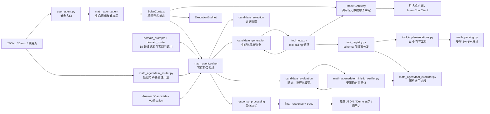

# 数学推理智能体架构

> 状态：当前生效  
> 更新日期：2026-08-31
> 本文件是仓库唯一的架构事实源。README、比赛报告和审计文档仅提供使用说明、实验记录或改进路线；内容冲突时以本文件和当前代码为准。

## 1. 目标与边界

系统面向竞赛数学题，在调用方注入的 Intern 兼容模型客户端上完成领域与题型分析、候选生成、可选符号计算、确定性/模型验证、低置信度反思和答案聚合。

当前仓库只有一套可运行实现，全部位于 `math_agent/` 包。根目录 `user_agent.py` 只是竞赛兼容入口，与 `math_agent` 导出同一个 `ReasoningAgent` 和 `AgentConfig`，不保留第二份实现。2026-08-28 删除的同名目录是未接入入口、依赖不同的旧原型；2026-08-30 建立的是现有扁平运行时的保守包化迁移，两者没有代码继承关系。多智能体、共享黑板和自适应候选升级仍属于未来设想，不是当前能力。

## 2. 外部契约

```python
ReasoningAgent(client).solve(problem, metadata)
# -> {"final_response": str, "trace": list[dict]}
```

- `problem` 是题目字符串，必须非空且默认不超过 20000 字符。
- `metadata` 为竞赛兼容字典，必须可序列化为 JSON 且默认不超过 20000 字符；批处理入口会传入 `idx`，当前核心流水线不依赖其内容。
- `client` 必须提供 `chat(messages=..., **kwargs)`，由调用方注入。
- `final_response` 是非空字符串；除明确的 `未解出` 失败哨兵外，保留获胜候选推理，并以唯一一行 `最终答案：...` 结尾。该行只含规范化答案体，不含解释性句子；常见 Unicode/LaTeX 表示转换为稳定记号，已有精确形式时优先保留精确形式。
- `trace` 是事件列表，用于记录路由、题型长度目标、工具、候选、验证、截断恢复、反思、选择、最终答案来源和单题预算摘要。截断事件只记录阶段、候选编号、token、是否已有首行答案和处理状态，不保存残缺回复。
- `ReasoningAgent.solve()` 捕获全局异常并尝试低成本回退；`main.py` 将空答案和 `未解出` 视为失败记录。

## 3. 组件与数据流



| 组件 | 职责 |
| --- | --- |
| `user_agent.py` | 竞赛兼容入口，只重新导出 `math_agent` 中的公开类型；不得增加运行时实现 |
| `math_agent/__init__.py` | 唯一包级公开 API，导出 Agent、客户端、网关、求解上下文和核心数据类型 |
| `math_agent/agent.py` | 维护公开 Agent 生命周期：输入校验、单题上下文创建、异常收敛和兼容转发；不实现具体求解阶段 |
| `math_agent/agent_config.py` | 定义固定候选策略、模型参数、恢复开关和单题预算配置 |
| `math_agent/competition_policy.py` | 固定手册哈希、正式 `intern-s1` 模型、官方端点和默认开启的参赛模式校验；非 S1 只能显式作为非提交实验 |
| `math_agent/agent_prompts.py` | 集中保存策略、验证、批评和反思提示词；不持有运行状态 |
| `math_agent/agent_types.py` | 定义带 `finish_reason`/usage/阶段的 `ModelCallResult`，以及 `Answer`、`Candidate`、`Verification` 内部数据对象 |
| `math_agent/answer_equivalence.py` | 保守归一化数值、集合和多解；无法证明的关系返回 `unknown` |
| `math_agent/solver.py` | 只编排领域/题型路由、候选生成、候选评估、可选反思、选择和输出阶段 |
| `math_agent/candidate_generation.py` | 生成工具/纯推理候选，执行候选截断恢复、整题紧急答案和全局短回退 |
| `math_agent/candidate_evaluation.py` | 执行确定性/模型验证、截断 verifier 重试、批评和反思 |
| `math_agent/candidate_selection.py` | 执行一致确定性证据优先和原多数票/置信度回退，并记录最终来源 |
| `math_agent/response_processing.py` | 提取显式答案、解析 verdict、裁剪复核文本，并强制唯一非空末行答案 |
| `math_agent/context.py` | 定义每次 `solve()` 独占的 `SolveContext`，显式持有题目、metadata、trace、预算和网关 |
| `math_agent/model_calls.py` | 把 system/user 消息显式组装后交给 `ModelGateway`，不保存最近响应 |
| `math_agent/model_gateway.py` | 统一普通、工具、验证、反思和恢复请求；将原始响应、文本、finish reason、usage 和预算请求编号原子绑定为 `ModelCallResult` |
| `math_agent/truncation.py` | 统一更新截断事件的恢复/隔离状态，并在返回前封闭待处理事件 |
| `math_agent/domain_router.py` | 本地关键词计数选择一个领域，不访问模型；领域提示内容仍由 `domain_prompts.py` 提供 |
| `math_agent/task_router.py` | 零模型调用识别一个或多个题型；仅对结构明确的直接计算题生成至多一个可执行验证计划，证明、数域不明或复合任务只保留标签 |
| `math_agent/budget.py` | 统一记录和限制每题普通/恢复请求、usage token、工具调用及阶段 deadline，并按调用阶段累计截断和恢复状态 |
| `math_agent/domain_prompts.py` | 提供 18 个领域提示；关键词路由在本地完成，不额外调用模型 |
| `math_agent/math_tools.py` | 兼容旧导入的薄门面，只重导出工具公共 API；不得新增解析、实现、注册或循环逻辑 |
| `math_agent/math_parsing.py` | 受限 SymPy 命名空间、表达式/符号/整数/矩阵解析以及输入、结果和复杂度边界 |
| `math_agent/tool_implementations.py` | 实现 11 个有界数学工具；不声明模型 schema，不发起模型调用 |
| `math_agent/tool_registry.py` | 保持工具 schema 与实现一一对应，验证 tool-call JSON，并通过可终止子进程限时分发 |
| `math_agent/tool_loop.py` | 通过同一 `SolveContext` 绑定的 `ModelGateway` 执行 tool-calling 循环、轮数/调用数限制和强制最终回复 |
| `math_agent/tool_executor.py` | 在可终止子进程中执行数学计算，并施加墙钟硬超时 |
| `math_agent/deterministic_verifier.py` | 只通过 `math_parsing.py` 的公共解析接口，在可终止子进程中执行封闭数值表达式、有限方程解集、导数、积分、极限、留数、行列式、模幂、组合数及符号等价验证；结果为 `pass/fail/unknown` |
| `math_agent/llm_client.py` | 读取环境变量，只向官方 Intern HTTPS 端点发送 OpenAI 兼容请求，处理响应和有限重试；`chat()` 保持原返回契约，自有客户端显式声明私有协议后才由 `chat_with_metadata()` 原子返回响应及元数据 |
| `main.py` | 校验 JSONL，控制并发，保存每题 checkpoint、运行摘要并支持断点续跑 |
| `demo.py` | 将同一 `ReasoningAgent` 暴露为本地 Gradio 界面 |
| `verify_math.py` | 人工在线检查 few-shot；不属于默认测试或生产调用链 |
| `evaluation/io_utils.py` | 评测包共享的 UTF-8 JSON/JSONL 读取、SHA-256、同目录临时文件和原子写入；避免各脚本重复实现 |
| `evaluation/data/` | 数据边界：题集审计、内部基准生成、PutnamBench 导入、JSON schema 与固定截断压力集 |
| `evaluation/scoring/` | 评分边界：四态保守判分、旧报告重算、运行汇总与请求级截断门禁 |
| `evaluation/experiments/` | 实验边界：数据/运行时冻结、匿名 A/B、逐题配对统计与机器可读能力协议 |
| `scripts/run_quality_gates.py` | 顺序执行完整非模型质量门禁，并生成绑定 Git 快照的机器可读报告；失败后继续收集其余诊断 |
| `scripts/check_secrets.py` / `check_markdown_links.py` | 检查已跟踪及非忽略的未跟踪文件中的常见凭据模式，以及仓库内 Markdown 链接 |
| `scripts/check_competition_compliance.py` | 无网络验证正式模型/端点、运行时网络入口、参考答案字段隔离、JSON 输出契约及发布排除项 |
| `scripts/build_release.py` | 从受限文件白名单生成带来源、配置、锁哈希、质量摘要和文件哈希的确定性 ZIP；正式包只读取 Git blob |
| `.github/workflows/offline-quality.yml` | 在 Python 3.10/3.12 上以哈希锁安装开发依赖，运行质量门禁并验证正式打包；不调用模型端点 |

## 4. 求解流程

`ReasoningAgent` 只创建 `SolveContext` 并调用 `SolveOrchestrator`。后者只决定下列阶段顺序；候选生命周期、评估、选择和输出规则分别由对应模块实现。任何阶段需要题目、trace、预算或模型访问时都必须显式接收同一个 `SolveContext`，不得从 Agent 属性或“最近响应”方法读取单题状态。

1. **领域与题型路由**：`_detect_domain()` 对 18 个领域的关键词做不区分 ASCII 大小写的计数，选择最高分领域；未匹配时使用通用提示。`analyze_task()` 可返回多题型标签和置信度，但只有无证明指令、无复合目标且语法严格匹配的直接计算题才产生验证计划。方程必须明确实数域或复数域；整数、正根等约束以及数域不明时不执行强验证。
2. **候选生成**：默认生成 2 个工具增强候选和 1 个纯推理候选，策略温度 `0.6`、`thinking_mode=False`、API 单次上限仍为 `8192` tokens。关键词在本地把证明/推导/分类讨论题的推理目标设为 3500 输出 token，其余计算题设为 1800；这只约束 prompt，不压低 API 安全余量。所有候选第一行先写显式答案，只保留决定结论的推导。
3. **工具循环**：每个工具候选最多 3 轮。模型请求工具后，本地执行并把结果作为 `tool` 消息回灌；超过轮数后强制答案先行的无工具文本回复。任何工具轮调用出现 `finish_reason=length/max_tokens` 时立即停止，残缺工具调用不执行。
4. **截断恢复**：每次调用保存文本、阶段、候选编号、`finish_reason` 和 usage；外部 `client.chat()` 返回行为不变。候选截断后从正常聚合隔离，每候选最多恢复一次：已有首行答案时独立核验，未有答案时短解。只有正常结束且有显式首行答案的恢复结果才替换原候选；再次截断或格式异常时两份文本都隔离，只保留首行答案供整题紧急调用参考。三候选最多使用 3 个恢复名额，始终为一次最多 512 token 的整题紧急答案保留第 4 个名额。紧急回复即使截断，也只有首行显式答案可作为无推理答案体输出。
5. **验证**：若题型路由生成了严格计划，每个有显式答案的候选先在隔离子进程中做一次确定性验证，并占用共享工具预算；超时、解析不支持和预算不足均为 `unknown`。随后仍按原配置由模型验证 1 次，温度 `0.0`，提示只允许一行 `VERDICT: A/B`；长候选保留头尾。模型验证截断时在普通请求预算内重试一次紧凑判断；再次截断或无法解析时写入 `unknown` 并使用中性置信度，不当作失败票。
6. **批评与反思**：最佳候选原始置信度低于 `0.5` 且已有答案时，先请求不超过 6 行的决定性错误摘要。批评截断时直接丢弃，不触发反思；反思截断时走与普通候选相同的恢复状态机。
7. **聚合**：抽取为结构化 `Answer`。存在确定性 `pass` 且所有通过证据指向同一个 canonical answer 时，优先选择该答案中带通过证据且模型置信度最高的候选；通过证据互相冲突时记录冲突并回退。没有一致的确定性通过证据时，完整保留原选择规则：按保守 canonical key 多数票优先，没有多数项时选择置信度最高的候选。`fail` 和 `unknown` 单独出现时不排除候选，避免路由或解析边界造成错误降权。答案、展示推理和验证证据始终来自同一候选。
8. **构造响应**：移除模型文本中已有的答案标签，保留其余获胜且未截断候选推理，并统一追加唯一的 `最终答案：...`。最终结构校验要求答案非空、标记唯一且位于最后一行；失败时降级为仅含规范答案的一行。截断紧急回复只使用首行答案，不使用其推理。答案体经共享安全归一化后输出；精确值与近似值同时存在时保留精确部分，并规范角度符号、`πi` 显式乘法及常见特征根标签。

P1 只改变“严格计划存在且获得一致确定性通过证据”时的选择优先级；`enable_deterministic_verification=False` 可完整关闭该层。候选数量、温度、thinking mode、模型验证次数、token 上限和无证据时的原聚合规则均未改变。该机制通过离线正例、反例、漏根、数域、证明阻断和证据冲突测试；真实正确率增益仍必须按冻结 P0 协议独立评测。

默认配置由 `AgentConfig` 管理：

| 参数 | 默认值 |
| --- | ---: |
| `tool_candidates` / `plain_candidates` | `2` / `1` |
| `verifier_voting_times` | `1` |
| `policy_temperature` / `verifier_temperature` | `0.6` / `0.0` |
| `critic_temperature` / `reflection_temperature` | `0.3` / `0.3` |
| `max_tokens` / `verifier_max_tokens` / `critic_max_tokens` | `8192` / `1024` / `1024` |
| `fallback_max_tokens` | `512` |
| 计算 / 证明推理目标 | `1800` / `3500` |
| `recovery_max_tokens` / 每候选恢复次数 | `2048` / `1` |
| `max_tool_rounds` | `3` |
| `tool_timeout_seconds` | `5.0` |
| `max_model_requests` | `16` |
| `max_recovery_requests` / 总请求硬上限 | `4` / `20` |
| `max_total_tokens` | `200000` |
| `max_tool_calls` | `48` |
| `problem_timeout_seconds` | `600.0` |
| `max_problem_chars` / `max_metadata_chars` | `20000` / `20000` |
| tools / critic / reflection / fallback | 全部启用 |
| deterministic verification | 启用；可用 `enable_deterministic_verification=False` 回退 |

## 5. 数学工具

当前注册 11 个工具：

| 工具 | 用途 |
| --- | --- |
| `calculate` | 解析、化简表达式 |
| `solve_equation` | 解一元方程 |
| `differentiate` | 求导 |
| `integrate` | 不定积分 |
| `limit` | 求极限 |
| `residue` | 求复函数留数 |
| `matrix_det` | 求矩阵行列式 |
| `matrix_eigenvals` | 求矩阵特征值 |
| `gcd_lcm` | 求最大公约数与最小公倍数 |
| `mod_pow` | 模幂 |
| `binomial` | 组合数 |

模型工具参数是不可信输入。执行层使用无 builtins 的 SymPy 白名单命名空间，并限制表达式 2048 字符、工具参数 8192 字符、结果 8000 字符、矩阵最大 `12×12`、整数最多 1000 位、组合数 `n≤100000`、幂指数 `≤10000`、每轮最多 8 个工具调用。每次注册工具计算在 spawned 子进程中运行，默认超过 5 秒即由父进程终止。未知工具、畸形 JSON、越界输入、超时和子进程失败均返回受控错误，不进入任意代码执行路径。

## 6. 客户端与运行器

`InternChatClient` 使用：

| 环境变量 | 默认值 |
| --- | --- |
| `INTERN_API_KEY` | 无，缺失时拒绝启动 |
| `INTERN_API_BASE` | `https://chat.intern-ai.org.cn/api/v1/chat/completions` |
| `INTERN_MODEL` | `intern-s1` |
| `COMPETITION_MODE` | `1`；参赛模式拒绝非 S1 模型 |

自有客户端对端点使用失败关闭校验，只接受手册对应的官方 HTTPS Chat Completions 地址；即使 `COMPETITION_MODE=0` 也不能切换第三方服务。参赛模式默认开启并只接受 `intern-s1`，关闭模式仅允许重放明确标记为非提交的历史模型实验。客户端拒绝 `stream=True` 和 `n != 1`，当前不发送未经平台兼容验证的 `stop` 或流式参数。只重试连接错误、超时、HTTP `408/409/425/429`、服务端 `5xx`，以及响应 code/type/message 明确表示频率限制的 HTTP 400；普通参数错误和认证错误直接失败。`chat()` 保持原有文本/tool-call 返回契约。自有 `InternChatClient` 通过项目私有协议显式声明原子元数据能力，`ModelGateway` 才调用 `chat_with_metadata()` 并在同一返回值中取得 request id、模型、`finish_reason`、usage、耗时和尝试次数；外部注入客户端始终只依赖竞赛公开保证的 `chat()`，即使它碰巧存在同名私有方法也不会探测调用。项目不再保存“最近一次响应”全局或上下文变量，也不再在请求后另取元数据。

`main.py` 读取 JSONL，每行必须是对象且含非空 `problem`。`idx` 缺失时按行生成；显式 `idx` 必须是 1～128 位 ASCII 字母、数字、下划线或连字符，且不能重复。结果写入 `<output_dir>/<idx>.json`，先写 `.tmp` 再原子替换。只有合法 JSON、`status == "success"` 且 `final_response` 非空的 checkpoint 会被跳过。`未解出` 保存为 error checkpoint，并保留 Agent trace 供区分数学失败、预算和平台错误。并发由 `LOCAL_MAX_CONCURRENCY` 控制，默认 `3` 且必须为正整数；正式评测可在 manifest 中冻结为更低值以规避端点节流。批处理完成后原子写入 `<output_dir>/_run/run_summary.json`，包含输入文件名和 SHA-256、模型、并发、UTC 开始时间、耗时以及成功/失败/跳过计数，不包含题面或密钥。

## 7. 信任边界与失败行为

- API key 只从环境变量读取；`.env`、`outputs/` 和验证报告被 Git 忽略。
- 正式参赛只使用 `intern-s1`、赛事注入客户端或官方 Intern 端点、本地受限 SymPy；禁止人工逐题干预、赛后补填、伪造日志和未经允许的外部闭源服务。详细操作证据边界见 `docs/COMPETITION_COMPLIANCE.md`。
- 批处理入口只把 `problem` 和 `idx` 送入 Agent，输入记录中的参考答案、参考解和判分字段只属于离线评分边界，不进入求解上下文或模型消息。
- 题目、metadata、模型文本、tool calls、HTTP/JSON 响应和 checkpoint 均视为不可信输入。
- trace 会包含题面衍生内容、候选片段和工具结果，输出目录应按敏感数据管理。
- 工具调用失败会退化到纯推理；截断候选、验证器、批评器和反思各按状态机处理，任何残缺文本都不能直接进入聚合或最终推理；全局异常仍保证接口返回结构稳定。
- SymPy 子进程有墙钟硬超时，但尚无操作系统级内存上限；复杂表达式在超时前仍可能形成内存峰值。
- 单题 deadline 在各模型/工具调用边界检查，无法提前取消已发出的阻塞 HTTP 请求；单请求由客户端超时保护。
- token 上限依赖响应 usage 后记账；一次响应若造成超额，后续请求会停止，但已产生的 token 无法撤销。
- 模型输出具有随机性。正确率、延迟和成本结论必须绑定固定数据集、模型、配置和提交记录。

## 8. 验证边界

默认完整检查：

```bash
python -m scripts.run_quality_gates
```

测试以 fake client 和确定性输入覆盖接口、显式上下文、统一网关、模块组合边界、预算、工具、客户端、截断状态机、并发元数据隔离、评分和 runner，不依赖真实 API。完整门禁还执行 70% 语句覆盖率阈值、Ruff、compileall、Bandit、开发锁的 Python 3.10/Linux 条件依赖闭包检查、`pip check`、三套依赖锁漏洞审计、敏感信息扫描、Markdown 本地链接检查、竞赛合规探针、few-shot dry-run 和所有正式 CLI 的帮助入口。合规探针必须验证正式模型和端点、运行时网络入口、参考答案字段隔离、JSON 输出及发布排除项。漏洞审计会访问公开漏洞数据库，但不会访问模型端点；跳过它生成的报告不能授权正式包。并发测试要求同一注入客户端上的响应元数据原子返回，不能跨题串入其他 `SolveContext`。`python -m evaluation.data.audit_dataset <dataset>` 可离线检查题集规模、元数据和泄漏风险，并可通过 `--reference-dataset` 检查跨 split 重合；`evaluation.scoring.judge` 的文字语义与无法证明等价关系必须保持 `unknown`，禁止用子串命中判对。证明和开放语义题只能在 `manual_blind` 模式下由盲审裁决覆盖，未复核时保持 `unknown`。能力实验必须绑定干净 commit 的冻结 manifest；新旧三轮报告按 `idx` 配对，不能用两个独立总分替代配对统计。截断门禁使用请求级点估计和单侧 95% Wilson 上界；当约有 1082 次请求时最多允许 42 次截断。`evaluation/data/truncation_stress.jsonl` 应连续运行 3 次后合并报告，且候选阶段截断率、恢复覆盖、无效答案和残句泄漏分别独立检查。评测入口统一使用 `python -m evaluation.<group>.<module>`，共享结构化文件 I/O，不允许通过 `sys.path` 修改规避包边界。`python verify_math.py` 默认只解析 few-shot，不访问 API；只有 `--execute` 才会在线验证，并由 `--max-requests` 限制首轮和重试总请求数。`main.py` 和 `demo.py` 使用真实凭据时会消耗配额，不应进入默认 CI。

## 9. 架构变更规则

以下变化必须同时更新本文件、README 和相应测试：外部接口、候选/验证流程、工具注册与安全界限、环境变量、运行入口、checkpoint 格式或目录布局。实验数据与演进历史写入 `技术报告.md`，待办与风险写入 `docs/AUDIT_AND_OPTIMIZATION.md`，不要另建第二份架构文档。

## 10. 质量、供应链与交付边界

`requirements.txt`、`requirements-dev.txt` 和 `requirements-demo.txt` 只描述维护者选择的直接依赖范围；与之对应的三个 `.lock` 文件记录完整传递依赖、精确版本和允许制品的 SHA-256。核心运行时和开发工具支持 Python 3.10+；共享开发锁在 Python 3.12 生成时必须显式纳入只在 3.10 生效的条件依赖，并由最低版本真实安装和目标环境元数据闭包共同验证。可选 Demo 使用 Python 3.12+，因为修复已知漏洞的 Pillow 版本不再支持 3.10/3.11，不能为扩大可选界面兼容范围而锁回已知脆弱版本。运行安装、CI 和交付验证必须使用 `pip install --require-hashes`，变更任一输入规格后必须重新生成并验证受影响的锁，不能手工删减哈希来绕过解析冲突。

`scripts.run_quality_gates` 是唯一完整质量入口。它按固定清单执行各项检查，即使某项失败也继续诊断，并把命令参数、返回码、耗时和有界输出尾部写入 `.quality/quality-report.json`；报告同时保存检查前后的 commit、tree、分支和工作树状态。报告不保存 API key、题面或完整模型响应。CI 只授予 `contents: read`，第三方 Action 固定到完整提交 SHA，关闭 checkout 凭据持久化，并在 Python 3.10 与 3.12 上验证。CI 与默认测试均不允许 `--execute`、`main.py` 求解或启动 Demo。

正式发布必须同时满足：工作树干净；模型参数等于 `intern-s1`；质量报告状态为通过且包含依赖审计与 `competition_compliance`；报告前后 commit/tree 与当前 HEAD 完全一致；所有必需检查均有通过记录。发布器只选择 Git 已跟踪或非忽略的未跟踪文件，再施加根文件白名单和受限目录/后缀；符号链接、路径逃逸、含 NUL 的伪装二进制、超过 5 MiB 扫描/单文件上限或总输入超过 50 MiB 均被拒绝，嵌入的质量报告也必须通过同一敏感信息扫描。正式包从 Git blob 读取源字节，按固定名称顺序、提交时间、Unix 文件模式和压缩级别写 ZIP；同一提交、同一质量报告、同一模型标识应得到相同 SHA-256。包内 manifest 记录提交/tree、模型、手册哈希、正式模型匹配状态、默认 `AgentConfig`、依赖锁哈希和逐文件哈希，旁路 `.sha256` 用于传输校验。

脏工作树只能通过 `--allow-dirty` 生成 `draft`，内容来自当前工作区且 manifest 明确保留脏文件清单；它不能升级为正式包。`.env`、`.quality/`、`dist/`、`outputs/`、虚拟环境及未在白名单中的文件不会进入交付包。

根 `LICENSE` 当前明确项目代码未授予开源许可；这是一项保守边界，不代表对第三方软件或数据取得再授权。Python 依赖、压力集和本地导入题集分别遵守其自身许可及来源记录，具体说明见 `THIRD_PARTY_NOTICES.md`。更换项目许可证属于所有者决策，不能由维护脚本自动放宽。
