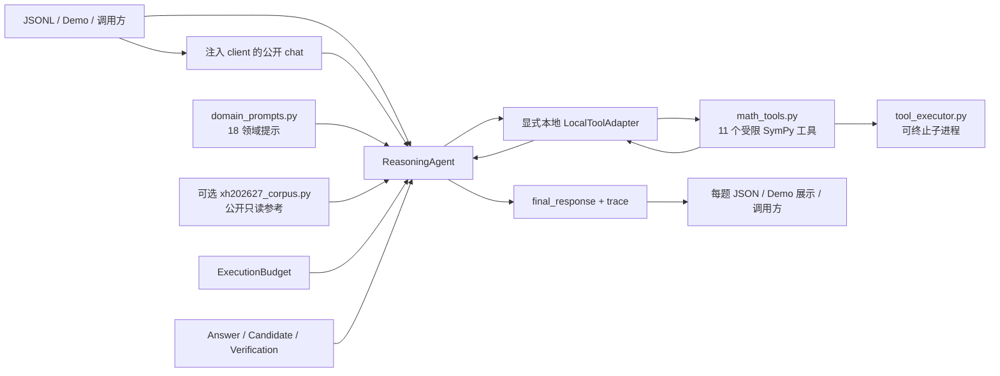

# 数学推理智能体架构

> 状态：R1 与 Q0/Q1/Q2 离线工程；当前正式代码以已核验的 `5c2f7a0` 为基线
>
> 更新日期：2026-09-08
>
> 运行时基线：`0641043` 获正式 26/112；`5c2f7a0` 继承思考关闭并增加答案交付加固，收益未证实
> 本文件是仓库唯一的架构事实源。工程底线、恢复门禁和重建路线由 `docs/ENGINEERING_SPECIFICATION.md` 规定，但不另行定义组件架构。

> **2026-09-08 第一批 K/C 实施补充**：新增独立且默认关闭的 Q1 开关 `corpus_retrieval`、`bounded_math`、`condition_checks`。正式代码闭包新增唯一前缀 `xh202627_corpus.py`，仍由入口位置加载到私有命名空间，不读取或覆盖官方预加载同名模块。语料读取只在检索开关开启、指定普通候选生成时发生；首批 160 条公开教材参考位于 `resources/hefferon-v1/`，读取前比对代码绑定的 SHA-256，单文件最多 1.5 MB，最多两个参考、6000 字符。不可用或无匹配时回到原生成路径，无跨题缓存、无联网和无直接查表返回。

`condition_checks` 只为初始生成消息追加完整题意和必要条件核查，不改题面、温度、候选数或请求预算，不改变补答/verifier 的提示。`bounded_math` 在现有精确证据位置检查完整有界任务，新增中文/英文及受限 LaTeX 表示、小型有理数矩阵行列式、完整多项式导数/原函数、组合数和模运算；未支持的条件、参数、函数或复合任务保持 unknown。原 `deterministic` 与默认请求行为保留。检索只影响首个普通候选（默认第三个生成），其余候选及 verifier 无语料注入；所有模式仍使用公开四参数且显式 False。

Q1 指纹包含新增模块及语料、清单，单变量计划登记三项新开关，旧 combined 仍只包含原五项。分发检索候选时必须包含新模块与资源；全量门禁新增 `test_first_batch.py`、`test_xh_corpus.py`，旧默认行为和污染测试继续执行。工程实现与真实模型验证分别记录于 `docs/evaluations/FIRST_BATCH_20260908.md`。

> **2026-09-06 截断修复补充**：单次输出参数强制 1–8192；生成预算耗尽保留已完成合格候选；任一来源的未完成状态不能被 stop 覆盖；明确 length 且 content=null 可进入已有预算内的恢复。无完整验证标签默认 unknown，不触发批评/反思。真实模型截断率仍待实测，详见 `docs/evaluations/TRUNCATION_REPAIR_20260906.md`。

> **2026-09-07 答案交付补充**：`_extract_answer` 读取最后一个有界最终答案块，支持粗体、标题、连续编号、逐行等式及闭合显示公式；完整响应上限 100000 字符、答案上限 2048 字符/128 行。最后标记为空、结构不完整、代码围栏示例及显式非 stop 状态继续拒绝；不回取更早答案。`_quick_fallback` 返回保留 finish_reason 的已验证答案体，候选恢复由 `_candidate_from_recovery` 恢复最终标记；最终兜底直接输出，确定性检查接收普通字符串。导入闭包、公开 client 协议、提示与预算不变。

> **离线边界（2026-09-08）**：回放支持旧平铺和新队列封装的录制，严格比较完整请求参数；缺失/null/False/True 不互相替代。新快照指纹包含思考及工具参数；不执行 solve 的 compare 明确标记 parser_only。中继保留显式布尔思考开关到 HTTP，并在排队前拒绝不支持的工具参数；Q2 文本观察器同样拒绝工具参数。队列、暂停、全局限额、单次发送、旧证据只读和正式导入隔离保持不变。已暂停实测不自动恢复；当前离线修复不代表新增正式成绩。

## 1. 目标与边界

2026-09-08 B1 实验补充：`Q1Policy.tool_aware_prompts` 默认 False。开启后，纯文本候选只替换仓库固定领域提示中的工具指导，领域方法、易错点、公式和 few-shot 原样保留；普通候选（含本地适配器的普通请求）、无适配器工具候选和多样性候选均覆盖。紧凑提示本身不含工具指导，仍保持原内容。真实工具循环的消息不变，反思/验证/恢复阶段不受 B1 改动。工具能力由显式 `local_adapter` 与调用路径决定，不探测 client。Q1 新增同名单变量候选，原 `combined` 固定为原五项开关。默认请求仍与 `9acff7e` 一致；本地小批未取得正向信号，尚未通过端到端收益验证。

2026-09-08 B2 实验补充：`Q1Policy.concise_recovery` 默认 False。开启后，`_quick_fallback` 改用专用 `CONCISE_RECOVERY_PROMPT`，系统与原有用户提示均要求只交付简短最终答案。仅此系统消息变化；原题文本、用户提示、512 上限、温度 0、思考 False、请求预算、恢复时机、metadata 完整性及答案资格均保持不变。工具来源恢复、Q1 普通候选恢复、整题最终恢复共用该路径，B1/B2 可分别启用。原 combined 不自动开启 B2。

系统面向竞赛数学题，在调用方注入的 Intern 兼容模型客户端上完成领域提示、候选生成、可选符号计算、模型验证、低置信度反思和答案聚合。

当前仓库只有一套可运行实现。2026-08-28 已删除未接入入口的 `math_agent/` 原型、其 `configs/`/`data/`、专属测试和 `lagent` 复现脚手架，避免并存的环境变量、输出契约和依赖继续漂移。多智能体、共享黑板和自适应候选升级属于未来设想，不是当前能力。

2026-09-04，仓库为了恢复正式平台可观测性，以普通前向提交恢复到 `350a267f` 的运行时内容。后续 S1～S6 的包化、显式上下文、统一网关、工具/评测拆分、CI 和发布系统保存在 `archive/s1-s6-1fc98b7`，当前均不是活动架构。恢复不等于否定分层：已确认的致命缺陷是后续扁平版把官方预载的同名 `llm_client` 当作项目模块，并以类身份开启私有方法；包结构本身仍缺正式因果证据。

## 2. 外部契约

R1 独立验收缺陷已于 2026-09-06 完成本地修复。以下描述当前工作树；`0641043` 已取得一次正式运行证据，`5c2f7a0` 的交付改动及未公开的平台契约仍单独待验。

```python
ReasoningAgent(client).solve(problem, metadata)
# -> {"final_response": str, "trace": list[dict]}
```

- `problem` 是题目字符串，必须非空且默认不超过 20000 字符。
- `metadata` 为竞赛兼容字典，必须可序列化为 JSON 且默认不超过 20000 字符；批处理入口会传入 `idx`，当前核心流水线不依赖其内容。
- `client` 必须提供公开 `chat(messages=..., temperature=..., max_tokens=..., thinking_mode=False)`，由调用方注入，运行时一律按外部对象处理。
- `final_response` 是非空字符串；除明确的 `未解出` 失败哨兵外，保留获胜候选推理，并以唯一一行 `最终答案：...` 结尾。该行只含规范化答案体，不含解释性句子；常见 Unicode/LaTeX 表示转换为稳定记号，已有精确形式时优先保留精确形式。
- `trace` 是公开事件列表，最多 256 项；只保留白名单阶段标识和有界数值预算，其余 content 为固定省略文本。没有题面、模型、工具、答案、异常原文，也不靠截取前缀来脱敏。
- `ReasoningAgent.solve()` 的公共失败边界覆盖配置校验、输入序列化、预算初始化、求解、聚合和输出；不可预期异常返回 `未解出`，不发起额外的紧急请求。`main.py` 将空答案和 `未解出` 视为失败记录。

构造形式是 `ReasoningAgent(client, config=None, *args, local_adapter=None, **kwargs)`。仅接受此入口真实定义的 `AgentConfig` 为配置；不透明参数和未知 kwargs 不污染配置，也不触发 client 能力探测。未知 client 一律按上述四参数调用 `chat`。本地入口可显式传入 `LocalToolAdapter`，`complete()` 返回 `{response, metadata}`，`run_tools()` 返回文本、工具 trace 与本次 metadata；不存在共享最近响应 getter。

正式导入闭包为根 `user_agent.py` 及 `_FORMAL_SOURCE_FILES` 中五个源文件：`agent_types.py`、`budget.py`、`domain_prompts.py`、`answer_equivalence.py`、`xh202627_corpus.py`，合计六个文件。入口按自身 `__file__` 确定源目录，以标准加载 API 装入新建的 `xh202627_runtime_<uuid>` 私有命名空间。等价模块在该空间内使用相对类型导入；不修改 `sys.path`、不复用或替换平台的同名缓存。没有新增物理包目录或复制第二套实现；语料模块只依赖标准库，默认关闭时不读取语料。正式入口不导入 SymPy、工具执行器、HTTP client 或本地适配器；本地工具由显式适配器按原有可 spawn 路径调用。

## 3. 组件与数据流



| 组件 | 职责 |
| --- | --- |
| `user_agent.py` | 维护竞赛接口、固定策略候选生成、验证、反思和聚合，并协调单题预算 |
| `agent_types.py` | 定义 `Answer`、`Candidate`、`Verification` 内部数据对象 |
| `answer_equivalence.py` | 保守归一化数值、集合和多解；无法证明的关系返回 `unknown` |
| `budget.py` | 统一记录和限制每题模型请求、usage token、工具调用及阶段 deadline |
| `domain_prompts.py` | 提供 18 个领域提示；关键词路由在本地完成，不额外调用模型 |
| `xh202627_corpus.py` | 默认关闭的本地词项检索；校验固定语料、至多两条参考只注入一个候选；精确引用查找不返回库存答案 |
| `math_tools.py` | 声明工具 schema，安全执行 SymPy，并驱动 tool-calling 循环 |
| `tool_executor.py` | 在可终止子进程中执行数学计算，并施加墙钟硬超时 |
| `deterministic_verifier.py` | 提供方程、导数、积分、行列式、模幂、组合数及符号等价验证原语；当前尚未接入候选选择 |
| `llm_client.py` | 读取环境变量，发送 OpenAI 兼容 HTTP 请求，处理响应和有限重试 |
| `local_support/xh202627_local_adapter.py` | 显式本地适配器（CLIENT-002）：包装自有 client，为本地入口提供 usage 记账与工具调用增强；不在正式入口导入图内 |
| `main.py` | 校验 JSONL，控制并发，保存每题 checkpoint、运行摘要并支持断点续跑 |
| `demo.py` | 将同一 `ReasoningAgent` 暴露为本地 Gradio 界面 |
| `verify_math.py` | 人工在线检查 few-shot；不属于默认测试或生产调用链 |
| `evaluation/audit_dataset.py` | 离线审计 JSONL 的规模、领域分布、来源字段、内部重复及与 prompt/sample 的重合 |
| `evaluation/judge.py` | 离线保守判分；只接受可证明等价，输出 `correct/wrong/unknown/no_answer`，不属于运行时选择链路 |
| `evaluation/rescore_report.py` | 不调用模型，使用保守判分器重新核算已有报告，并保留旧 verdict 供差异追踪 |
| `evaluation/generate_internal_benchmark.py` | 生成可复现的18领域内部合成基准；它不是生产调用链或官方独立题集 |
| `evaluation/score_run.py` | 汇总 `main.py` 逐题输出、四态判分、领域/难度/题型指标和 usage，并导出人工复核队列 |

## 4. 求解流程

2026-09-06 离线实验接口：显式 `local_policy=Q1Policy(...)` 可分别启用纯推理候选恢复、严格 verifier 标签、完整算术题的有界精确证据、紧凑领域提示和纯推理候选多样性。默认五项均关闭，原 AgentConfig 默认值与基础 prompt 保持冻结。本次截断修复将 unknown 不投票、不触发纠错提升为默认行为；calibrated_verifier 现在只进一步拒绝单独 A/B/CORRECT/INCORRECT 标签，要求完整 VERDICT 标签，旧计划和旧收益不能沿用。精确证据只接受完整匹配的整数/有理算式、组合数和模幂题；部分自然语言、符号任务及无法解析的答案返回 unknown。确定性 pass 可优先于模型多数票，确定性 fail 不参与选择；不加载额外正式模块或 SymPy。工具/critic/reflection 消融使用已有配置；关闭 reflection 时不进入该阶段。

Q0 支持模块仅在 evaluation 下运行，提供许可来源导入、分层冻结、输入与答案隔离、运行来源绑定、同题配对比较和双人盲审合并，不进入正式导入闭包。参考答案永不传入 solve metadata。冻结前按数字模板和双向近似匹配去重，合并测试代码字符串、few-shot 和公开样例作排重参考；仅保证这些词面检查，不保证跨语言/语义或预训练独立。

Q1 精确证据另支持完整匹配的有界有理多项式求导、不定积分（要求显式 +C）及 2×2/3×3 整数矩阵行列式。关闭 reflection 只禁止反思请求，critic 可继续独立执行；因此两个消融不会意外退化为相同开关。正式默认不导入新的数学依赖。

严格评分补丁：复杂分式归一化保留运算括号，符号大小写不再混同；极端科学计数法在 Fraction 转换前限制长度和指数。离线 judge 对有定义域条件的符号变形返回 unknown，自动符号比较仅放行有界多项式语法和非零整数分母。评分器拒绝路径越界、重复题号、超大记录和错题号 checkpoint，非有限 usage 不进入统计。完整运行评分绑定输入、配置、代码及所有 checkpoint 指纹；成对报告保留 unknown/error/missing 转移与成本，不将其吞成错误票。

2026-09-07 实测判分补充：离线 judge 在调用运行时 canonical 比较前单独处理集合与多项文本；只有显式花括号、最多 128 个精确数值元素的有限集合可直接比较，重复元素不影响集合相等。其它非同形多项答案、文字与符号元素进入 unknown，不因字段顺序或字面差异自动判对/判错；答案先施加 2048 字符上限，未知集合不进入递归 canonical 或符号解析。正式求解器的聚合 key 保持冻结，本补丁只修复离线评分。判分源码变化使旧 Q1/Q2 计划失效，保留旧输出及旧口径，另存重评分证据。

1. **领域路由**：`_detect_domain()` 对 18 个领域的关键词做不区分 ASCII 大小写的计数，选择最高分领域；未匹配时使用通用提示。
2. **候选生成**：默认生成 2 个工具增强候选和 1 个纯推理候选，策略温度 `0.6`、单次上限 `8192` tokens；R1-1 起不再发送 `thinking_mode` 参数。
3. **工具循环**：本地每个工具候选最多 3 轮，经显式适配器的 `run_tools()` / `complete_with_tools()` 执行工具增强并返回请求元数据。正式平台没有本地适配器时，工具候选直接执行同提示、显式关闭思考的四参数文本请求，不进入工具模块。
4. **响应资格与恢复**：响应将可用的 finish_reason 与文本绑定。明确未完成状态、缺少完整答案标记、未闭合 TeX 或残句均不具备候选资格。工具候选和全候选无答案时仍可用原有温度 `0.0`、最多 `512` tokens 直接答案恢复；恢复本身共享请求/token/时间预算，恢复为空、异常、残句或再次截断时失败关闭。
5. **验证**：每个候选默认由模型验证 1 次，温度 `0.0`，只对完整 VERDICT: A/B 或单独 A/B/CORRECT/INCORRECT 标签投票；其它文本、互相矛盾的标签或显式截断均为 unknown。calibrated_verifier 只接受完整 VERDICT: A/B。长候选保留头尾，避免截掉末尾答案；验证结果写入结构化 `Verification`。有可抽取答案的候选仍按既有策略加 `0.3`，无答案减 `0.5`。
6. **批评与反思**：最佳候选原始置信度低于 `0.5`、已有答案且至少有一个明确否定票时，才进入批评；存在明确问题时以温度 `0.3` 生成反思候选并再次验证。unknown-only 不驱动额外纠错请求。
7. **聚合**：初始候选、反思和直接恢复均通过共享答案资格检查；有资格的 `Answer` 保持原有保守 canonical key 和多数票优先排序。没有多数项时选最高置信度；答案和展示推理来自同一获胜组。无资格候选不能由最终 fallback 重新抽取原文；没有可用答案就返回 `未解出`。生成、验证、反思阶段预算耗尽时均允许对已有合格候选聚合；生成阶段保留局部候选列表并记录 generation_budget_exhausted，后续仍受原预算限制。明确截断的 verifier 为 unknown，截断 critic 不驱动反思。
8. **构造响应**：移除模型文本中已有的答案标签，保留其余获胜候选推理，并统一追加唯一的 `最终答案：...`。答案体经共享安全归一化后输出；精确值与近似值同时存在时保留精确部分，并规范角度符号、`πi` 显式乘法及常见特征根标签；fallback 也通过同一构造逻辑。

`deterministic_verifier.py` 已提供受硬超时保护的确定性验证原语，但本层保守改动没有把它们接入第 5～7 步，也没有改变候选数量、温度、thinking mode 或模型选择。接入前必须先建立固定回归集并验证假阳性/假阴性。

默认配置由 `AgentConfig` 管理：

| 参数 | 默认值 |
| --- | ---: |
| `tool_candidates` / `plain_candidates` | `2` / `1` |
| `verifier_voting_times` | `1` |
| `policy_temperature` / `verifier_temperature` | `0.6` / `0.0` |
| `critic_temperature` / `reflection_temperature` | `0.3` / `0.3` |
| `max_tokens` / `verifier_max_tokens` / `critic_max_tokens` | `8192` / `1024` / `1024` |
| `fallback_max_tokens` | `512` |
| `max_tool_rounds` | `3` |
| `tool_timeout_seconds` | `5.0` |
| `max_model_requests` | `16` |
| `max_total_tokens` | `200000` |
| `max_tool_calls` | `48` |
| `problem_timeout_seconds` | `600.0` |
| `max_problem_chars` / `max_metadata_chars` | `20000` / `20000` |
| tools / critic / reflection / fallback | 全部启用 |

## 5. 数学工具

当前注册 11 个工具：

| 工具 | 用途 |
| --- | --- |
| `calculate` | 解析、化简表达式 |
| `solve_equation` | 解一元方程 |
| `differentiate` | 求导 |
| `integrate` | 不定积分 |
| `limit` | 求极限 |
| `residue` | 求复函数留数 |
| `matrix_det` | 求矩阵行列式 |
| `matrix_eigenvals` | 求矩阵特征值 |
| `gcd_lcm` | 求最大公约数与最小公倍数 |
| `mod_pow` | 模幂 |
| `binomial` | 组合数 |

模型工具参数是不可信输入。执行层使用无 builtins 的 SymPy 白名单命名空间，并限制表达式 2048 字符、工具参数 8192 字符、结果 8000 字符、矩阵最大 `12×12`、整数最多 1000 位、组合数 `n≤100000`、幂指数 `≤10000`、每轮最多 8 个工具调用。每次注册工具计算在 spawned 子进程中运行，默认超过 5 秒即由父进程终止。未知工具、畸形 JSON、越界输入、超时和子进程失败均返回受控错误，不进入任意代码执行路径。

## 6. 客户端与运行器

`InternChatClient` 使用：

| 环境变量 | 默认值 |
| --- | --- |
| `INTERN_API_KEY` | 无，缺失时拒绝启动 |
| `INTERN_API_BASE` | `https://chat.intern-ai.org.cn/api/v1/chat/completions` |
| `INTERN_MODEL` | `intern-s2-preview` |

客户端拒绝 `stream=True` 和 `n != 1`。只重试连接错误、超时、HTTP `408/409/425/429`、服务端 `5xx`，以及响应 code/type/message 明确表示频率限制的 HTTP 400；普通参数错误和认证错误直接失败。客户端保留 `chat` 的可选扩展参数（`thinking_mode`、`tools` 等）供本地显式调用，并新增 `meta_sink` 回调（R1-2）：成功响应后以回调交付 usage、finish_reason 等元数据，不进入 HTTP payload；显式适配器将 metadata 与本次 response 一并返回，末轮文本请求也记账。原 `get_last_response_meta()` 静态方法与 ContextVar 已删除（R1-2 迁移至显式本地适配器）。本地运行经 `LocalToolAdapter` 恢复单题 usage 记账；正式平台无适配器时 usage 记账为 0，请求数、工具调用与 deadline 预算不受影响。

`main.py` 读取 JSONL，每行必须是对象且含非空 `problem`。`idx` 缺失时按行生成；显式 `idx` 必须是 1～128 位 ASCII 字母、数字、下划线或连字符，且不能重复。结果写入 `<output_dir>/<idx>.json`，先写 `.tmp` 再原子替换。只有合法 JSON、`status == "success"` 且 `final_response` 非空的 checkpoint 会被跳过。`未解出` 保存为 error checkpoint，并保留 Agent trace 供区分数学失败、预算和平台错误。并发由 `LOCAL_MAX_CONCURRENCY` 控制，默认 `3` 且必须为正整数；正式评测可在 manifest 中冻结为更低值以规避端点节流。批处理完成后原子写入 `<output_dir>/_run/run_summary.json`，包含输入文件名和 SHA-256、模型、并发、UTC 开始时间、耗时以及成功/失败/跳过计数，不包含题面或密钥。

## 7. 信任边界与失败行为

- API key 只从环境变量读取；`.env`、`outputs/` 和验证报告被 Git 忽略。
- 题目、metadata、模型文本、tool calls、HTTP/JSON 响应和 checkpoint 均视为不可信输入。
- 公开 trace 仅包含白名单事件和数值预算；final_response 仍保留获胜解答推理，输出目录继续按题目数据的敏感级别管理。
- 本地数学计算失败返回受控工具错误；模型传输或协议失败不盲目重试为纯推理。候选不完整时仅通过有预算的直接答案恢复；全局异常返回稳定失败结构。
- R1-4 生命周期兜底：验证或反思阶段预算耗尽时，已生成候选以无票状态进入聚合（聚合不消耗预算），trace 记录 `verify_budget_exhausted`/`reflect_budget_exhausted`；生成阶段预算耗尽仍返回 `未解出`。
- SymPy 子进程有墙钟硬超时，但尚无操作系统级内存上限；复杂表达式在超时前仍可能形成内存峰值。
- 单题 deadline 在各模型/工具调用边界检查，无法提前取消已发出的阻塞 HTTP 请求；单请求由客户端超时保护。
- token 上限依赖响应 usage 后记账；一次响应若造成超额，后续请求会停止，但已产生的 token 无法撤销。
- 模型输出具有随机性。正确率、延迟和成本结论必须绑定固定数据集、模型、配置和提交记录。

## 8. 验证边界

默认离线检查：

```bash
python -m pytest -q
python -m compileall -q .
python -m ruff check .
python .agents/policy_guard.py --formal
```

测试以 fake client 和确定性输入覆盖接口、预算、工具、客户端及 runner，不依赖真实 API。`python evaluation/audit_dataset.py <dataset>` 可离线检查题集规模、元数据和泄漏风险；`evaluation/judge.py` 的文字语义与无法证明等价关系必须保持 `unknown`，禁止用子串命中判对。`python verify_math.py` 默认只解析 few-shot，不访问 API；只有 `--execute` 才会在线验证，并由 `--max-requests` 限制首轮和重试总请求数。`main.py` 和 `demo.py` 使用真实凭据时会消耗配额，不应进入默认 CI。

`--formal` 现在执行完整离线测试，缺少必要 R1 回归或测试失败会阻断；静态 `evaluate(formal=True)` 不是完整验收。无 finish_reason 时的格式检查不能证明任意自然语言解答未截断或数学正确，实际隐藏集 invalid/截断指标仍待官方评测。

### Q2 离线证据层

`evaluation/q2_pipeline.py` 复用 Q0 的绑定评分与 Q1 的计划/执行器，位于正式导入闭包之外。`protocol.json` 冻结数据、运行配置、分析代码、候选、重复次数和规则；`state.json` 记录凭证、运行指纹及 development → selected → holdout → closed 状态。独占锁保护状态写入，执行前创建不可复用的 attempt 文件，避免不确定失败后的隐式重复支出。进程崩溃遗留锁时停止并要求人工检查，不自动清除或重试。

Q1 运行清单增加随机 run_id、开始时间和可选预登记凭证摘要，求解逻辑不变。显式本地 `ObservedTextClient` 使用项目自有 client 的逐请求 meta_sink，向求解器提供公开响应结构；不得包装未知平台 client。成本回执绑定运行及输出摘要，元数据缺失保持 unknown。每次分析从原始 checkpoint 重新校验及评分，候选锁定后和最终交付前重新检查开发与留出证据。

重复统计先按题汇总，再配对重采样，重复次数不扩大独立样本量。开发阶段同时登记的候选使用 Bonferroni 调整；未知判分按对候选最不利情况计算区间。留出集目录保存跨研究使用标记，只允许已锁定候选和基线使用；这是本地工作流约束，不能阻止人工读取、复制目录或伪造全部摘要。交付检查只核对本地 Git 状态和调用方提供的提交值，不执行拉取、推送或正式提交，也不替代发布安全检查和 Q0 双人盲审。

## 9. 架构变更规则

以下变化必须同时更新本文件、README 和相应测试：外部接口、候选/验证流程、工具注册与安全界限、环境变量、运行入口、checkpoint 格式或目录布局。实验数据与演进历史写入 `技术报告.md`，待办与风险写入 `docs/AUDIT_AND_OPTIMIZATION.md`，不要另建第二份架构文档。

可维护架构可以重新引入，但顺序受 `docs/ENGINEERING_SPECIFICATION.md` 约束：先取得恢复锚点的正式非零请求，再加固最小 client/入口契约，随后建立可信能力基线，最后单独验证物理模块结构。根 `user_agent.py` 必须真实声明入口类；新正式模块优先使用 `xh202627_*` 一类唯一前缀，不得使用 `agent`、`context`、`solver`、`budget`、`llm_client` 等通用顶层名。正式网关不得根据 client 的类身份、同名方法或动态属性启用私有能力。

结构迁移必须满足四项等价门禁：官方 `llm_client` 先加载、严格四参数 client（含 False 断言）、完整 `sys.modules` 污染矩阵、仓库外隔离导入。迁移前后使用同一 fake 响应序列，且正式评测中不能同时改变 prompt、候选数、温度、模型、工具或聚合策略。

任何架构工作在修改前必须由 `.agents/policy_guard.py --paths` 显示 `IMPORT-*`、`CLIENT-*`、`ENTRY-*`、`CHANGE-001` 和 `DOC-001` 等实际触发项，修改后用 `--changed` 复核。出现 blocker 时，工作 agent 必须先显式报告规则和安全替代，再停止触线子动作；架构便利不能作为豁免理由。
