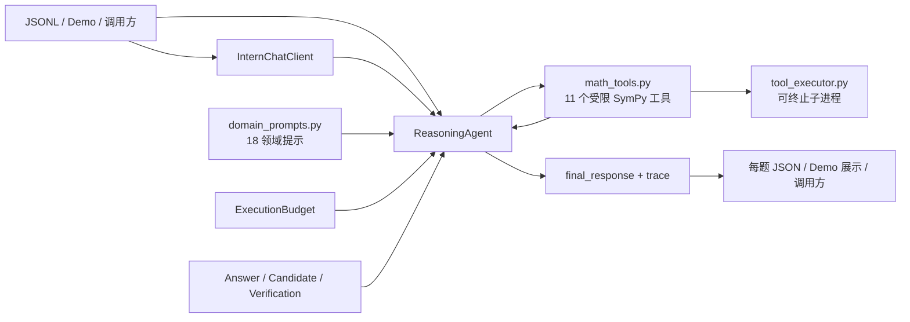

# 数学推理智能体架构

> 状态：R1 最小契约加固进行中
>
> 更新日期：2026-09-05
>
> 运行时基线：`350a267f`（R0 已定锚）；R1-1 三参数投影已使运行时合法偏离锚点
> 本文件是仓库唯一的架构事实源。工程底线、恢复门禁和重建路线由 `docs/ENGINEERING_SPECIFICATION.md` 规定，但不另行定义组件架构。

## 1. 目标与边界

系统面向竞赛数学题，在调用方注入的 Intern 兼容模型客户端上完成领域提示、候选生成、可选符号计算、模型验证、低置信度反思和答案聚合。

当前仓库只有一套可运行实现。2026-08-28 已删除未接入入口的 `math_agent/` 原型、其 `configs/`/`data/`、专属测试和 `lagent` 复现脚手架，避免并存的环境变量、输出契约和依赖继续漂移。多智能体、共享黑板和自适应候选升级属于未来设想，不是当前能力。

2026-09-04，仓库为了恢复正式平台可观测性，以普通前向提交恢复到 `350a267f` 的运行时内容。后续 S1～S6 的包化、显式上下文、统一网关、工具/评测拆分、CI 和发布系统保存在 `archive/s1-s6-1fc98b7`，当前均不是活动架构。恢复不等于否定分层：已确认的致命缺陷是后续扁平版把官方预载的同名 `llm_client` 当作项目模块，并以类身份开启私有方法；包结构本身仍缺正式因果证据。

## 2. 外部契约

```python
ReasoningAgent(client).solve(problem, metadata)
# -> {"final_response": str, "trace": list[dict]}
```

- `problem` 是题目字符串，必须非空且默认不超过 20000 字符。
- `metadata` 为竞赛兼容字典，必须可序列化为 JSON 且默认不超过 20000 字符；批处理入口会传入 `idx`，当前核心流水线不依赖其内容。
- `client` 必须提供公开 `chat(messages=..., temperature=..., max_tokens=...)`（R1-1 三参数投影），由调用方注入，运行时一律按外部对象处理。
- `final_response` 是非空字符串；除明确的 `未解出` 失败哨兵外，保留获胜候选推理，并以唯一一行 `最终答案：...` 结尾。该行只含规范化答案体，不含解释性句子；常见 Unicode/LaTeX 表示转换为稳定记号，已有精确形式时优先保留精确形式。
- `trace` 是事件列表，用于记录路由、工具、候选、验证、反思、回退、选择和单题预算摘要；R1-3 起所有字符串内容经统一脱敏截断（300 字符上限 + 显式截断标记），不含凭据类材料。
- `ReasoningAgent.solve()` 捕获全局异常并尝试低成本回退；`main.py` 将空答案和 `未解出` 视为失败记录。

R1-1（2026-09-05）已完成该收敛：运行时对所有注入 client 只调用三参数公开 `chat`，不再发送 `thinking_mode`、`tools`、`tool_choice`，也不再读取最近响应 getter；根入口已不再 import `llm_client`（IMPORT-001 碰撞面消除）。R1-2（2026-09-05）增加宽构造器：`ReasoningAgent(client, config, local_adapter=...)` 可显式注入 `local_support/xh202627_local_adapter.py` 的本地适配器（CLIENT-002，正式入口导入图之外），为本地入口恢复 usage 记账与工具调用；正式平台不传适配器，全部请求保持三参数，运行时不做任何能力探测。

## 3. 组件与数据流



| 组件 | 职责 |
| --- | --- |
| `user_agent.py` | 维护竞赛接口、固定策略候选生成、验证、反思和聚合，并协调单题预算 |
| `agent_types.py` | 定义 `Answer`、`Candidate`、`Verification` 内部数据对象 |
| `answer_equivalence.py` | 保守归一化数值、集合和多解；无法证明的关系返回 `unknown` |
| `budget.py` | 统一记录和限制每题模型请求、usage token、工具调用及阶段 deadline |
| `domain_prompts.py` | 提供 18 个领域提示；关键词路由在本地完成，不额外调用模型 |
| `math_tools.py` | 声明工具 schema，安全执行 SymPy，并驱动 tool-calling 循环 |
| `tool_executor.py` | 在可终止子进程中执行数学计算，并施加墙钟硬超时 |
| `deterministic_verifier.py` | 提供方程、导数、积分、行列式、模幂、组合数及符号等价验证原语；当前尚未接入候选选择 |
| `llm_client.py` | 读取环境变量，发送 OpenAI 兼容 HTTP 请求，处理响应和有限重试 |
| `local_support/xh202627_local_adapter.py` | 显式本地适配器（CLIENT-002）：包装自有 client，为本地入口提供 usage 记账与工具调用增强；不在正式入口导入图内 |
| `main.py` | 校验 JSONL，控制并发，保存每题 checkpoint、运行摘要并支持断点续跑 |
| `demo.py` | 将同一 `ReasoningAgent` 暴露为本地 Gradio 界面 |
| `verify_math.py` | 人工在线检查 few-shot；不属于默认测试或生产调用链 |
| `evaluation/audit_dataset.py` | 离线审计 JSONL 的规模、领域分布、来源字段、内部重复及与 prompt/sample 的重合 |
| `evaluation/judge.py` | 离线保守判分；只接受可证明等价，输出 `correct/wrong/unknown/no_answer`，不属于运行时选择链路 |
| `evaluation/rescore_report.py` | 不调用模型，使用保守判分器重新核算已有报告，并保留旧 verdict 供差异追踪 |
| `evaluation/generate_internal_benchmark.py` | 生成可复现的18领域内部合成基准；它不是生产调用链或官方独立题集 |
| `evaluation/score_run.py` | 汇总 `main.py` 逐题输出、四态判分、领域/难度/题型指标和 usage，并导出人工复核队列 |

## 4. 求解流程

1. **领域路由**：`_detect_domain()` 对 18 个领域的关键词做不区分 ASCII 大小写的计数，选择最高分领域；未匹配时使用通用提示。
2. **候选生成**：默认生成 2 个工具增强候选和 1 个纯推理候选，策略温度 `0.6`、单次上限 `8192` tokens；R1-1 起不再发送 `thinking_mode` 参数。
3. **工具循环**：每个工具候选最多 3 轮。R1-1 三参数投影后，对注入 client 的请求不再携带 API 级 `tools` 定义，工具候选退化为纯推理请求（循环与 tool_calls 处理结构保留）；R1-2 起本地入口可经显式适配器（`chat_with_tools`）恢复工具增强，正式平台保持三参数纯文本。
4. **截断回退**：候选无可抽取答案，或长回复缺少最终答案标记时，以温度 `0.0`、最多 `512` tokens 请求直接答案。
5. **验证**：每个候选默认由模型验证 1 次，温度 `0.0`，仅接受 `VERDICT: A` 为正票；长候选保留头尾，避免截掉末尾答案；验证结果写入结构化 `Verification`。有可抽取答案的候选仍按既有策略加 `0.3`，无答案减 `0.5`。
6. **批评与反思**：最佳候选原始置信度低于 `0.5` 且已有答案时，先批评；存在明确问题时以温度 `0.3` 生成反思候选并再次验证。
7. **聚合**：抽取为结构化 `Answer`，使用保守 canonical key 归一化精确数值、集合、多解、常见 Unicode 上下标和 LaTeX 包装，按多数票优先；无法证明的符号或语义等价不合并。没有多数项时选择置信度最高的候选。答案和展示推理始终取自同一个获胜答案组。
8. **构造响应**：移除模型文本中已有的答案标签，保留其余获胜候选推理，并统一追加唯一的 `最终答案：...`。答案体经共享安全归一化后输出；精确值与近似值同时存在时保留精确部分，并规范角度符号、`πi` 显式乘法及常见特征根标签；fallback 也通过同一构造逻辑。

`deterministic_verifier.py` 已提供受硬超时保护的确定性验证原语，但本层保守改动没有把它们接入第 5～7 步，也没有改变候选数量、温度、thinking mode 或模型选择。接入前必须先建立固定回归集并验证假阳性/假阴性。

默认配置由 `AgentConfig` 管理：

| 参数 | 默认值 |
| --- | ---: |
| `tool_candidates` / `plain_candidates` | `2` / `1` |
| `verifier_voting_times` | `1` |
| `policy_temperature` / `verifier_temperature` | `0.6` / `0.0` |
| `critic_temperature` / `reflection_temperature` | `0.3` / `0.3` |
| `max_tokens` / `verifier_max_tokens` / `critic_max_tokens` | `8192` / `1024` / `1024` |
| `fallback_max_tokens` | `512` |
| `max_tool_rounds` | `3` |
| `tool_timeout_seconds` | `5.0` |
| `max_model_requests` | `16` |
| `max_total_tokens` | `200000` |
| `max_tool_calls` | `48` |
| `problem_timeout_seconds` | `600.0` |
| `max_problem_chars` / `max_metadata_chars` | `20000` / `20000` |
| tools / critic / reflection / fallback | 全部启用 |

## 5. 数学工具

当前注册 11 个工具：

| 工具 | 用途 |
| --- | --- |
| `calculate` | 解析、化简表达式 |
| `solve_equation` | 解一元方程 |
| `differentiate` | 求导 |
| `integrate` | 不定积分 |
| `limit` | 求极限 |
| `residue` | 求复函数留数 |
| `matrix_det` | 求矩阵行列式 |
| `matrix_eigenvals` | 求矩阵特征值 |
| `gcd_lcm` | 求最大公约数与最小公倍数 |
| `mod_pow` | 模幂 |
| `binomial` | 组合数 |

模型工具参数是不可信输入。执行层使用无 builtins 的 SymPy 白名单命名空间，并限制表达式 2048 字符、工具参数 8192 字符、结果 8000 字符、矩阵最大 `12×12`、整数最多 1000 位、组合数 `n≤100000`、幂指数 `≤10000`、每轮最多 8 个工具调用。每次注册工具计算在 spawned 子进程中运行，默认超过 5 秒即由父进程终止。未知工具、畸形 JSON、越界输入、超时和子进程失败均返回受控错误，不进入任意代码执行路径。

## 6. 客户端与运行器

`InternChatClient` 使用：

| 环境变量 | 默认值 |
| --- | --- |
| `INTERN_API_KEY` | 无，缺失时拒绝启动 |
| `INTERN_API_BASE` | `https://chat.intern-ai.org.cn/api/v1/chat/completions` |
| `INTERN_MODEL` | `intern-s2-preview` |

客户端拒绝 `stream=True` 和 `n != 1`。只重试连接错误、超时、HTTP `408/409/425/429`、服务端 `5xx`，以及响应 code/type/message 明确表示频率限制的 HTTP 400；普通参数错误和认证错误直接失败。客户端保留 `chat` 的可选扩展参数（`thinking_mode`、`tools` 等）供本地显式调用，并新增 `meta_sink` 回调（R1-2）：成功响应后以回调交付 usage 等元数据，不进入 HTTP payload。原 `get_last_response_meta()` 静态方法与 ContextVar 已删除（R1-2 迁移至显式本地适配器）。本地运行经 `LocalToolAdapter` 恢复单题 usage 记账；正式平台无适配器时 usage 记账为 0，请求数、工具调用与 deadline 预算不受影响。

`main.py` 读取 JSONL，每行必须是对象且含非空 `problem`。`idx` 缺失时按行生成；显式 `idx` 必须是 1～128 位 ASCII 字母、数字、下划线或连字符，且不能重复。结果写入 `<output_dir>/<idx>.json`，先写 `.tmp` 再原子替换。只有合法 JSON、`status == "success"` 且 `final_response` 非空的 checkpoint 会被跳过。`未解出` 保存为 error checkpoint，并保留 Agent trace 供区分数学失败、预算和平台错误。并发由 `LOCAL_MAX_CONCURRENCY` 控制，默认 `3` 且必须为正整数；正式评测可在 manifest 中冻结为更低值以规避端点节流。批处理完成后原子写入 `<output_dir>/_run/run_summary.json`，包含输入文件名和 SHA-256、模型、并发、UTC 开始时间、耗时以及成功/失败/跳过计数，不包含题面或密钥。

## 7. 信任边界与失败行为

- API key 只从环境变量读取；`.env`、`outputs/` 和验证报告被 Git 忽略。
- 题目、metadata、模型文本、tool calls、HTTP/JSON 响应和 checkpoint 均视为不可信输入。
- trace 会包含题面衍生内容、候选片段和工具结果，输出目录应按敏感数据管理。
- 工具调用失败会退化到纯推理；候选截断会尝试快速回退；全局异常仍保证接口返回结构稳定。
- R1-4 生命周期兜底：验证或反思阶段预算耗尽时，已生成候选以无票状态进入聚合（聚合不消耗预算），trace 记录 `verify_budget_exhausted`/`reflect_budget_exhausted`；生成阶段预算耗尽仍返回 `未解出`。
- SymPy 子进程有墙钟硬超时，但尚无操作系统级内存上限；复杂表达式在超时前仍可能形成内存峰值。
- 单题 deadline 在各模型/工具调用边界检查，无法提前取消已发出的阻塞 HTTP 请求；单请求由客户端超时保护。
- token 上限依赖响应 usage 后记账；一次响应若造成超额，后续请求会停止，但已产生的 token 无法撤销。
- 模型输出具有随机性。正确率、延迟和成本结论必须绑定固定数据集、模型、配置和提交记录。

## 8. 验证边界

默认离线检查：

```bash
python -m pytest -q
python -m compileall -q .
python -m ruff check .
```

测试以 fake client 和确定性输入覆盖接口、预算、工具、客户端及 runner，不依赖真实 API。`python evaluation/audit_dataset.py <dataset>` 可离线检查题集规模、元数据和泄漏风险；`evaluation/judge.py` 的文字语义与无法证明等价关系必须保持 `unknown`，禁止用子串命中判对。`python verify_math.py` 默认只解析 few-shot，不访问 API；只有 `--execute` 才会在线验证，并由 `--max-requests` 限制首轮和重试总请求数。`main.py` 和 `demo.py` 使用真实凭据时会消耗配额，不应进入默认 CI。

## 9. 架构变更规则

以下变化必须同时更新本文件、README 和相应测试：外部接口、候选/验证流程、工具注册与安全界限、环境变量、运行入口、checkpoint 格式或目录布局。实验数据与演进历史写入 `技术报告.md`，待办与风险写入 `docs/AUDIT_AND_OPTIMIZATION.md`，不要另建第二份架构文档。

可维护架构可以重新引入，但顺序受 `docs/ENGINEERING_SPECIFICATION.md` 约束：先取得恢复锚点的正式非零请求，再加固最小 client/入口契约，随后建立可信能力基线，最后单独验证物理模块结构。根 `user_agent.py` 必须真实声明入口类；新正式模块优先使用 `xh202627_*` 一类唯一前缀，不得使用 `agent`、`context`、`solver`、`budget`、`llm_client` 等通用顶层名。正式网关不得根据 client 的类身份、同名方法或动态属性启用私有能力。

结构迁移必须满足四项等价门禁：官方 `llm_client` 先加载、严格三参数 client、完整 `sys.modules` 污染矩阵、仓库外隔离导入。迁移前后使用同一 fake 响应序列，且正式评测中不能同时改变 prompt、候选数、温度、模型、工具或聚合策略。

任何架构工作在修改前必须由 `.agents/policy_guard.py --paths` 显示 `IMPORT-*`、`CLIENT-*`、`ENTRY-*`、`CHANGE-001` 和 `DOC-001` 等实际触发项，修改后用 `--changed` 复核。出现 blocker 时，工作 agent 必须先显式报告规则和安全替代，再停止触线子动作；架构便利不能作为豁免理由。
