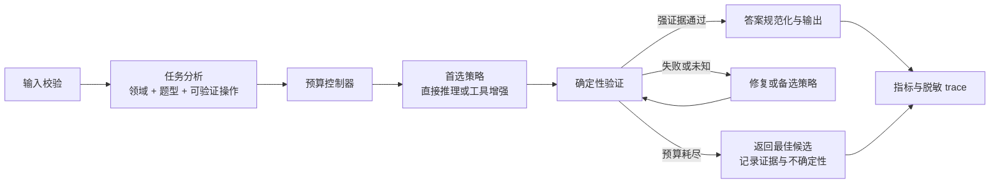

# 全方位审计与优化方案

> 初始审计日期：2026-08-31；最近状态更新：2026-09-03
> 审计对象：当前工作区中的唯一运行链路及其测试、Demo、依赖、文档和交付材料  
> 文档边界：本文件记录问题、目标和实施路线，不定义当前架构。当前架构唯一事实源仍是根目录 `ARCHITECTURE.md`。

## 1. 总体判断

当前项目在离线工程层已经达到“可运行数学 Agent”的标准：竞赛接口、18 领域提示、模型调用边界、批处理、断点续跑和 Demo 均已打通；11 个本地数学工具也保留独立测试。由于连续四次正式评测均为 `0 request / 112 error`，正式 `solve()` 暂时只运行保守兼容内核，物理模块已回迁仓库根目录；在线可运行性仍须下一次平台结果确认。

当前项目还没有达到“可靠数学求解器”的标准。项目报告记录的 112 题隐藏集水平约为 22%，历史峰值为 28.57%；当前只有 3 道公开样例，无法证明跨 18 领域的稳定正确率。第一层保守改动已经补上结构化答案、预算、工具硬超时、usage 和运行摘要，S0+S1 消除了重复实现，S2～S4 完成分层；2026-09-04 又在不撤销这些分层的前提下把物理模块回迁仓库根目录，以隔离排查连续四次 0 request。上述工程变化本身都不证明解题能力提高。当前主要瓶颈不是 Agent 数量，而是以下五项：

1. 缺少能代表真实题型分布的固定回归集；
2. 确定性验证曾接入严格直接题但当前正式路径暂停；即使恢复，对证明、复合目标和带约束任务覆盖仍窄；
3. 每题固定生成和验证多个候选，调用成本高且多数投票可能放大共同错误；
4. SymPy 已有子进程硬超时，但尚无操作系统级内存上限和完整函数复杂度限制；
5. usage 与批处理汇总已可采集，仍缺少固定数据集上的正确率、验证冲突和失败分类指标。

因此，优化顺序应当是：**可信评测 → 确定性验证 → 自适应预算 → 工具隔离 → 可观测性 → Demo 与交付**。不建议先增加多智能体或更多候选。

## 2. 目标定义与验收口径

“解数学题”不能只用“能输出答案”作为完成标准。项目目标应拆成六个可验证结果：

| 目标 | 必须记录的指标 | 建议初始门槛 |
| --- | --- | --- |
| 数学正确性 | 精确/等价正确率、按领域正确率、无效答案率 | 固定公开集不低于基线；每次优化必须有可重复增益 |
| 领域覆盖 | 18 领域题数、题型数、工具覆盖 | 每领域至少 3 题，总计不少于 60 题 |
| 可靠性 | 超时率、异常率、空答案率、checkpoint 恢复率 | 离线异常路径全部有测试；单题永不无限运行 |
| 成本性能 | 请求数、输入/输出 token、P50/P95 延迟、工具轮数 | 每题不得超过配置预算；优化后正确率不降且平均调用下降 |
| 安全隐私 | 工具超时、输入长度、密钥/PII/trace 管理 | 工具硬超时 100% 生效；公开仓库无密钥和非必要个人信息 |
| 可复现性 | commit、模型、配置、数据哈希、重复次数 | 每次结果都可追溯；随机结论至少重复 3 次或报告区间 |

准确率目标不能根据 3 道样例制定。第一阶段先建立公开基线，再冻结验收阈值。隐藏集结果只能用于最终外部验证，不能承担日常回归测试。

## 3. 当前证据基线

| 项目 | 当前事实 |
| --- | --- |
| Git 基线 | `main` 分支；具体实验必须记录当次完整 commit，不在文档中固定易过期的 HEAD |
| 外部接口 | `ReasoningAgent.solve(problem, metadata) -> {final_response, trace}` |
| 领域与工具 | 18 个领域提示，11 个受限 SymPy 工具 |
| 候选策略 | 当前正式配置为 3 个纯文本候选，每个候选默认验证 1 次；旧工具/确定性/critic/reflection 开关不能启用另一正式路径 |
| 常规模型调用 | 默认恰好 6 次/题；只有截断恢复或整题紧急答案可使用额外 4 次恢复预算 |
| 公开题目 | 3 道 `sample_data/dev.jsonl` 样例，只能做接口 smoke；本地 36 题 A/B 集也已判定不适合作为正确率基准 |
| few-shot | 18 个领域共 21 个示例；已修复验证脚本只解析 18 个的问题 |
| 离线测试 | 覆盖运行链路，并新增题集审计、保守四态判分和唯一最终答案行回归测试；以最新 CI/本地测试输出为准 |
| 语句覆盖率 | 2026-08-31 S3+S4 后全仓离线统计为 82%；生命周期入口 `agent.py` 75%、顶层 `solver.py` 93%、工具解析/注册/循环 83%/81%/85%、评测共享 I/O 83%，确定性验证器与在线检查脚本仍是主要缺口 |
| 静态与安全检查 | Ruff、compileall、Bandit、`pip check`、`pip-audit`、skill 校验通过 |
| 在线验证 | 本轮未调用真实 API；没有对当前工作树生成新的正确率结论 |
| 附加 A/B 报告 | 已找到本地 36 题集和旧判分脚本。人工复核两版均为 36/36，但题量、难度、来源、prompt 重合和判分器均存在问题，结果只能说明 smoke 集已饱和 |
| 工程交付 | S5/S6 已加入 Python 3.10/3.12 CI、70% 覆盖率门槛、三套哈希锁、敏感信息/链接检查、明确许可证边界、机器质量报告和确定性发布包；当前工作树的最终诊断见第 22～23 节 |

这些证据能证明代码可运行和已有基础安全控制，不能证明 18 领域数学正确率、真实成本或线上稳定性。

## 4. 全维度状态表

| 维度 | 当前状态 | 核心缺口 | 优先级 |
| --- | --- | --- | --- |
| 产品目标 | 基本明确 | “高正确率”“可接受成本”没有量化门槛 | P0 |
| 运行架构 | 唯一根目录分层实现 + `user_agent.py` 兼容门面；Agent 生命周期、顶层编排、候选阶段与工具子系统均已分层 | 扁平部署的官方兼容性仍待验证；大型题型路由与确定性验证模块可按后续证据继续演进 | P2 |
| 数学策略 | 当前正式路径为领域提示、三纯文本候选、模型验证与多数票；工具增强、题型识别和确定性证据作为暂停能力保留 | 先证明平台请求链恢复，再逐个变量重启能力；证明和复合目标仍缺独立真值 | P1 |
| Prompt | 18 领域，有 few-shot | 缺少版本化、离线校验和消融记录 | P1 |
| 领域路由 | 本地零调用、已支持 ASCII 大小写 | 关键词重叠、无置信度、无多标签 | P1 |
| 数学工具 | 11 个工具，有输入/结果限制和 5 秒子进程硬超时 | 无内存硬上限；短表达式仍可能触发高复杂度计算 | P1 |
| 模型验证 | 当前每候选仅做一次同模型紧凑 verifier；保留的确定性库不影响正式选择 | 证明和语义题的 verifier 与求解器同源，不能提供独立真值 | P1 |
| 答案处理 | 已有 `Answer` 类型及数值、集合、多解的保守 canonical key | 区间和复杂符号等价覆盖仍有限 | P1 |
| 聚合选择 | 当前固定 canonical answer 多数票，平票按模型置信度；旧确定性证据被忽略 | P1 真实增益尚未完成匿名 A/B；不可验证题仍受多数票相关错误影响 | P0 |
| 评测体系 | 已有题集审计器、保守四态判分器、固定 PutnamBench 120 题 × 3 冻结基线、盲审和配对统计入口 | 仍缺候选版本匿名配对盲审，以及 100～200 题独立密封验收集 | P0 |
| 客户端 | 有超时、选择性重试和响应 usage/模型/id/耗时元数据 | 无 Retry-After、抖动和统一错误码 | P1 |
| Runner | 有 JSONL 校验、原子 checkpoint、并发、单题预算和脱敏运行摘要 | deadline 不能取消在途 HTTP；尚未流式读取 | P1 |
| 可观测性 | 内部事件经公开元数据白名单投影；保留阶段、状态、编号、长度、调用量、耗时和预算摘要 | 内部事件生产格式仍可继续收敛，但自由正文不再进入公开 trace | P2 |
| 安全隐私 | 密钥忽略、工具白名单、路径安全、公开 trace 脱敏；公开提交文档已移除手机号；本地/CI 与发布包均有不回显凭据的扫描 | 启发式 secret scan 不能替代凭据轮换和托管平台 push protection | P2 |
| 测试 | 已补答案等价、题型路由、数域/漏根、证据冲突回退、预算、工具超时、dry-run 和汇总测试 | Demo、在线 Agent 评测和部分编排分支覆盖不足 | P1 |
| Demo | 本地监听，展示 trace | 无调用确认、预算提示、取消、排队和结果反馈 | P1 |
| 依赖供应链 | 运行、开发、Demo 均有精确版本和制品哈希锁；CI 自动执行依赖审计，直接依赖与第三方边界已记录 | 仍需持续处理 Dependabot/审计告警；新增依赖的许可证兼容性需要人工决策 | P1 |
| 文档治理 | README、AGENTS、skill、唯一架构文档、许可证和第三方说明齐全 | 比赛陈述中的成绩证据仍需按最终提交复核，队伍/平台信息仍待所有者填写 | P1 |
| 发布交付 | 正式包从干净提交 Git blob 生成，绑定质量报告、manifest 和 SHA-256；脏树只能生成 draft | 尚未在远程 CI 实际运行本工作树；AtomGit 地址和最终参赛主体信息待填 | P1 |

## 5. 已验证缺陷与风险清单

### 5.1 本轮已直接修复

| ID | 问题 | 原影响 | 修复与证据 |
| --- | --- | --- | --- |
| COR-001 | 聚合答案可能来自 B/C，但最终响应保留最高置信度 A 的不同答案 | 多数投票结果被覆盖 | 聚合同时返回获胜答案及同组候选文本；已加回归测试 |
| COR-002 | verifier/critic 只读取候选前 3000 字符 | 长推理末尾答案被截掉 | 改为保留头尾的审阅摘要；已测试末尾答案存在 |
| COR-003 | fallback 可能返回没有 `最终答案：` 标记的裸字符串 | 外部输出契约不一致 | 所有 fallback 通过统一响应构造；已加测试 |
| PROMPT-001 | 通用提示把所有领域答案限制为数字/分数 | 集合、公式、区间、证明结论受损 | 改为允许数学表达式、集合、区间、公式和结论 |
| PROMPT-002 | PDE few-shot 缺少初速度却给出 `B_n=0` 的解 | 向模型注入错误先验 | 补充 `u_t(x,0)=0` 并说明 `B_n=0`；已加静态测试 |
| PROMPT-003 | 抽象代数 few-shot 最终答案写成 `81-9=72` | 答案等价与数值聚合不稳定 | 最终答案规范为 `72` |
| EVAL-001 | 在线脚本只解析 21 个 few-shot 中的 18 个 | 验证覆盖被高估 | 解析器现覆盖全部 21 个；已加测试 |
| EVAL-002 | 字符串子串匹配会把 `1` 与 `10`、`收敛` 与 `不收敛` 判为一致 | 评测假阳性 | 改为保守的归一化完全匹配；已加反例测试 |
| TOOL-001 | 单轮超过 8 个 tool calls 时，没有为被拒调用返回 tool 消息 | 下一轮可能因响应不完整被 API 拒绝 | 为所有超限调用返回受控错误 tool 消息；已加协议测试 |
| ROUTE-001 | 英文关键词区分大小写 | `ode`、`pde` 等小写输入漏路由 | 使用 `casefold()` 比较；已加测试 |
| ANSWER-001 | 候选与答案使用散落字典，等价判断主要靠 float/字符串 | 复杂答案易误组，证据不可追踪 | 引入 `Candidate/Answer/Verification`；数值用精确分数，集合/多解保守规范化，未知不猜测；已测试 |
| EVAL-004 | 在线脚本默认执行且没有总请求上限 | 可能意外消耗配额 | 默认 dry-run；只有 `--execute` 才联网，首轮和重试共享 `--max-requests`；已测试无 client 构造 |
| BUDGET-001 | 所有生成、验证、反思和工具分支没有共享预算 | 调用可无统一上界 | 引入单题 `ExecutionBudget`，统一限制模型请求、已报告 token、工具调用和阶段 deadline；trace 写入摘要；已测试 |
| TOOL-002 | SymPy 在主进程运行且无法终止 | 复杂合法输入可拖住主流程 | 所有注册工具及确定性验证均进入 spawned 子进程，默认 5 秒超时后终止；已测试真实超时。内存硬上限仍列为剩余风险 |
| INPUT-001 | 核心接口不限制题目和 metadata | 超大输入增加费用和内存压力 | 调用模型前校验 problem、metadata 类型、JSON 可序列化性及默认 20000 字符上限；已测试零调用拒绝 |
| RUN-001 | 只有单次 HTTP 超时，没有单题统一 deadline | 多分支可持续累积 | 单题预算在每次模型/工具调用前检查 600 秒 deadline；在途 HTTP 仍只能依赖客户端超时 |
| RUN-002 | Runner 无成功/失败/跳过/耗时汇总 | 运行结果难核查 | 输出 `_run/run_summary.json`，记录输入文件名/SHA-256、模型、耗时、并发与计数，不记录题面 |
| RUN-003 | `未解出` 在 runner 转换为异常时丢弃 Agent trace | 无法区分数学失败、预算耗尽和 API 节流 | 保存为 error checkpoint并保留原始 trace；已加回归测试 |
| CLIENT-001 | 响应 usage 与结束原因未采集 | 无法核对 token 或定位截断 | `chat()` 保持原返回契约；`chat_with_metadata()` 与 `ModelGateway` 原子绑定响应、usage、模型、request id、`finish_reason`、耗时和尝试次数，预算统一累计并按阶段统计 |
| EVAL-005 | 36 题 A/B 原始分数从 33/36 降至 32/36 | 表面上像工程重构造成能力回退 | 已知 wrong 来自 Unicode/LaTeX 格式漏判，但旧判分器同时存在文字包含假阳性，原始分数整体作废；运行时与离线判分现共享安全归一化，并加入格式正反例测试 |
| CLIENT-003 | 平台把“请求过于频繁”作为 HTTP 400 + `invalid_request_error` 返回 | 客户端把临时限流当永久参数错误，正式评测可能直接丢题 | 仅当 400 响应的 code/type 或 message 明确表示限流时重试；普通 400、401 不重试；已加正反测试 |
| EVAL-006 | 旧判分器用双向子串包含判定 | `1`/`10`、肯定/否定文字可能出现假阳性 | 新增四态保守离线判分；无法证明等价时返回 `unknown`，符号验证受子进程硬超时保护 |
| OUTPUT-001 | 模型可能输出重复答案标签、Unicode/LaTeX 变体或解释性整句 | runner/外部判分格式不稳定 | 统一响应构造：移除已有答案标签，保留推理并追加唯一规范化最终答案行；prompt 明确答案体规则，已加回归测试 |
| DATA-002 | 36 题集无来源/许可/split/难度，且与 prompt 示例强重合 | 36/36 不能作为独立正确率证据 | 新增题集审计器，报告规模、领域分布、元数据、重复和 prompt/sample 重合；旧集降级为 smoke |
| TRUNC-001 | 隐藏集 1082 次请求有 106 次截断，旧逻辑可能把残句抽成答案；验证截断也会被当作失败票 | 候选污染、`invalid`、错误选择和不可定位的可靠性回退 | 已增加 1800/3500 题型长度目标、调用级阶段元数据、每候选一次恢复、整题紧急答案、验证重试/unknown、批评隔离、最终结构校验、分阶段统计和 Wilson 门禁；所有截断文本在聚合前隔离，离线 scripted-client 回归覆盖主要分支。尚待真实压力测试确认低于 5% |
| BUILD-001 | 无 CI、覆盖率门槛、锁文件和 secret scan | 合并质量与依赖安装不可复现 | S5 增加完整非模型质量入口、Python 3.10/3.12 SHA 固定 CI、70% 覆盖率门槛、三套完整哈希锁、依赖审计、敏感信息和 Markdown 链接检查；三套锁已在全新隔离环境安装验证 |
| DELIVERY-001 | 提交 hash 与文件清单依赖手工填写，脏工作树也可能被打包 | 交付来源、质量证据和内容不可复核 | S6 增加正式/草稿状态机；正式包只读取干净提交 Git blob，并嵌入 commit/tree、模型、默认配置、锁哈希、逐文件哈希与质量摘要，另生成 ZIP SHA-256 |
| LICENSE-001 | 项目代码与第三方依赖没有明确许可边界 | 使用、提交和再分发范围含糊 | 根 `LICENSE` 采用不擅自授权的保守“保留所有权利”声明，`THIRD_PARTY_NOTICES.md` 区分运行、开发、Demo 依赖和数据许可；更换开源许可证保留为所有者决策 |

### 5.2 仍需解决的高价值问题

| ID | 问题与证据 | 影响 | 建议 |
| --- | --- | --- | --- |
| QUAL-001 | 当前仍固定生成 3 个候选；项目报告记录 5/8 候选和多数投票在低单次正确率时有害 | 正确率下降、调用增多 | 改为“单候选 → 确定性验证 → 失败才升级” |
| VER-001 | verifier 与 solver 使用同一模型，只有二元文本判断 | 共同错误无法发现 | 建立工具驱动的确定性验证，模型 verifier 降为弱证据 |
| VER-002 | “有可抽取答案”固定加 0.3 分 | 格式完整可能压过数学正确性 | 分数由证据等级组成，不奖励仅有格式的答案 |
| EVAL-003 | `verify_math.py` 直接问基础模型，没有调用 `ReasoningAgent` | 不能衡量真实 Agent | 拆成 prompt lint 与 Agent evaluation 两个入口 |
| DATA-001 | 已建立固定 PutnamBench 公开大学竞赛对照、数据哈希、盲审和配对统计；仍缺独立命题或私有第三方的密封验收集 | 公开集可比较版本，但预训练污染未知，不能单独估计陌生题实际正确率 | 公开 120 题用于同题 A/B；另建 100～200 题一次性密封验收集，记录来源/许可/split/难度并隔离 prompt |
| TOOL-003 | `factorial`、`gamma`、`simplify`、精确特征值等可在短输入上产生高复杂度 | 字符长度不能限制计算复杂度 | 函数级参数边界、复杂度计数、超时和降级数值计算 |
| CLIENT-002 | 重试未尊重 `Retry-After`，无随机抖动 | 限流时可能同步重试 | 优先服务端等待值，再用有上限指数退避与 jitter |
| OBS-001 | 内部 trace 生产者仍使用松散 `dict`，但公开边界已投影为封闭元数据 schema | 内部事件名漂移仍影响诊断统计，不再直接造成公开正文泄漏 | 后续把生产者逐步改为 typed event；不得绕过公开投影 |
| PRIV-001 | 旧 trace 保存候选、verifier、critic、工具结果、答案和异常片段 | 私有题目或模型输出可能泄露 | 已以失败关闭白名单修复，并加入题面/模型/答案哨兵、幂等与 JSON 性质门禁；原始实验输出继续隔离 |
| PRIV-002 | `SUBMISSION_INFO.md` 含真实手机号 | 公开仓库产生个人隐私风险 | 公共仓库改占位符，私人提交包在生成时注入 |
| TEST-001 | `agent.py` 与 `verify_math.py` 的部分在线和异常分支仍未覆盖 | 关键分支仍有回归风险 | 用 scripted fake client 继续覆盖超时、冲突和错误响应；在线 smoke 保持显式执行 |
| DEMO-001 | 点击即调用真实 API，无确认、预算展示、取消或队列限制 | 误触费用、重复请求和体验不稳定 | 增加确认、预计调用上限、禁用重复提交、取消和反馈导出 |
| DELIVERY-002 | 成绩和调用数据只在报告中陈述，仓库缺少去敏汇总证据 | 结果难以复核 | 提交匿名化实验 manifest、汇总指标和数据哈希，不提交私有题面 |

## 6. 建议的目标运行流程

以下是待实验验证的优化方向，不代表当前已经实现；采纳后再更新 `ARCHITECTURE.md`。



核心原则：

- 先尝试最便宜且最可验证的策略；
- 确定性证据优先于同源模型投票；
- 未知不等于错误，验证器必须允许 `pass/fail/unknown`；
- 只有失败或未知时才增加候选、反思或模型调用；
- 所有分支共享同一个请求、token、时间和工具预算；
- 最终理由、答案和证据必须来自同一个获胜候选。

## 7. 十条优化工作流

### 7.1 评测与数据

已新增 `evaluation/` 基础层，并与运行代码分离：

- `audit_dataset.py`：统计规模、领域分布、元数据、重复及 prompt/sample 重合；
- `judge.py`：`correct/wrong/unknown/no_answer` 四态保守判分；
- `benchmark.jsonl`：公开、许可明确、去敏的固定题集（待建立）；
- `manifest.json`：数据版本、SHA-256、领域分布、答案类型；
- `run_eval.py`：运行真实 `ReasoningAgent`，支持恢复、预算和多次重复；
- `answer_equivalence.py`：保守等价判定；
- `report.py`：按领域、题型、工具和失败类型生成汇总。

数据记录至少包含：`id/problem/expected_answer/answer_type/domain/task_type/source/license`。私有题面不进入仓库，只提交哈希和匿名汇总。

验收：60 题可作为早期开发回归下限，不作为能力认证；用于总体约 ±5 个百分点精度的简单随机估计时，最保守情形约需 385 道独立题，按 18 领域分别下结论还需要更多。题集还须覆盖数值、分数、表达式、集合、区间、多解、公式、证明和文字结论，并报告置信区间及 A/B 配对差异。

### 7.2 内部答案与候选模型

新增明确的数据对象，替代散落字典：

```python
@dataclass
class Candidate:
    reasoning: str
    raw_answer: str
    normalized_answer: str
    answer_type: str
    strategy: str
    tool_evidence: list
    verification: list
    calls: int
    tokens: int
    latency_ms: int
    errors: list
```

`Verification` 至少包含 `status=pass/fail/unknown`、证据类型、详情和强度。选择器只按证据和预先定义的规则工作，不能因为答案格式完整就直接加分。

验收：答案与展示推理始终来自同一候选；复杂答案无法安全判等时返回 `unknown`，不产生假阳性。

### 7.3 任务路由

保留零成本领域关键词，但增加任务类型：方程、导数、积分、极限、留数、矩阵、模运算、组合数、证明、优化、概率等。路由输出应包含：

- 领域及置信度；
- 一个或多个任务类型；
- 推荐求解策略；
- 可用工具；
- 可执行验证器。

低置信度和多标签时使用通用提示，不强行选错领域。路由准确率单独在标注集上评估。

### 7.4 确定性数学验证

优先实现与现有 11 个工具配套的验证器：

| 题型 | 验证方式 |
| --- | --- |
| 方程 | 将候选根代回；检查遗漏根和定义域 |
| 导数 | 候选与符号导数作差化简，并做安全数值采样 |
| 积分 | 对候选求导，与被积函数比较 |
| 极限 | 符号极限与高精度单侧/双侧采样交叉检查 |
| 留数 | 直接计算或用洛朗系数复核 |
| 矩阵 | 行列式、迹、特征值和/积、不变量检查 |
| 数论 | gcd、模幂和同余直接复核 |
| 组合 | 整数性、边界、小规模枚举或公式复核 |
| 概率 | 范围 `[0,1]`、概率和、期望边界及小规模枚举 |
| 证明/抽象题 | 只能使用规则检查和模型评审，状态默认 `unknown` |

所有符号验证也必须走隔离进程和预算，不能让“验证”成为新的资源攻击面。

### 7.5 自适应预算控制

建议默认策略：

1. 生成 1 个首选候选；
2. 若确定性验证通过，立即返回；
3. 若失败，带具体反例修复 1 次；
4. 若未知，再生成不同策略的备选候选；
5. 只有候选冲突且预算允许时调用模型 verifier；
6. 达到 deadline 或预算后返回最佳证据候选并记录原因。

预算对象统一管理：模型请求数、输入/输出 token、工具调用数、工具 CPU 时间和单题墙钟时间。先用固定回归集比较，再决定默认上限，不能凭经验直接写死新参数。

### 7.6 Prompt 与领域知识

- 为每个 prompt 增加版本号和变更原因；
- 建立静态检查：必须有最终答案协议、few-shot 可解析、工具名存在、无相互矛盾约束；
- 每个 few-shot 先通过人工/确定性校验再进入 prompt；
- 将“领域知识”“输出格式”“工具使用原则”分离，减少重复 token；
- 证明题、计算题、集合/公式题使用不同答案格式说明；
- prompt 改动必须在固定集上做 A/B，不以单道样例决定。

### 7.7 工具安全与能力

- 使用独立子进程执行 SymPy，父进程负责超时终止；
- 对 `factorial/gamma/simplify/solve/eigenvals` 增加函数级规模限制；
- 记录执行耗时、输入摘要、结果状态和错误码；
- 将工具错误分类为 `invalid_input/unsupported/timeout/resource/internal`；
- 确定性验证与求解工具复用实现，但使用独立证据事件；
- 工具扩展必须先证明对应题型在回归集中存在，避免继续堆低利用率工具。

### 7.8 客户端、Runner 与可观测性

- 客户端返回文本、tool calls、usage、模型、请求 ID 和耗时；
- 重试尊重 `Retry-After`，加入 jitter，并记录重试原因；
- runner 增加 `--max-requests-per-problem`、`--problem-timeout`、`--trace-level`；
- 为每次运行生成不可变配置快照、数据哈希和 `run_summary.json`；
- 事件 schema 至少包含 `event/type/status/duration_ms/calls/tokens/content_preview/error_code`；
- 默认 trace 使用 minimal 模式，debug 模式才保留候选摘要。

### 7.9 测试、CI 与供应链

测试金字塔：

1. 纯函数：答案解析、等价、路由、预算和工具边界；
2. scripted fake client：完整 Agent 流程、冲突候选、反思、超时和降级；
3. runner：断点、并发、deadline、汇总和损坏文件；
4. 少量显式在线 smoke，不进入默认 CI；
5. 固定数学回归集，按需执行并保存 manifest。

CI 至少包含：pytest、coverage gate、Ruff、compileall、Bandit、依赖审计、secret scan 和 Markdown 链接检查。运行依赖生成可复现锁文件；许可证由项目所有者根据竞赛与第三方材料做出明确选择。

### 7.10 Demo、隐私与交付

- 首次调用前显示模型、预计最大请求数和可能费用；
- 防重复点击、限制并发、支持取消；
- 同时展示“答案”“证据”“调用统计”，避免把内部 trace 当作正确性证明；
- 允许用户标记正确/错误并导出匿名反馈；
- 默认不展示完整候选和工具原始输入；
- 公共仓库提交说明使用姓名、电话占位符；私人交付包由脚本注入；
- 打包脚本自动写入 commit、模型、依赖锁、文件 SHA-256 和检查结果；脏工作树拒绝生成正式包。

## 8. 实验矩阵

按以下顺序做单变量实验：

| 实验 | 变化 | 主要回答的问题 |
| --- | --- | --- |
| E0 | 当前 2 工具 + 1 纯推理 + 模型验证 | 建立可重复基线 |
| E1 | 单首选候选，其余不变 | 固定多候选是否值得成本 |
| E2 | E1 + 确定性验证通过即停 | 能否同时提高正确率并减少调用 |
| E3 | E2 + 验证失败后一次定向修复 | 反例驱动修复是否有效 |
| E4 | E3 + 冲突时才启用第二候选 | 自适应升级的边际收益 |
| E5 | E4 + 模型 verifier 仅处理 unknown | 模型验证的真实增益和误判率 |
| E6 | 路由/Prompt 单独 A/B | 领域提示是否带来统计增益 |

每次实验记录：commit、模型、完整配置、数据哈希、重复次数、正确率、按领域正确率、请求数、token、P50/P95 延迟、超时、工具成功率、验证假阳性/假阴性和错误类型。一次只改变一个变量。

建议采纳门槛：

- 正确率改动：固定集不退化，并在重复运行中表现一致；
- 成本改动：正确率不退化时，平均请求或 token 至少下降 20%；
- 安全改动：恶意/复杂输入测试全部受控失败，无挂起；
- Prompt 改动：总体不退化，且任何领域下降都必须有解释；
- 新工具：至少解决固定集中的真实失败类型，并有确定性验证测试。

## 9. 分阶段实施路线

### M0：建立可信基线

实施：

1. 创建公开评测 schema、数据 manifest 和至少 60 题开发回归集，再建立与 prompt 隔离的更大盲测集；
2. 把 `verify_math.py` 改为默认 dry-run，并增加显式请求预算；
3. 建立 Agent 级评测入口，而不是直接询问基础模型；
4. 补答案类型和保守等价测试；
5. 记录当前策略的准确率、调用、token、延迟和失败类型。

退出条件：评测可在同一 commit/config/data 上重复；所有 18 领域有样本；任何优化都能与 E0 比较。

### M1：提高数学正确性

实施：

1. 引入 `Candidate/Answer/Verification`；
2. 实现方程、导数、积分、极限、矩阵、数论和组合的确定性验证；
3. 把固定三候选改为自适应升级；
4. 用明确反例驱动修复，不再使用泛化的“请反思”；
5. 完成 E1～E5 消融。

退出条件：固定集正确率不低于基线；平均调用下降；验证假阳性有独立统计；答案与推理始终一致。

### M2：可靠性、安全与观测

实施：

1. SymPy 子进程硬超时与资源上限；
2. 单题 deadline、请求/token/工具预算；
3. usage、耗时、错误码和运行汇总；
4. minimal/debug trace 与脱敏；
5. retry、Retry-After、jitter 和响应 schema 测试。

退出条件：复杂输入不会挂起主进程；预算不可被任何分支绕过；批处理结束后有完整汇总。

### M3：工程化与交付

实施：

1. CI、覆盖率门槛、secret scan、依赖锁和许可证决策；
2. Demo 请求确认、排队、取消、统计和反馈；
3. 可复现打包脚本与交付 manifest；
4. 公共文档去除非必要 PII；
5. 技术报告从实验 manifest 自动同步关键数据。

退出条件：干净环境可安装并通过全部检查；正式包只能从干净提交生成；文档、commit 和实验证据一致。

## 10. 明确不建议优先做的工作

- 不先增加多智能体、共享黑板或复杂编排；
- 不增加 5/8 个候选追求多数票；
- 不把同一个模型的 verifier 当作真值；
- 不用 3 道样例或单次随机结果调整温度；
- 不继续增加没有对应回归题和验证器的工具；
- 不在主进程执行无硬超时的复杂符号计算；
- 不把完整私有题面、候选响应、手机号或 token 放进公开产物。

只有当错误分类显示大量失败来自长程分解、跨领域协作或上下文管理，并且单智能体加确定性验证后仍无法解决时，才评估多智能体。届时也必须先用实验量化新增调用的收益。

## 11. 实施状态与下一批队列

第一层保守修改和 P0 冻结基线已经完成：在线脚本显式确认与请求上限、`Candidate/Answer/Verification`、保守等价、单题预算、SymPy 子进程硬超时、客户端 usage 元数据、批处理运行摘要，以及 PutnamBench 120 题 × 3 轮的旧版真实基线。

P1 已完成严格题型验证接入：`math_agent/task_router.py` 只为结构明确的直接计算题生成可执行计划；`math_agent/deterministic_verifier.py` 在隔离子进程中输出三态证据；只有一致的 `pass` 改变选择，其他状态完整回退旧聚合。候选数、温度、thinking mode、模型、模型 verifier 次数和 token 配置均未改变。

后续按收益和依赖排序：

1. 为 P1 建立有来源的直接计算开发回归集，并在下一次混合题型隐藏评测中记录路由覆盖、假阳性和正确率变化；
2. 为高复杂度 SymPy 函数增加规模规则和操作系统级内存上限；
3. 在固定基线上完成自适应“验证通过即停”控制器及 E1～E5 消融；
4. 定义 minimal/debug trace schema，并补错误码、验证冲突和失败分类；
5. 客户端支持 `Retry-After`、抖动和对应响应测试；
6. 在 S5/S6 本地门禁通过后观察首次远程 CI，并由项目所有者补齐 AtomGit、队伍和最终提交信息；若要改为开源许可，另行完成明确授权决策。

## 12. 最终完成标准

只有同时满足以下条件，才能认为项目足以稳定达成“解数学题”的目标：

- 18 领域固定回归集和评测器存在且可重复；
- 当前策略相对基线有明确、重复的正确率或成本收益；
- 可工具验证题优先使用确定性证据；
- 每题请求、token、工具和时间均有硬预算；
- 复杂符号输入无法挂起主进程；
- 答案、推理、候选和验证证据一致；
- 默认 trace 不泄露完整敏感内容；
- CI、依赖审计、secret scan、文档和交付 manifest 全部通过；
- 所有成绩、延迟和成本声明都能追溯到 commit、配置和数据哈希。

在这些条件完成之前，项目应定位为“具备完整工程骨架的数学 Agent 原型”，而不是“已经可靠解决 18 领域数学题的系统”。

## 13. 36 题测试集专项审计

### 13.1 结论

用户提出的三项怀疑分别得到以下结论：

| 怀疑 | 结论 | 证据 |
| --- | --- | --- |
| 题量不够 | **确认** | 总计 36 题、18 领域，每领域仅 2 题。即使把 36/36 当作独立随机样本，Wilson 95% 区间也约为 `[90.36%, 100%]`；每领域 2/2 的下界约 34.24% |
| 难度太低 | **确认** | 题面中位数 21 字符，35/36 少于 40 字符，30/36 的参考答案不超过 3 字符；多数是一步计算、定义回忆或中学基础题，没有证明、反例、长链推导和组合多知识点任务 |
| 测试集与训练集相同 | **无法核验模型预训练集；但确认非独立盲测** | 基座模型训练语料不可见，不能声称预训练集重复；但题集缺少来源和 split，且在默认阈值下至少 2 题与项目 prompt few-shot 强重合。prompt 示例提交时间早于该题集文件 |

因此，两版人工复核 36/36 只说明这个本地 smoke set 已经饱和，既不能证明接近 100% 的大学竞赛正确率，也不能排除两个版本在真实难题上的差异。对 36 个零失败样本使用 rule-of-three，仍只能把未观测失败率的近似 95% 上界压到 8.33%；而本集并非随机独立抽样，所以这些区间也只能作为“样本太少”的说明，不能修复数据污染。

### 13.2 内容与污染证据

题集覆盖了 18 个领域名称，但“大学领域术语”不等于“大学竞赛难度”。典型内容包括圆面积、3-4-5 三角形、掷骰子概率、`C(10,2)`、`5!`、`K4` 边数、树的边数，以及 `sin(x)/x` 极限、常数函数积分、循环群定义等直接回忆题。题集中没有 `source`、`license`、`split` 或 `level` 字段，无法证明题目来源、许可、去重和盲测隔离。

审计器把数字常量归一化后，与 21 个领域 few-shot 和 3 个公开样例比较。默认相似度阈值 `0.82` 下确认 2 个强重合：一个 2×2 矩阵特征值题与 prompt 示例近乎相同；一个 `K4` 边数题是 prompt 中 `K5` 边数题的参数替换模板。降低阈值还会发现留数、线性规划和其他同题型相似项，但这些只标记为污染风险，不能当作复制事实。

其余本地候选集也不能直接替代：

| 题集 | 题量 / 领域 | 主要缺口 |
| --- | --- | --- |
| `university_bench.jsonl` | 22 / 13 | 每领域 1～2 题、无来源/许可/split；“hard” 标签未校准，仍含直接公式题 |
| `grad_bench.jsonl` | 12 / 7 | 题量和领域不足，无来源/许可/split |
| `hard_benchmark.jsonl` | 10 / 10 | 每领域 1 题，无来源/许可/split，且有 prompt 重合 |
| `math_hard.jsonl` | 20 / 5 | 题目较长，但来自公开 MATH 风格的高中竞赛范围，领域不足且存在公开语料记忆风险 |

### 13.3 判分器与输出格式

旧 runner 同时使用 `sympify` 和双向字符串包含关系。包含关系会把预期 `1`、实际 `10` 判成正确，也无法可靠区分“收敛”和“不收敛”。人工逐题复核可以发现格式漏判，但它没有固定规则、复核记录和一致性统计，不能替代可复现判分。

对工作区现存 `benchmark_report.json` 进行离线重算，得到 30 个 `correct`、6 个 `unknown`、0 个 `wrong`。与旧 verdict 相比，3 个 Unicode/LaTeX 格式漏判被纠正，另有 6 个旧 `correct` 因为只是“答案记号包含在整句里”而转为 `unknown`。这 6 题可以人工确认数学语义，但在引入题型专用文字判分规则或双人复核记录前，自动系统不得把它们计入正确率分子。

当前已新增：

- `evaluation/data/audit_dataset.py`：输出题量、领域分布、题面/答案长度、元数据覆盖、内部重复、prompt/sample 重合、Wilson 区间和零失败上界；
- `evaluation/data/benchmark.schema.json`：要求 `source/license/split/level/task_type` 等基本字段；
- `evaluation/scoring/judge.py`：四态保守判分，禁止子串判对；只有规范化完全等价或受硬超时保护的符号证明才自动判为正确；
- `evaluation/scoring/rescore_report.py`：不重新调用模型，按新规则复核已有报告并保留旧 verdict；
- 统一最终响应构造：保留获胜推理，删除模型产生的重复答案标签，并在末尾追加唯一、紧凑、稳定的 `最终答案：...`。

### 13.4 下一轮可信评测设计

1. 将现有 36 题冻结为 smoke set，只检查路由、异常、输出格式和判分流水线。
2. 建立开发集与盲测集两个 split；盲测题面不得进入 prompt、样例、错误模式库或调参过程。
3. 每题记录来源、许可、难度依据、领域、题型、答案类型和去重指纹；公开数据还要记录原始 split，私有题只提交哈希和匿名统计。
4. 以大学竞赛知识要求重新命题或选题，加入证明、反例、参数讨论、多步推导、跨知识点和不可直接套公式的问题，并由至少两名独立复核者校准。
5. 60 题可用于早期回归和发现大故障；若要在简单随机假设下把总体比例误差控制到约 ±5 个百分点，最保守情形约需 385 题。要分别声称 18 个领域的能力，样本量还需更大。
6. A/B 使用相同题目做配对比较，记录每题谁对谁错、`unknown` 和格式失败；随机模型至少重复运行，并报告区间、请求、token、延迟和错误率，不能只比较两个总分。

## 14. 35B 内部 396 题压力测试

2026-08-29 在干净 commit `4df48b1` 上，以并发 1 完成 `Intern-S2-Preview-35B` 的一次真实 API 全量运行。396/396 个 checkpoint 成功，0 个 runner 错误；共 3,567 次模型请求、4,900,722 tokens、1,458 次工具调用，墙钟 9,457,078 ms。数据 SHA-256 为 `b879bb1cb9123349c2da5d54d993d3e40266147bf30264d2936592a50291db2a`，详细脱敏结果见 `docs/evaluations/INTERNAL_35B_V1.md`。

冻结代码的保守自动评分为 376 `correct`、11 `wrong`、9 `unknown`。对全部 20 个非自动正确项在同一评测流程内进行保存 trace 的单轮复核后，20 项数学结论均正确，复核口径为 396/396；这不是独立人工盲审。错误类型集中在特征根顺序/标签（5）、`πi` 隐式乘法（4）、角度符号（4）、语义布尔回答（3）、精确值附近似值（2）和仅给近似小数（2）。已保守修复可确定的输出归一化，并继续把依赖题面语义的判定留给人工复核。

这次实验确认“增加题量”本身不够：396 题仅来自 108 个项目自生成模板簇，284 题题面少于 40 字符，309 个参考答案不超过 3 字符，且没有外部难度校准和预训练独立性证明。满分是基准饱和证据，不是实际大学竞赛正确率证据。下一轮不再优先扩增同类合成变体，而应建立 100～200 题的第三方私有或人工新命题挑战集，加入证明、反例、参数分类和跨知识点长推导，并采用双人盲审、相同题目的版本配对比较及至少 3 次随机重复。

## 15. 112 题隐藏集回退与截断复盘

2026-08-29 的隐藏集评测运行 commit `350a267`，输入哈希仍为 `7f2499c…`。成绩为 23/112（20.54%），其中 83 incorrect、6 invalid；112 个 Agent 结果全部成功写出，runner 和基础设施错误均为 0。该分数比 v17 峰值 32/112 低，但与固定三候选的 v21 27/112、v24 22/112 处于同一历史波动带。由于缺少逐题配对判定，当前证据不能把总分差归因于模块化重构。

日志中更确定的缺陷是 1,082 次模型请求发生 106 次截断，截断率 9.80%；平均输出约 1,007 token/请求，是同日内部公式型基准约 162 token/请求的 6.2 倍。旧候选协议把答案放在推理末尾，而 `_extract_answer()` 又会把没有答案标记的最后一行当作答案，导致截断残句绕过 fallback 并进入聚合。修复恢复了项目历史已验证过的答案先行协议，删除末行猜测，并将 `finish_reason` 与每题截断次数写入预算摘要。详细证据和下一次验收条件见 `docs/evaluations/OFFICIAL_112_20260829.md`。

## 16. 截断专项工程改造

在答案先行的第一步修复之上，当前工作树已完成按调用处理的截断状态机，保持模型、三候选、温度、thinking mode、工具轮数和 8192 API 上限不变：

- 本地把计算题推理目标设为 1800 输出 token，把证明、推导和分类讨论题设为 3500；prompt 要求省略重复验算、背景定义和无关展开；
- 普通请求上限仍为 16，另外设置 4 个恢复请求名额。三候选各最多恢复一次，并始终保留一次整题紧急答案名额；所有请求共享 200000 token、工具和 600 秒 deadline；
- `policy_tool`、`policy_plain`、`tool_final`、`reflection`、`verifier`、`critic`、`recovery`、`emergency` 分阶段计数。截断事件只记录阶段、候选编号、usage、首行答案是否存在和恢复状态；
- 截断候选及其再次截断的恢复文本全部退出聚合。整题紧急回复即使再次截断，也只允许取第一行显式答案，并以无推理格式返回；
- verifier 截断时重试一次，仍不可解析则记 `unknown`，不按失败票处理；critic 截断直接丢弃；reflection 截断使用相同候选恢复流程；
- 最终结构校验强制唯一、非空、末行 `最终答案：...`。离线汇总提供总截断率、候选阶段截断率、各阶段统计、受影响题数、恢复覆盖、截断后有效答案率和残句泄漏计数；
- `evaluation/scoring/truncation_gate.py` 要求总截断点估计与单侧 95% Wilson 上界均低于 5%。约 1082 次请求时最多允许 42 次截断；4% 大样本模拟通过、6% 模拟失败；
- 固定压力集 `evaluation/data/truncation_stress.jsonl` 含 18 领域各 2 道项目自建长输出题，SHA-256 为 `8e787dc5027ed1a855ff27d149d7dab0023ac91b98ee8d54051aac488f82382c`。它只用于可靠性压力，不提供独立实际正确率证据。

提交 `a81fda0` 已在真实 `intern-s2-preview`（平台对应 `Intern-S2-Preview-35B`）上以并发 3 完成 36 题 × 3 次。共 800 次请求、1079850 tokens、164 次工具调用，108/108 个题目运行有效，0 runner 错误、0 invalid、0 截断、0 残句泄漏；候选生成阶段 508 次请求也为 0 截断。请求级单侧 95% Wilson 上界为 0.3371%，正式门禁通过。三轮保守判分为 32/36、31/36、31/36；因为重复的是同一批项目自建题，94/108 不能当作 108 道独立题的实际正确率，也不能与隐藏集直接比较。真实运行没有触发恢复请求，因此恢复后的行为证据仍来自离线 scripted-client 测试。完整报告见 `docs/evaluations/TRUNCATION_STRESS_35B_V1.md`。

## 17. P1 严格题型验证与证据优先选择

P1 解决的是“已有确定性验证原语但运行时不用”的断点。当前本地路由可以标记多个题型，但仅对封闭数值表达式、明确实数域/复数域且解集有限的方程、导数、不定积分、极限、留数、数值矩阵行列式、模幂和组合数生成一个严格验证计划。证明指令、复合目标、数域不明、整数解、正根、定积分优化等情况不生成强计划。

每个候选的验证计划占用共享工具预算，并在与求解工具相同的可终止子进程边界内执行。结果保持 `pass/fail/unknown`：只有一个或多个 `pass` 指向同一 canonical answer 时才优先选择；通过证据冲突、只有 `fail/unknown`、超时、预算不足或无法解析时全部回退 P0 的多数票/置信度选择器。配置开关可以完整关闭 P1，便于单变量回退。

离线回归覆盖直接题正反例、方程漏根/增根、实数域与复数域、证明阻断、复合任务阻断、证据冲突和完整 Agent 选择，当前全套离线测试通过。对冻结的 PutnamBench 120 题做只读路由扫描时，可执行严格计划为 0：该集以证明和复杂答案加论证题为主。因此 P1 的工程行为已经完成，但该公开集本身无法测出这层的收益；在新的混合题型隐藏评测或有来源的直接计算回归完成之前，不能声称数学正确率已经提高，也不应仅为 P1 重跑一轮预期无行为差异的昂贵 Putnam 120 × 3 测试。

## 18. S0+S1 结构基线与唯一运行包

2026-08-30 完成第一批纯结构改造。根 `user_agent.py` 现在只保留竞赛兼容导出，所有运行实现迁入唯一 `math_agent/` 包；`main.py`、`demo.py`、`verify_math.py` 和离线判分入口均改为引用包 API。实验冻结清单同步覆盖根兼容入口、完整包、runner 和 Demo，避免目录迁移后漏算运行时指纹。

S0 新增 scripted fake client 契约测试，冻结候选与 verifier 两次请求的顺序、温度、token 上限、thinking mode、唯一末行答案、trace 基本步骤和预算摘要；根入口与包公开类型还必须保持对象身份一致。Demo 的 Gradio 依赖改为启动时延迟加载，未安装可选依赖时可正常导入辅助模块，并返回明确安装提示。

最终离线门禁为 132 项测试通过，全仓语句覆盖率 80%，Ruff、compileall、`pip check` 和 `git diff --check` 通过；`main.py --help`、21 个 few-shot dry-run、样例数据审计和运行时指纹均通过。整个过程未调用真实 API，也未改变模型、候选数、温度、thinking mode、token、截断恢复或聚合规则。

本阶段没有实施发布打包、CI 或依赖锁定，`pyproject.toml` 仍只承担测试和静态检查配置；这些内容保留给后续交付阶段。S2 已完成单题显式上下文、统一模型网关和 Agent 编排拆分；S3 随后完成工具子系统拆分，见第 20 节。

## 19. S2 显式求解上下文与统一模型网关

2026-08-30 完成第二批纯结构改造。每次 `ReasoningAgent.solve()` 现在创建独立 `SolveContext`，显式持有题目、metadata、trace、`ExecutionBudget` 和 `ModelGateway`；候选生成、工具循环、验证、批评、反思、截断恢复、紧急答案、聚合和全局 fallback 均通过参数取得单题状态，不再读取 Agent 级隐式变量。

`InternChatClient.chat()` 继续返回原有文本或 tool-call message，保证调用方兼容；新增 `chat_with_metadata()` 在同一返回值中提供响应与无敏感元数据。`ModelGateway` 是 Agent 和工具循环的唯一模型请求入口，负责请求预算、原子元数据绑定、usage/截断记账和 `ModelCallResult` 构造。旧 `_ACTIVE_BUDGET`、`_LAST_RESPONSE_META` 和 `get_last_response_meta()` 已删除，工具循环中重复的请求与记账逻辑也已移除。

新增网关测试覆盖原子元数据、纯 `chat()` 客户端兼容、非法协议、原始 tool-call 响应和共享客户端并发隔离；原有截断并发测试改为无 ContextVar 的原子返回模型，并强化为同一个 `ReasoningAgent` 实例并发解题。最终离线门禁为 138 项测试通过，全仓语句覆盖率 81%，Ruff、compileall、`pip check`、CLI 帮助、few-shot dry-run、样例审计、运行时指纹和 `git diff --check` 均通过。此次改造未改变请求顺序、请求参数、模型、候选数、温度、thinking mode、token、恢复或聚合规则，也没有调用真实 API。

2026-08-31 补完 S2 的编排拆分目标。`ReasoningAgent` 只保留输入校验、`SolveContext` 创建、异常收敛和既有私有测试所需的兼容转发；`SolveOrchestrator` 负责顶层阶段顺序，候选生成/截断恢复、验证/批评/反思、证据选择、答案格式、领域路由和模型消息适配分别迁入独立模块。各阶段仍只通过显式 `SolveContext` 访问单题状态，未引入 Agent 级可变运行状态。

实验冻结指纹同步纳入所有新运行模块，并增加组合边界、唯一 `AgentConfig` 类型、完整运行模块清单、无隐式上下文旁路和网关绑定工具预算测试。目标复核还发现工具循环在直接接收 `ModelGateway` 时没有从网关取得工具预算，可能漏记 Agent 正常工具调用；现已改为复用网关绑定的同一 `ExecutionBudget`。补完后的离线全量结果为 143 项测试通过、全仓语句覆盖率 81%；Ruff、compileall、`pip check`、CLI 帮助、few-shot dry-run、样例审计、运行时指纹和 `git diff --check` 通过。逐项复核确认 `agent.py` 已从 1275 个物理行缩减为 389 个物理行（342 个非空行），且仅含生命周期与兼容转发；运行阶段分别由 `solver.py`、三个 candidate 模块、`response_processing.py`、`domain_router.py`、`model_calls.py` 和 `truncation.py` 承担，所有可变单题状态仍由 `SolveContext` 显式传递。除恢复既定工具预算记账外，该补完只迁移职责，不调整请求参数、候选数量、温度、thinking mode、token、验证、恢复或聚合算法，也没有调用真实 API。

## 20. S3 数学工具子系统拆分

2026-08-31 完成工具层职责拆分。`math_tools.py` 从同时承载解析、11 个实现、schema、分发和模型循环的集中模块缩减为兼容门面；受限 SymPy 解析迁入 `math_parsing.py`，工具函数迁入 `tool_implementations.py`，schema 与隔离分发迁入 `tool_registry.py`，tool-calling 状态机迁入 `tool_loop.py`。候选生成直接依赖工具循环，确定性验证器只依赖公共解析接口，不再导入工具门面的私有函数。

拆分保留原有安全边界：表达式、整数、矩阵、幂指数、组合数、单轮工具数量和结果长度上限不变，所有工具仍在可终止子进程内执行并受同一 5 秒默认硬超时保护。逐字段对照确认 11 个模型工具 schema 与拆分前完全相同；`math_tools.py` 仍重导出旧公共名称及必要的私有解析兼容别名，避免已有调用方失效。工具请求继续只经过绑定同一 `ExecutionBudget` 的 `ModelGateway`，没有恢复直接调用客户端的旁路。

新增结构测试固定兼容门面对象身份、schema/实现一一对应关系及确定性验证器的公共解析边界；原有工具成功、恶意输入、参数过长、工具超时、轮数、调用数和预算测试继续通过。S3 只迁移职责，没有改变模型、候选数、温度、thinking mode、token、工具轮数或聚合算法。

## 21. S4 离线评测工程集成

2026-08-31 将根部平铺的评测脚本整理为三个可导入包：`evaluation/data/` 负责数据导入、生成、审计、schema 和压力集，`evaluation/scoring/` 负责保守判分、重算、运行汇总和截断门禁，`evaluation/experiments/` 负责冻结、盲审、配对比较和机器可读协议。命令入口统一为 `python -m evaluation.<group>.<module>`，评测源码不再修改 `sys.path`。

新增 `evaluation/io_utils.py` 统一 UTF-8 JSON/JSONL 读取、对象校验、SHA-256、同目录临时文件和原子替换写入，移除了各脚本重复的哈希和普通覆盖写入实现。压力集 manifest、README、唯一架构文档、能力协议、历史报告引用、测试导入和实验运行时指纹均同步到新路径。结构测试要求评测根目录只能保留包入口和共享 I/O，所有分组模块必须可导入，禁止重新加入 `sys.path` 修改。

S3+S4 最终离线诊断为 149 项测试全部通过，全仓语句覆盖率 82%；Ruff、compileall、`pip check`、Bandit、联网 `pip-audit` 和已跟踪文件敏感模式扫描通过。`main.py --help`、9 个评测模块帮助入口、21 个 few-shot dry-run 和样例题集审计通过；实际离线文件流还成功生成并审计 396 条内部基准，再在脏工作树上按预期生成 `draft` 冻结 manifest，数据 SHA-256 仍为 `b879bb1cb9123349c2da5d54d993d3e40266147bf30264d2936592a50291db2a`。本轮没有调用真实模型 API，也没有生成新的正确率结论。

S3/S4 没有加入 CI、许可证、依赖锁文件或发布包；这些仍属于后续交付阶段，不能用本次结构测试替代。

## 22. S5 质量门禁、CI 与供应链

2026-08-31 完成 S5。运行、开发和可选 Gradio Demo 分别保留可读的 `requirements*.txt` 输入规格，并新增包含完整传递依赖、精确版本和 SHA-256 制品哈希的 `requirements*.lock`。三套锁均已在全新 Python 3.12 隔离环境中使用 `pip install --require-hashes` 成功安装；运行时与 Demo 核心导入通过，三个环境 `pip check` 无冲突。诊断发现开发锁的 stevedore 5.9 已取消 Python 3.10 支持，现约束为 5.8；同时确认 Demo 若为兼容 Python 3.10/3.11 而降级 Pillow，会重新引入已知漏洞，因此明确把可选 Demo 最低版本设为 Python 3.12，而不是保留脆弱依赖。CI 使用开发锁，不再根据最低版本范围临时解析不同依赖图。

首次远程矩阵运行进一步暴露了跨解释器锁生成缺陷：开发锁在 Python 3.12 生成，遗漏了 pytest 只在 Python `<3.11` 激活的 `exceptiongroup`，因此 Python 3.10 在 `--require-hashes` 安装阶段正确拒绝了未固定依赖，而 Python 3.12 全流程成功。此前以 `pip --python-version 3.10` 执行的交叉干运行只验证制品标签与 `Requires-Python`，没有可靠替代真实解释器上的 marker 求值。修复后把 exceptiongroup 和 Python 3.10.0/3.10.1 所需的 importlib-metadata 显式纳入开发输入及哈希锁，并新增 `scripts.check_lock_closure`，用已安装发行版元数据针对 Python 3.10/Linux 重新求值所有活动依赖及版本约束；最终又在官方 Python 3.10.11 隔离环境完成真实哈希安装、`pip check` 和专项测试。

新增 `scripts.run_quality_gates` 作为唯一完整质量入口，顺序执行 pytest/coverage、Ruff、compileall、Bandit、Python 3.10/Linux 开发锁闭包、`pip check`、三套依赖锁的 `pip-audit`、敏感信息扫描、Markdown 本地链接、few-shot dry-run、runner 帮助和 9 个评测模块帮助入口。某一检查失败后其余诊断仍继续，最终生成 schema version 1 的 `.quality/quality-report.json`，记录 Git 前后快照、返回码、耗时和脱敏后的有界输出。敏感信息检查覆盖 Git 已跟踪及非忽略的未跟踪文件，只报告位置与类型，不回显命中的值。

`.github/workflows/offline-quality.yml` 在 Python 3.10/3.12 上安装哈希锁并运行完整门禁与正式打包验证；全局权限限制为 `contents: read`，checkout 不保留凭据，`actions/checkout` 与 `actions/setup-python` 固定到完整提交 SHA。Dependabot 每月检查 pip 与 GitHub Actions 更新。CI 不运行 `--execute`、真实 runner 或 Demo；`pip-audit` 查询公开漏洞数据库是唯一网络型检查。

修复后的 Python 3.10 与 3.12 本地完整门禁均为 20/20 检查通过：173 项测试全部通过，语句覆盖率 76.56%，高于 70% 门槛；Ruff、compileall、Bandit、Python 3.10/Linux 开发锁闭包和 `pip check` 通过；运行、开发和 Demo 三套锁均未发现已知漏洞；115 个已跟踪/非忽略未跟踪文件的严格敏感模式扫描和 17 份 Markdown 本地链接检查通过；所有非模型入口通过。门禁诊断过程中还发现并修复两个集成问题：跨权限执行使用系统临时目录导致测试不可写，现统一进入忽略的 `.quality/tmp`；PutnamBench 源文件位于其他 Git 工作树内部但未被跟踪时曾错误继承父仓库 commit，现只有 `git ls-files` 确认源文件已被该仓库跟踪才采信 commit。

这些结果证明非模型工程门禁、依赖可安装性和当前已知漏洞查询通过，不构成线上 API 或数学正确率证据。远程 CI 必须在每次提交/推送后单独确认；首轮矩阵结果已经作为上述 Python 3.10 锁缺陷的发现证据，修复后仍须以新的远程运行收口。

## 23. S6 许可证、质量证据与可复现交付

2026-08-31 完成 S6。根 `LICENSE` 采用保守的“保留所有权利”声明，明确仓库尚未授予开源许可；该决定避免在没有所有者明确授权时擅自放宽权利。`THIRD_PARTY_NOTICES.md` 记录运行依赖闭包、开发与 Demo 的直接边界，以及压力集/PutnamBench 数据许可边界。未来若改用开源许可证，必须由项目所有者单独确认，不能由维护脚本推断。

`scripts.build_release` 实现正式与草稿两种状态。正式包要求干净工作树、包含依赖审计且全部必需检查通过的质量报告、报告前后 commit/tree 与当前 HEAD 一致；源内容直接读取该提交的 Git blob，避免 Windows/Linux checkout 换行造成字节差异。打包只从 Git 已跟踪或非忽略候选中选择受控根文件和指定目录/后缀，拒绝符号链接、路径逃逸、含 NUL 的伪装二进制、超过 5 MiB 扫描/单文件上限和总输入超过 50 MiB，并对实际入包内容及嵌入质量报告再次执行敏感信息扫描。ZIP 固定条目顺序、提交时间、文件模式和压缩参数，内置 manifest 记录 commit/tree、模型、默认 `AgentConfig`、三套锁哈希、质量摘要和逐文件 SHA-256，旁路文件记录整个 ZIP 的 SHA-256。

脏工作树只能用 `--allow-dirty` 生成 `draft`，manifest 保留脏文件清单且不会被标成 formal。当前未提交工作树上的验收符合该规则：普通正式命令按预期拒绝；草稿包成功包含 114 个源文件和 2 个 release 元数据条目，三套锁均被记录，`.env`、`outputs/`、`.quality/`、`dist/` 和虚拟环境均未入包。以不同文件名连续构建两次得到相同 ZIP SHA-256。临时干净 Git 仓库测试另外验证了 formal 模式、Git blob 字节、质量证据拒绝、路径逃逸、secret 阻断和确定性。

S5/S6 没有修改模型、候选数量、温度、thinking mode、token、工具轮数、截断恢复、验证或聚合规则，也没有调用真实模型 API。要得到正式交付物，必须在目标干净提交上重新运行完整门禁；这属于来源真实性约束，不应通过降低为 draft 绕过。

## 24. 2026-08-31 隐藏集运行时故障与客户端兼容修复

隐藏集评测实际拉取 `70ac53f` 后得到 0 success、112 error、112 invalid，官方 client 同时记录 0 request、0 attempt、0 token。该轮不是数学正确率 0%，而是全部题目在模型请求前失败；runner completed 和 0 infrastructure error 仅表示失败记录被完整收集。

首次复盘把最高置信原因定位到 S2 `ModelGateway` 对注入客户端同名 `chat_with_metadata()` 的结构探测。该行为确实可导致请求前失败；`c088a84` 改为读取私有协议 marker 后才走原子元数据接口，没有恢复 ContextVar、最近响应 getter 或模型调用旁路。但后续复现证明旧版和 S2 版都会把 `thinking_mode` 等扩展 kwargs 传给未知 client，因此“旧版只调用最低公开契约”及“私有方法探测就是线上根因”的结论已撤回。

专项 fake client 已复现同名扩展误调用并通过离线回归；但 2026-09-01 平台实际拉取 `c088a84` 后仍为 112 error、0 request，证明该轮离线门禁不足以支持“恢复平台兼容性”的结论。首次证据保留在 `docs/evaluations/OFFICIAL_112_20260831_RUNTIME_FAILURE.md`，更正和后续修复见 `docs/evaluations/OFFICIAL_112_20260901_RUNTIME_FAILURE.md`。

## 25. 赛事手册合规复核与失败关闭门禁

2026-08-31 对用户提供的 13 页 XH-202627 赛事手册完成逐页文字与版面核验，源文件 SHA-256 为 `ece081cd4a0c4f496943b3e3c7d79716d8ffd1d9a6249e11bb3ed5c4a39902d7`。手册明确禁止人工逐题干预、赛后补填、伪造日志和未经允许的外部闭源服务代答，并要求可解析 JSON；同时题目和资源说明均指向 Intern-S1。此前项目默认、`.env.example`、提交说明和正式打包默认值仍为 `intern-s2-preview`，虽然它来自既有开发实验和官方 baseline 的模型选择说明，但没有主办方书面答复足以覆盖本手册要求，因此按 P0 合规阻断处理。

当前修复把正式/默认模型改为 `intern-s1`，新增默认开启的 `COMPETITION_MODE`。参赛模式拒绝非 S1；关闭模式只允许明确标记的本地非提交实验。自有 HTTP 客户端无论模式都只接受官方 Intern HTTPS Chat Completions 地址。formal 发布器再次校验模型必须为 S1，并在 manifest 中保存手册哈希、要求模型和匹配状态；非 S1 只能得到 draft。历史 S2 报告不改写，只补充“开发实验、不能替代正式授权”的边界。

新增 `scripts.check_competition_compliance` 离线门禁，扫描运行时网络依赖和 URL，以含参考答案哨兵的记录验证 runner 只向 Agent 传 `problem` 与 `idx`，验证输出 JSON 与唯一末行答案，并确认 `.env`、运行结果、质量缓存和发布产物不会回流源码包。该检查加入完整质量报告和 formal 发布必需检查。详细红线、工程映射、正式运行步骤和提交前四眼核对见 `docs/COMPETITION_COMPLIANCE.md`。

代码可以阻止常见误配置并留下哈希证据，但不能证明操作者从未在代码外逐题干预，也不能自行授权 S2 或第三方服务。正式流程仍必须使用全新输出目录、保存平台原始日志、禁止原地修改结果，并归档任何主办方书面许可；没有可验证许可时继续使用最保守配置。

## 26. P1～S6 工程规范与故障回归基线固化

2026-09-01 将 P1、S1～S6、后续平台兼容修复和赛事手册复核从分散的提交记录与审计章节提炼为 `docs/ENGINEERING_SPECIFICATION.md`。该文件明确是工程变更与回归规范，不是第二份架构文档；组件职责、数据流和当前配置仍只由 `ARCHITECTURE.md` 与代码定义。规范以提交 `a0df6d0`、`3ba0610`、`13fb638`、`70ac53f`、`3cbd587`、`366f270` 和 `c088a84` 为阶段锚点，冻结每阶段已经取得且不得回退的工程结果。

规范建立了带稳定 ID 的硬规则，覆盖赛事与人工行为、公开客户端契约、输出格式、截断恢复、P1 确定性验证、显式上下文与唯一运行包、工具安全、runner、数据与评测、依赖/CI、发布和版本控制。历史问题登记表同时保留已修复、待官方重跑、能力结论未完成、未解决和条件性缺口等不同状态，特别禁止把工程测试通过推导成数学正确率提高，也禁止把 `request_count=0` 的官方运行时故障计入能力趋势。

赛事合规文件补齐了手册事实基线：题目与目标、18 领域、初赛单 Agent 与 112 题、决赛多 Agent/Web/Notebook、评分权重、JSON/日志、方案倾向、模型资源、交付件、9 月 5 日、提交邮箱和压缩包命名。手册事实与项目实现状态分栏记录，避免把比赛目标误写成当前能力；人工逐题干预、赛后补填、伪造日志、未经允许的外部闭源服务等绝对红线继续失败关闭。

执行层面，`AGENTS.md`、维护 Skill、`CONTRIBUTING.md`、README、唯一架构文档和提交说明均已引用该规范，并要求变更说明列出受影响的规则/问题 ID 与证据。formal 发布白名单和离线合规探针把规范列为必需文件，避免发布包遗漏；新增规范回归测试固定阶段锚点、规则类别、开放问题状态、文档入口和手册关键事实。

本次最终离线门禁为 21/21 检查通过，185 项测试通过，总语句覆盖率 76.87%；Ruff、compileall、Bandit、Python 3.10/Linux 锁闭包、`pip check`、三套依赖漏洞审计、secret scan、20 份 Markdown 本地链接、竞赛合规探针、few-shot dry-run、runner 与 9 个评测 CLI 入口全部通过。首次受限环境运行仅因套接字权限无法访问 PyPI 漏洞数据库而使 `pip_audit` 失败；在允许该公开安全查询后，同一工作树完整通过。这一过程没有调用真实模型 API，也没有产生新的正确率或线上平台兼容性结论。

## 27. 项目级属性测试 Skill 集成

2026-09-01 从 Trail of Bits `skills` 仓库的固定提交 `6feac677af72e52ef4d279412276b5a6f21366f0` 引入 `property-based-testing`，安装于 `.agents/skills/property-based-testing/`。该 Skill 精确覆盖项目中风险较高的 parser、canonicalizer、normalizer、validator、数值等价、序列化和恢复状态机不变量；它补充现有 `math-agent-maintainer` 的项目约束，不定义架构、比赛规则或数学策略，也不会因安装而提高模型解题能力。

路由采用三层闭环：上游 `SKILL.md` 的窄触发描述负责 Codex 隐式发现，`AGENTS.md` 明确项目内适用模块，项目维护 Skill 与贡献指南要求相关修改同时应用属性测试方法。工程规则 `QUAL-005` 进一步规定第三方 Skill 的固定提交、许可证、归属、逐文件哈希、依赖审批和 formal 发布隔离。当前安装不包含 `scripts/`，没有增加 Hypothesis 或其他 Python 依赖；若未来确有可验证性质需要新库，仍按 S5 锁文件流程单独审批。

上游 CC BY-SA 4.0 许可证全文保存在 Skill 子目录，`UPSTREAM.json` 记录来源路径和每个导入文件的 SHA-256，`THIRD_PARTY_NOTICES.md` 明确该子树的独立许可。供应链回归测试会拒绝未更新 manifest 的增删改，并确认该 Skill 不在 formal 竞赛发布白名单中。完整离线门禁为 21/21 检查通过，188 项测试通过，总语句覆盖率 76.87%；未调用真实模型 API。

## 28. 2026-09-01 第二次 112 题请求前故障与入口加固

平台本轮实际拉取 `c088a84`，仍得到 0 success、112 error、112 invalid，并且官方 client 的 request、attempt、retry 和 token 全为 0。Agent 阶段约 41.5 秒，runner completed、退出码 0、infrastructure error 0。该轮仍是模型请求前的批量运行时故障，不能解释为数学正确率 0%，也不能用于判断截断率或 P1 能力变化。原始日志 SHA-256、平台环境和完整证据边界见 `docs/evaluations/OFFICIAL_112_20260901_RUNTIME_FAILURE.md`。

进一步从 Git 归档隔离运行 `c088a84f` 和历史有效提交 `350a267f`。在固定的 3 个纯文本候选、每候选 1 次 verifier 配置下，无 `**kwargs` 的 `chat(messages, temperature, max_tokens)` fake 使两版都 0 次进入方法体并返回 `未解出`；只增加 `thinking_mode=None` 后，两版均为 6 次请求并输出 `最终答案：4`。`c088a84f` trace 直接保留 `unexpected keyword argument 'thinking_mode'`。这证明扩展参数未在未知注入边界投影是可产生完整同型症状的真实缺陷，也说明原样重提 v17 不适合在三参数假设下定锚。

这仍不是“平台在 8 月 29～31 日收紧实锤”。官方固定 baseline 的核心示例使用三参数，但其自带 `InternChatClient` 同时明确支持 `thinking_mode/tools` 和额外请求参数；平台日志没有逐题异常、线上 client 签名或版本。准确结论是：参数缺陷是当前最强的可复现候选根因；私有同名方法/marker、绝对路径入口和构造期异常收敛仍是独立缺陷；线上唯一归因必须等待绑定新提交的正式运行。

当前工作树已完成五层失败关闭：未知 client 只收到 `messages/temperature/max_tokens`；项目扩展只保留在自有 `InternChatClient` 名义类型边界；未知 client 的工具槽显式降级为纯文本并记录状态；根入口按自身文件目录引导包导入，gateway/上下文构造及 fallback 纳入顶层异常收敛；公开 trace 经白名单投影。运行时指纹和合规探针同步覆盖新边界。三参数 fake 在当前工作树由 0 请求恢复为 6 请求。

最终离线门禁为 21/21 项通过：196 项测试通过，总语句覆盖率 77.46%；Ruff、compileall、Bandit、Python 3.10/Linux 开发锁闭包、依赖一致性与漏洞审计、敏感信息扫描、Markdown 链接、竞赛合规探针、few-shot dry-run、runner 和全部评测 CLI 入口均通过。模型、候选槽数量、温度配置、token、工具轮数、验证、恢复和聚合算法没有改变，也没有调用真实模型 API；但未知注入路径不再发送 `thinking_mode/tools/tool_choice`，两个工具槽成为纯文本候选，可能改变模型默认推理、工具能力、请求量、截断和正确率。后续必须建立当前环境新基线，不能声称能力不受影响。本节完成时 `CLIENT-001` 的状态是“官方重跑待完成”；2026-09-02 对 `eb5d8d4` 的重跑仍为 112 error / 0 request，已将状态改回未解决，见第 31 节。

## 29. 三份官方材料全量登记与契约缺口治理

2026-09-01 对当前可获得的三份官方材料重新做完整性核验：13 页赛事方案逐页提取并渲染检查；`官方工具.docx` 的正文、链接、文档属性和关系结构逐段读取；纯截图 DOCX 的 8 张嵌入 JPEG 全部按原分辨率检查。三个原件 SHA-256 依次为 `ece081cd4a0c4f496943b3e3c7d79716d8ffd1d9a6249e11bb3ed5c4a39902d7`、`6855baa8b2ebaa38642725ca3404f7ad98cbadee7fb695ccccc04faf9667c8c4`、`30cac629e87703c8decf28e9596af56e6c280be8a84745db8199e47cccd1401e`。同时重新核验官方 baseline 远端提交为 `43be244a880d64a1f9d3a631aa7d9e976f26c17b`。原始群截图和个人联系方式没有进入仓库，只以来源哈希和必要事实留证。

新建 `docs/OFFICIAL_MATERIALS_REGISTER.md` 作为非架构的证据登记册，完整记录参赛资格、单/多 Agent 阶段、112 题与 18 领域、评分、交付、违规红线、通知时间线、全部官方入口、模型/Judger/trace、20 分钟时限、网络/依赖/GPU、进程模型、调用与流控口径。材料并非完全没有技术底线：运行时只允许官方 API、无 GPU 和通用外网、依赖须预安装、每题独立进程、单题硬时限 1200 秒、Agent 阶段 6 小时、最多 3 个题目进程，以及 JSON/可独立判分 `final_response` 都有书面依据。

更严重的缺口是这些材料没有形成可执行的完整平台契约。登记册保留七项 `INFO-CONFLICT-*`：S1/397B/可选模型、trace 是否参与 Judger、调用/token 是否无限、综合评分与榜单评分、9 月 5 日/9 月 15 日、2000 RPM/公开额度、邮箱/AtomGit 提交渠道；同时保留十类 `OFFICIAL-GAP-*`：client、response、error、budget、model、resource、Judge、runner、tools 和 change。多次 0 request 说明 `OFFICIAL-GAP-CLIENT/ERROR/RUNNER/CHANGE` 会直接造成整场失效，不能再把 baseline 示例、宽松 fake、历史成功请求或材料沉默当成平台保证。

规范层已同步建立失败关闭流程：`AGENTS.md`、项目维护 Skill、贡献指南、工程规范、唯一架构文档、README、提交说明、合规清单和技术报告都指向证据登记册；`intern-s1` 明确降格为冲突未解决前的项目保守 formal 门禁，而非已统一的官方最终模型；`final_response` 必须自包含，公开 trace 继续按当前 baseline 限制为元数据；正式运行不得依赖 GPU、外网或动态下载。正式 manifest 现在冻结三份原件哈希和 baseline commit，合规探针检查全部来源冲突与技术缺口 ID，防止以后发布时无声丢失。

本次只改证据治理、规范和离线发布校验，没有改变候选数、prompt、温度、token、工具轮数、验证、恢复、聚合或未知 client 的三参数投影，也没有调用真实模型 API。登记册列出的八个最小书面问题必须在下一次正式提交前优先向主办方确认；只有答复同时具备原文、日期、适用批次、精确接口/模型标识和来源指纹，才能关闭相应缺口。

完成后的全量离线门禁为 21/21 项通过：198 项测试通过，总语句覆盖率 77.44%；Ruff、compileall、Bandit、Python 3.10/Linux 锁闭包、`pip check`、三套依赖漏洞审计、敏感信息扫描、29 份 Markdown 本地链接、官方材料/赛事合规探针、few-shot dry-run、runner 和全部评测 CLI 入口均通过。首次受限运行只有 `pip_audit` 因套接字权限失败；允许访问公开 PyPI 漏洞数据库后，同一工作树完整通过。该查询没有访问模型端点，逐页渲染和八张截图的临时副本在核验后已从 `.quality/` 删除。

## 30. AtomGit 新通知与动态官方契约复核

2026-09-01 收到一条 AtomGit 赛事通知正文。规范化时移除 Markdown 链接外壳、保留 URL、统一 LF 和 UTF-8 并保留末尾换行，SHA-256 为 `757377813dc101c3ad3574aa2b1acb0da12ffe7e6178fd79c9b716a46a1defa3`。正文与 MAT-002 已保存的 7 月 21 日通知一致，确认自动判分延至 7 月 28 日、AtomGit 报名与作品截止调整到 9 月 15 日，但没有新增 client、返回类型、token、资源或 Judger 技术保证。AtomGit 注册教程在无登录访问时跳转登录页，因此只登记链接，不宣称教程正文已核验。

同日只读核验通知链接的 AtomGit 赛事页、初赛提交要求、更新日志和 FAQ。页面补齐了此前规范遗漏的可执行边界：平台从根 `user_agent.py` 导入 `ReasoningAgent`，构造器至少兼容 `client,*args,**kwargs`，`solve(problem, metadata)` 返回含非空 `final_response` 的字典；公开 client 示例仍只有 `messages/temperature/max_tokens`。代码相应接受并忽略不透明平台构造参数，同时保留历史位置/关键字 `AgentConfig`，未知注入 client 的三参数投影不变。

模型规则也得到书面更新。FAQ 允许 Intern-S 系列、可组合多个 Intern-S 模型并推荐精确 ID `intern-s2-preview`；结合 baseline 记录，formal allowlist 改为 `intern-s1`、`intern-s1-pro`、`intern-s2-preview`，默认仍为 `intern-s1`。因此第 25、29 节记载的 S1-only 保守门禁已被后续证据取代，不再是当前规则；“397/35B”简写与精确 ID 的映射、登录后提交页实际选项和运行模型版本仍属于 `OFFICIAL-GAP-MODEL`，不能推测关闭。

正式提交链路从旧 commit-hash 语义切换为 AtomGit 最新 `main`：选手必须在队伍 AtomGit 组织仓库推送 `main`，在作品页关联仓库、选择模型并点击“提交作品”；只推送代码不会入队。平台在北京时间 12:00/24:00 抓取当时最新 `main`，单日最多 2 次、单周最多 10 次。项目继续用精确 SHA 生成发布包和审计证据，但从点击提交到批次抓取完成必须冻结 `main`，抓取后以 AtomGit 远端 SHA 对账。当前本地只配置 GitHub `origin`，AtomGit URL 尚未取得，因此 `SUBMIT-001` 保持操作阻断，不能把 GitHub 推送或 formal ZIP 写成已完成赛事提交。

动态页面同时确认正式题集为不公开的 112 道中文独立题、Linux Docker、根 `requirements.txt` 的 Python 依赖、无 GPU/通用外网，可使用随仓库交付的离线 MCP/RAG/SymPy/本地 sandbox，不预装且运行时不能下载 Lean 工具链。页面仍没有给出 client 包版本与返回类型、具体 token/请求预算、基础镜像和 CPU/内存/磁盘数值、Judger 版本与 trace 权重、runner 启动细节或平台变更冻结机制；且飞书页面提示部分内容可能由 AI 生成。因此本轮缩小了契约缺口，没有把动态页面误写成不可变、完整的官方 API 规范。

2026-09-02 对 MAT-007《初赛赛题介绍与提交要求》按目录 1～11 节再次逐节复核。页面自身直接列出了 `intern-s1`、`intern-s1-pro`、`intern-s2-preview`，因此 formal allowlist 不再只依赖 baseline/FAQ 的组合推断；页面同时写明普通 API 账户 RPM 30、TPM 150000、通常可申请 200 RPM 以内，但正式 runner 的模型调用预算仍由平台统一控制，不能把本地账户数字或示例 `max_tokens=4096` 当作评测上限。页面要求已有 GitHub 仓库新增名为 `atomgit` 的远程，并明确解析了此前的渠道歧义：AtomGit 绑定仓库并点击“提交作品”用于自动判分，截止前最终代码与规定材料还须打 ZIP 发组委会邮箱。两条通道及各自回执都被加入 `SUBMIT-001`；当前本地仍只有 `origin`，所以阻断状态不变。页面仍显示 07 月 21 日修改并提示部分内容可能由 AI 生成，未补齐 client 返回类型、固定 endpoint 版本、正式 token/资源数值或 Judger 版本。

本轮针对性回归为 40 项通过；完成 2026-09-02 逐节复核后，全量离线门禁为 21/21 项通过、201 项测试通过、总语句覆盖率 77.42%。Ruff、compileall、Bandit、Python 3.10/Linux 开发锁闭包、`pip check`、三套依赖漏洞审计、敏感信息扫描、29 份 Markdown 本地链接、竞赛合规探针、few-shot dry-run、runner 和全部评测 CLI 入口均通过。依赖审计只访问公开漏洞数据库，没有调用模型 API；规范化通知临时文件在复核 SHA-256 后已删除。本轮没有生成正确率、平台在线兼容性或 AtomGit 提交成功的新证据。

## 31. 2026-09-02 第三次 112 题请求前故障

新日志 `eval_log_527cc8e9a6834c7088ce1d123aeb0131.log` 的 SHA-256 为 `ee890b09add3c2f6d5da7a23447e6b648c057f8497b544613e1b21c10cbda6f0`。平台实际拉取 `eb5d8d4793dc21de9387c24c81e38ebea6467f52`，在约 42.3 秒内产生 0 success、112 error、112 invalid，官方 client 的 request、attempt、retry 和 token 仍全部为 0。该提交已经包含三参数投影、未知工具能力文本降级、绝对路径入口与 trace 脱敏，因此 9 月 1 日锁定的扩展 kwargs 缺陷虽然真实，却已被正式结果反证为不足以恢复线上。第三轮仍是运行无效结果，不进入数学能力或截断趋势。

结合当天重新发现的 MAT-007 构造契约，当前最强候选转为 `eb5d8d4` 的 `__init__(client, config=None)`。若 runner 把不透明配置作为第二位置参数传入，旧代码会把字典保存为 `self.config`，随后每题在首个请求前读取 `max_problem_chars` 并让 `AttributeError` 逃出。Git 归档同形实验已复现 0 次进入严格三参数 `chat()` 后异常逃逸；当前工作树在相同输入下恢复 6 次调用和规范答案。由于公开技术页的正常示例仍只传 `client=`，正式日志又没有逐题异常或实际构造参数，这一缺陷只能登记为“足以解释、线上待证”，不得再次写成唯一根因闭环。

实现现已只采纳运行时确为项目 `AgentConfig` 的位置/关键字值；字典、字符串和伪 `config` 值均忽略。公开 `solve()` 增加覆盖预检、预算、流水线、收尾、trace 投影和规范化的最外层契约保护，普通异常返回非空 JSON 安全结果，且不会发无预算请求或泄露异常正文。合规探针和回归测试同时覆盖不透明位置参数、伪 `config`、真正配置、未知关键字、无 `**kwargs` 三参数 client 及首请求前异常。完整证据边界见 `docs/evaluations/OFFICIAL_112_20260902_RUNTIME_FAILURE.md`；`CLIENT-001`、`ENTRY-002` 与 `OFFICIAL-002` 继续保持线上未解决。

随后冻结官方 GitHub baseline 提交 `43be244a880d64a1f9d3a631aa7d9e976f26c17b`，将 Git 归档还原的 `eb5d8d4` 放入未修改的公开 `main.py` 与 `InternChatClient`，只在 HTTP 边界注入确定性响应。112 题全部 success，共 672 次进入公开 client；说明被评测提交与公开 baseline 的入口及请求构造可以协同运行。三组故障矩阵进一步显示：只拒绝 `max_tokens>4096` 时 336 次高额度调用被拒、112 次低额度调用成功，最终仍为 112 success；拒绝所有 560 次调用时，112 个 `未解出` 仍被公开 runner 记为 success；只有不透明第二位置配置污染能得到 0 调用、112 error。由此排除 8192 上限或 chat 拒绝在公开状态语义下作为单一根因，确认正式平台至少存在一项 baseline 外的 runner/client/初始化或状态分类差异。构造污染仍是唯一匹配全部聚合指标的本地模型，但线上归因仍需正式构造调用或逐题异常佐证。

本轮专项回归 55 项通过，完整离线门禁 21/21 项通过：202 项测试通过，总语句覆盖率 77.45%，所有代码、依赖、安全、链接、合规、runner 和评测入口检查通过。首次完整运行仅因受限网络无法访问 PyPI 漏洞数据库而失败；允许只读查询公开漏洞数据后同一工作树通过。没有调用模型 API，也没有据此声称正式平台兼容性已经恢复。

## 32. 2026-09-03 保守兼容内核与高级阶段暂停

连续三次正式运行均为 `0 request / 112 error`，而固定官方 baseline、本地严格三参数 client、拒绝高 `max_tokens` 和拒绝全部 chat 的对照都不能复现同一状态语义。现有证据仍不足以锁定平台唯一根因；继续让工具协议、题型计划、确定性证据、critic/reflection 和可变候选数量同时参与正式路径，会扩大下一次运行的诊断面。因此本轮采用可回退的保守策略：保留 S1～S6 的唯一包结构、显式 `SolveContext`、统一 `ModelGateway`、原子 metadata、共享预算、截断隔离、最终格式、trace 脱敏、runner、评测和发布边界，只收敛求解策略。

当前正式 `solve()` 固定生成 3 个纯文本候选，每个合格候选只做 1 次紧凑模型验证，再按 canonical answer 多数票选择，平票时使用模型置信度。正常题恰好发起 6 次普通请求；每次正式请求只含 `messages/temperature/max_tokens`。截断候选和 verifier 仍使用最多 4 次独立恢复预算，紧急答案只在完整候选全部不可用时执行。API 单次上限 `8192`、计算/证明推理目标 `1800/3500`、温度 `0.6/0.0`、总 token `200000` 和 600 秒软期限不变。

为保证仓库不存在第二条隐蔽正式协议，候选生成器不再暴露工具候选入口，评估器不再暴露 critic/reflection 入口，Agent 也删除相应私有转发；`solver.py` 不调用题型分析、确定性验证或反思，选择器不读取旧确定性证据提高优先级。`tool_candidates`、`plain_candidates`、`verifier_voting_times` 以及四个高级开关仍可被旧调用方传入，但运行时常量固定为 3×1；离线严格 client 用极端旧数值和全部开关开启时仍只能观察到 6 次三参数调用。受限工具、题型分析和确定性验证模块继续保留独立安全测试，未来恢复必须从 Git 历史单独提出并一次只恢复一个变量。

本轮同步更新 README、唯一架构事实源、提交说明、技术报告、工程规范、赛事合规控制、官方契约缺口防御、`AGENTS.md` 和项目维护 Skill。新增 `API-010` 与 `COMPAT-CORE-001`，明确保守内核是当前诊断策略，不是已证明的线上修复或数学能力提升。`OFFICIAL-GAP-CLIENT/ERROR/BUDGET/RUNNER/TOOLS/CHANGE` 继续未解决；下一次正式运行首先只验实际 SHA、`request_count>0`、`success>0`、`error=0` 和耗时合理，成功后才重建数学能力基线并逐项恢复高级阶段。

最终离线验证为 201 项测试通过、总语句覆盖率 77.29%，完整质量门禁 21/21 项通过；Ruff、compileall、Bandit、Python 3.10/Linux 开发锁闭包、`pip check`、三套依赖漏洞审计、敏感信息扫描、Markdown 链接、竞赛合规探针、few-shot dry-run、runner 与全部评测 CLI 入口均通过。第一次门禁只因沙箱禁止连接 PyPI 漏洞数据库而失败，允许只读漏洞查询后同一工作树通过。没有调用真实模型 API，没有生成正确率或正式平台兼容性新证据，本轮也未提交或推送。

## 33. 2026-09-03 第四次请求前故障与根模块兼容回迁

平台对保守兼容内核 `05ec5c276f6d9a6d2c536fdff9efd45f4d6e8456` 的正式评测再次得到 0 success、112 error、112 invalid，request/attempt/retry/token 全为 0；Agent 阶段只有约 14.9 秒。该结果把私有方法、契约外 kwargs、构造器参数污染和高级阶段复杂度依次从“足以单独恢复线上”的候选中排除，仍不能用于衡量数学能力。原始日志 SHA-256、时间和指标见 `docs/evaluations/OFFICIAL_112_20260903_RUNTIME_FAILURE.md`。

版本矩阵显示，最后一次有效官方运行 `350a267f` 使用根目录扁平模块，而从包化后进入评测的 `70ac53f`、`c088a84f`、`eb5d8d47`、`05ec5c27` 全部为 0 request。该相关性足以把物理目录结构作为下一次单变量，但不足以实锤 judge 丢弃子目录：最新日志明确显示完整仓库先被克隆，正式 worker 是否再次选择性复制、如何设置 `sys.path` 仍属于 `OFFICIAL-GAP-RUNNER`。

远程 `d9f7585` 已把分层运行模块回迁仓库根目录。拉取复核发现其机械导入替换导致 11 个测试收集错误，发布器的空前缀又会接纳任意根文件，根 `__init__.py` 必需项不存在，入口诊断还会把异常栈和本机路径写进公开 `final_response`。本地修正保留扁平部署，恢复 `scripts/`/`evaluation/` 内部包导入、显式发布白名单和安全公开边界，并新增真正不含 `math_agent/` 的根文件副本测试；严格三参数 fake 在该副本中完成固定 6 次调用。

本轮不修改模型、候选数、verifier 数、温度、token、恢复、聚合或输出协议，也不调用真实 API。`ARC-001/005/006` 已按唯一根目录分层实现更新；`ARCH-001`、`ENTRY-001/003`、`CLIENT-001` 和 `COMPAT-CORE-001` 仍要求下一次绑定明确 SHA 的正式运行确认。若仍为 0 request，应停止继续猜测结构变量并向官方索取逐题异常和 runner 加载细节。

修正后的完整离线门禁为 21/21 项通过：203 项测试通过，总语句覆盖率 77.27%；Ruff、compileall、Bandit、Python 3.10/Linux 开发锁闭包、`pip check`、三套依赖漏洞审计、敏感信息扫描、Markdown 链接、竞赛合规探针、few-shot dry-run、runner 与全部评测 CLI 入口均通过。根文件副本测试会实际执行 6 次严格三参数 fake 调用；实验 `RUNTIME_FILES` 与正式发布根 Python 白名单被锁为同一集合。没有调用真实模型 API，也没有产生新的正确率或线上兼容性证据。
