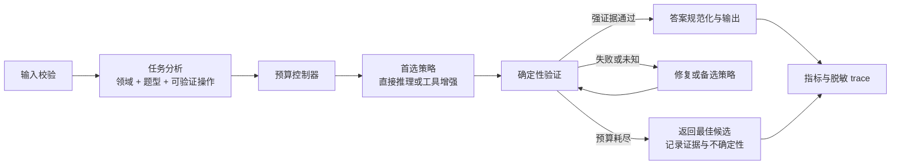

# 全方位审计与优化方案

> 审计日期：2026-08-29  
> 审计对象：当前工作区中的唯一运行链路及其测试、Demo、依赖、文档和交付材料  
> 文档边界：本文件记录问题、目标和实施路线，不定义当前架构。当前架构唯一事实源仍是根目录 `ARCHITECTURE.md`。

## 1. 总体判断

当前项目已经达到“可运行数学 Agent”的标准：竞赛接口、18 领域提示、11 个本地数学工具、模型调用、批处理、断点续跑和 Demo 均已打通。它适合作为竞赛原型、演示系统和后续实验基线。

当前项目还没有达到“可靠数学求解器”的标准。项目报告记录的 112 题隐藏集水平约为 22%，历史峰值为 28.57%；当前只有 3 道公开样例，无法证明跨 18 领域的稳定正确率。第一层保守改动已经补上结构化答案、预算、工具硬超时、usage 和运行摘要，但没有改变求解策略。当前主要瓶颈不是目录层次，也不是 Agent 数量，而是以下五项：

1. 缺少能代表真实题型分布的固定回归集；
2. 已有确定性验证原语，但尚未完成题型路由并接入候选选择；
3. 每题固定生成和验证多个候选，调用成本高且多数投票可能放大共同错误；
4. SymPy 已有子进程硬超时，但尚无操作系统级内存上限和完整函数复杂度限制；
5. usage 与批处理汇总已可采集，仍缺少固定数据集上的正确率、验证冲突和失败分类指标。

因此，优化顺序应当是：**可信评测 → 确定性验证 → 自适应预算 → 工具隔离 → 可观测性 → Demo 与交付**。不建议先增加多智能体或更多候选。

## 2. 目标定义与验收口径

“解数学题”不能只用“能输出答案”作为完成标准。项目目标应拆成六个可验证结果：

| 目标 | 必须记录的指标 | 建议初始门槛 |
| --- | --- | --- |
| 数学正确性 | 精确/等价正确率、按领域正确率、无效答案率 | 固定公开集不低于基线；每次优化必须有可重复增益 |
| 领域覆盖 | 18 领域题数、题型数、工具覆盖 | 每领域至少 3 题，总计不少于 60 题 |
| 可靠性 | 超时率、异常率、空答案率、checkpoint 恢复率 | 离线异常路径全部有测试；单题永不无限运行 |
| 成本性能 | 请求数、输入/输出 token、P50/P95 延迟、工具轮数 | 每题不得超过配置预算；优化后正确率不降且平均调用下降 |
| 安全隐私 | 工具超时、输入长度、密钥/PII/trace 管理 | 工具硬超时 100% 生效；公开仓库无密钥和非必要个人信息 |
| 可复现性 | commit、模型、配置、数据哈希、重复次数 | 每次结果都可追溯；随机结论至少重复 3 次或报告区间 |

准确率目标不能根据 3 道样例制定。第一阶段先建立公开基线，再冻结验收阈值。隐藏集结果只能用于最终外部验证，不能承担日常回归测试。

## 3. 当前证据基线

| 项目 | 当前事实 |
| --- | --- |
| Git 基线 | `main` 分支，HEAD `f47fa49`；当前工作区还有未提交优化 |
| 外部接口 | `ReasoningAgent.solve(problem, metadata) -> {final_response, trace}` |
| 领域与工具 | 18 个领域提示，11 个受限 SymPy 工具 |
| 候选策略 | 2 个工具候选 + 1 个纯推理候选；每个候选默认验证 1 次 |
| 常规最低模型调用 | 约 6 次/题；工具循环、反思与回退会继续增加 |
| 公开题目 | 3 道 `sample_data/dev.jsonl` 样例，覆盖不足 |
| few-shot | 18 个领域共 21 个示例；已修复验证脚本只解析 18 个的问题 |
| 离线测试 | Python 3.12 下 54 项通过 |
| 语句覆盖率 | 本轮列入检查的 10 个核心/边界模块合计 70%；`agent_types.py` 100%、`budget.py` 85%、`main.py` 85%、`answer_equivalence.py` 84%、`llm_client.py` 84%、`math_tools.py` 78%、`user_agent.py` 64%、`deterministic_verifier.py` 56%、`verify_math.py` 38% |
| 静态与安全检查 | Ruff、compileall、Bandit、`pip check`、`pip-audit`、skill 校验通过 |
| 在线验证 | 本轮未调用真实 API；没有对当前工作树生成新的正确率结论 |
| 附加 A/B 报告 | 36 题原始判定旧版 33/36、模块化版 32/36；报告中的人工复核为两版 36/36。原始运行目录不在当前工作区，尚不能独立复现 |
| 工程交付 | 无 CI、许可证、依赖锁定、自动发布包或 secret scan |

这些证据能证明代码可运行和已有基础安全控制，不能证明 18 领域数学正确率、真实成本或线上稳定性。

## 4. 全维度状态表

| 维度 | 当前状态 | 核心缺口 | 优先级 |
| --- | --- | --- | --- |
| 产品目标 | 基本明确 | “高正确率”“可接受成本”没有量化门槛 | P0 |
| 运行架构 | 单链路、边界清晰 | 控制策略仍是固定流程 | P1 |
| 数学策略 | 有领域提示和工具增强 | 缺少任务类型识别与确定性证据 | P0 |
| Prompt | 18 领域，有 few-shot | 缺少版本化、离线校验和消融记录 | P1 |
| 领域路由 | 本地零调用、已支持 ASCII 大小写 | 关键词重叠、无置信度、无多标签 | P1 |
| 数学工具 | 11 个工具，有输入/结果限制和 5 秒子进程硬超时 | 无内存硬上限；短表达式仍可能触发高复杂度计算 | P1 |
| 模型验证 | 有独立 verifier 视角 | 与求解器同源，不能提供独立真值 | P0 |
| 答案处理 | 已有 `Answer` 类型及数值、集合、多解的保守 canonical key | 区间和复杂符号等价覆盖仍有限 | P1 |
| 聚合选择 | 有多数票和置信度 | 报告已显示低单次正确率时多数票可能有害 | P0 |
| 评测体系 | 有 3 样例和在线脚本 | 样本太少；在线脚本不运行完整 Agent | P0 |
| 客户端 | 有超时、选择性重试和响应 usage/模型/id/耗时元数据 | 无 Retry-After、抖动和统一错误码 | P1 |
| Runner | 有 JSONL 校验、原子 checkpoint、并发、单题预算和脱敏运行摘要 | deadline 不能取消在途 HTTP；尚未流式读取 | P1 |
| 可观测性 | 有 trace | 无统一事件 schema、调用量、耗时、脱敏级别 | P1 |
| 安全隐私 | 密钥忽略、工具白名单、路径安全 | trace 可能泄露题面；提交文档含手机号；无 secret scan | P0 |
| 测试 | 已补答案等价、预算、工具超时、验证原语、dry-run 和汇总测试 | Demo、在线 Agent 评测和部分编排分支覆盖不足 | P1 |
| Demo | 本地监听，展示 trace | 无调用确认、预算提示、取消、排队和结果反馈 | P1 |
| 依赖供应链 | 运行依赖精简，当前审计无已知漏洞 | 只有最低版本，无锁文件、许可证和自动审计 | P1 |
| 文档治理 | README、AGENTS、skill、唯一架构文档齐全 | 比赛陈述中的成绩证据未随仓库打包，提交信息仍待填写 | P1 |
| 发布交付 | 有提交说明 | commit hash、平台地址、隐私材料和压缩包流程未自动化 | P1 |

## 5. 已验证缺陷与风险清单

### 5.1 本轮已直接修复

| ID | 问题 | 原影响 | 修复与证据 |
| --- | --- | --- | --- |
| COR-001 | 聚合答案可能来自 B/C，但最终响应保留最高置信度 A 的不同答案 | 多数投票结果被覆盖 | 聚合同时返回获胜答案及同组候选文本；已加回归测试 |
| COR-002 | verifier/critic 只读取候选前 3000 字符 | 长推理末尾答案被截掉 | 改为保留头尾的审阅摘要；已测试末尾答案存在 |
| COR-003 | fallback 可能返回没有 `最终答案：` 标记的裸字符串 | 外部输出契约不一致 | 所有 fallback 通过统一响应构造；已加测试 |
| PROMPT-001 | 通用提示把所有领域答案限制为数字/分数 | 集合、公式、区间、证明结论受损 | 改为允许数学表达式、集合、区间、公式和结论 |
| PROMPT-002 | PDE few-shot 缺少初速度却给出 `B_n=0` 的解 | 向模型注入错误先验 | 补充 `u_t(x,0)=0` 并说明 `B_n=0`；已加静态测试 |
| PROMPT-003 | 抽象代数 few-shot 最终答案写成 `81-9=72` | 答案等价与数值聚合不稳定 | 最终答案规范为 `72` |
| EVAL-001 | 在线脚本只解析 21 个 few-shot 中的 18 个 | 验证覆盖被高估 | 解析器现覆盖全部 21 个；已加测试 |
| EVAL-002 | 字符串子串匹配会把 `1` 与 `10`、`收敛` 与 `不收敛` 判为一致 | 评测假阳性 | 改为保守的归一化完全匹配；已加反例测试 |
| TOOL-001 | 单轮超过 8 个 tool calls 时，没有为被拒调用返回 tool 消息 | 下一轮可能因响应不完整被 API 拒绝 | 为所有超限调用返回受控错误 tool 消息；已加协议测试 |
| ROUTE-001 | 英文关键词区分大小写 | `ode`、`pde` 等小写输入漏路由 | 使用 `casefold()` 比较；已加测试 |
| ANSWER-001 | 候选与答案使用散落字典，等价判断主要靠 float/字符串 | 复杂答案易误组，证据不可追踪 | 引入 `Candidate/Answer/Verification`；数值用精确分数，集合/多解保守规范化，未知不猜测；已测试 |
| EVAL-004 | 在线脚本默认执行且没有总请求上限 | 可能意外消耗配额 | 默认 dry-run；只有 `--execute` 才联网，首轮和重试共享 `--max-requests`；已测试无 client 构造 |
| BUDGET-001 | 所有生成、验证、反思和工具分支没有共享预算 | 调用可无统一上界 | 引入单题 `ExecutionBudget`，统一限制模型请求、已报告 token、工具调用和阶段 deadline；trace 写入摘要；已测试 |
| TOOL-002 | SymPy 在主进程运行且无法终止 | 复杂合法输入可拖住主流程 | 所有注册工具及确定性验证均进入 spawned 子进程，默认 5 秒超时后终止；已测试真实超时。内存硬上限仍列为剩余风险 |
| INPUT-001 | 核心接口不限制题目和 metadata | 超大输入增加费用和内存压力 | 调用模型前校验 problem、metadata 类型、JSON 可序列化性及默认 20000 字符上限；已测试零调用拒绝 |
| RUN-001 | 只有单次 HTTP 超时，没有单题统一 deadline | 多分支可持续累积 | 单题预算在每次模型/工具调用前检查 600 秒 deadline；在途 HTTP 仍只能依赖客户端超时 |
| RUN-002 | Runner 无成功/失败/跳过/耗时汇总 | 运行结果难核查 | 输出 `_run/run_summary.json`，记录输入文件名/SHA-256、模型、耗时、并发与计数，不记录题面 |
| CLIENT-001 | 响应 usage 未采集 | 无法核对 token | 保持原返回契约，通过 `get_last_response_meta()` 暴露 usage、模型、request id、耗时和尝试次数；预算统一累计 |
| EVAL-005 | 36 题 A/B 原始分数从 33/36 降至 32/36 | 表面上像工程重构造成能力回退 | 人工复核显示两版均为 36/36；误差来自 Unicode/LaTeX/语义格式误杀。运行时与验证入口现共享保守归一化，并加入报告中的格式反例测试 |
| CLIENT-003 | 平台把“请求过于频繁”作为 HTTP 400 + `invalid_request_error` 返回 | 客户端把临时限流当永久参数错误，正式评测可能直接丢题 | 仅当 400 响应的 code/type 或 message 明确表示限流时重试；普通 400、401 不重试；已加正反测试 |

### 5.2 仍需解决的高价值问题

| ID | 问题与证据 | 影响 | 建议 |
| --- | --- | --- | --- |
| QUAL-001 | 当前仍固定生成 3 个候选；项目报告记录 5/8 候选和多数投票在低单次正确率时有害 | 正确率下降、调用增多 | 改为“单候选 → 确定性验证 → 失败才升级” |
| VER-001 | verifier 与 solver 使用同一模型，只有二元文本判断 | 共同错误无法发现 | 建立工具驱动的确定性验证，模型 verifier 降为弱证据 |
| VER-002 | “有可抽取答案”固定加 0.3 分 | 格式完整可能压过数学正确性 | 分数由证据等级组成，不奖励仅有格式的答案 |
| EVAL-003 | `verify_math.py` 直接问基础模型，没有调用 `ReasoningAgent` | 不能衡量真实 Agent | 拆成 prompt lint 与 Agent evaluation 两个入口 |
| DATA-001 | 只有 3 道公开样例 | 无法覆盖 18 领域和失败模式 | 建立不少于 60 题的许可明确公开回归集 |
| TOOL-003 | `factorial`、`gamma`、`simplify`、精确特征值等可在短输入上产生高复杂度 | 字符长度不能限制计算复杂度 | 函数级参数边界、复杂度计数、超时和降级数值计算 |
| CLIENT-002 | 重试未尊重 `Retry-After`，无随机抖动 | 限流时可能同步重试 | 优先服务端等待值，再用有上限指数退避与 jitter |
| OBS-001 | trace 是无 schema 的 `dict` 列表 | 事件名漂移，统计和脱敏困难 | 定义稳定事件字段：阶段、状态、耗时、调用数、摘要、错误码 |
| PRIV-001 | trace 保存候选片段和工具结果 | 私有题目或模型输出可能泄露 | 增加 `minimal/debug` 两级 trace，默认截断并支持哈希 |
| PRIV-002 | `SUBMISSION_INFO.md` 含真实手机号 | 公开仓库产生个人隐私风险 | 公共仓库改占位符，私人提交包在生成时注入 |
| TEST-001 | `user_agent.py` 64%、`verify_math.py` 38%，部分编排/在线分支仍未覆盖 | 关键分支仍有回归风险 | 用 scripted fake client 继续覆盖反思、超时、冲突和错误响应；在线 smoke 保持显式执行 |
| DEMO-001 | 点击即调用真实 API，无确认、预算展示、取消或队列限制 | 误触费用、重复请求和体验不稳定 | 增加确认、预计调用上限、禁用重复提交、取消和反馈导出 |
| BUILD-001 | 无 CI、锁文件、LICENSE、secret scan | 合并质量和供应链不可复现 | 建立最小 CI 和锁定流程，补许可证决策 |
| DELIVERY-001 | 提交 commit 曾固定为旧值；当前工作树尚未形成最终提交 | 提交信息可能与代码不一致 | 打包脚本从 Git 自动写入 commit、manifest 和校验和 |
| DELIVERY-002 | 成绩和调用数据只在报告中陈述，仓库缺少去敏汇总证据 | 结果难以复核 | 提交匿名化实验 manifest、汇总指标和数据哈希，不提交私有题面 |

## 6. 建议的目标运行流程

以下是待实验验证的优化方向，不代表当前已经实现；采纳后再更新 `ARCHITECTURE.md`。



核心原则：

- 先尝试最便宜且最可验证的策略；
- 确定性证据优先于同源模型投票；
- 未知不等于错误，验证器必须允许 `pass/fail/unknown`；
- 只有失败或未知时才增加候选、反思或模型调用；
- 所有分支共享同一个请求、token、时间和工具预算；
- 最终理由、答案和证据必须来自同一个获胜候选。

## 7. 十条优化工作流

### 7.1 评测与数据

建议新增 `evaluation/`，与运行代码分离：

- `benchmark.jsonl`：公开、许可明确、去敏的固定题集；
- `manifest.json`：数据版本、SHA-256、领域分布、答案类型；
- `run_eval.py`：运行真实 `ReasoningAgent`，支持恢复、预算和多次重复；
- `answer_equivalence.py`：保守等价判定；
- `report.py`：按领域、题型、工具和失败类型生成汇总。

数据记录至少包含：`id/problem/expected_answer/answer_type/domain/task_type/source/license`。私有题面不进入仓库，只提交哈希和匿名汇总。

验收：不少于 60 题，18 领域全部覆盖；数值、分数、表达式、集合、区间、多解、公式和文字结论均有测试。

### 7.2 内部答案与候选模型

新增明确的数据对象，替代散落字典：

```python
@dataclass
class Candidate:
    reasoning: str
    raw_answer: str
    normalized_answer: str
    answer_type: str
    strategy: str
    tool_evidence: list
    verification: list
    calls: int
    tokens: int
    latency_ms: int
    errors: list
```

`Verification` 至少包含 `status=pass/fail/unknown`、证据类型、详情和强度。选择器只按证据和预先定义的规则工作，不能因为答案格式完整就直接加分。

验收：答案与展示推理始终来自同一候选；复杂答案无法安全判等时返回 `unknown`，不产生假阳性。

### 7.3 任务路由

保留零成本领域关键词，但增加任务类型：方程、导数、积分、极限、留数、矩阵、模运算、组合数、证明、优化、概率等。路由输出应包含：

- 领域及置信度；
- 一个或多个任务类型；
- 推荐求解策略；
- 可用工具；
- 可执行验证器。

低置信度和多标签时使用通用提示，不强行选错领域。路由准确率单独在标注集上评估。

### 7.4 确定性数学验证

优先实现与现有 11 个工具配套的验证器：

| 题型 | 验证方式 |
| --- | --- |
| 方程 | 将候选根代回；检查遗漏根和定义域 |
| 导数 | 候选与符号导数作差化简，并做安全数值采样 |
| 积分 | 对候选求导，与被积函数比较 |
| 极限 | 符号极限与高精度单侧/双侧采样交叉检查 |
| 留数 | 直接计算或用洛朗系数复核 |
| 矩阵 | 行列式、迹、特征值和/积、不变量检查 |
| 数论 | gcd、模幂和同余直接复核 |
| 组合 | 整数性、边界、小规模枚举或公式复核 |
| 概率 | 范围 `[0,1]`、概率和、期望边界及小规模枚举 |
| 证明/抽象题 | 只能使用规则检查和模型评审，状态默认 `unknown` |

所有符号验证也必须走隔离进程和预算，不能让“验证”成为新的资源攻击面。

### 7.5 自适应预算控制

建议默认策略：

1. 生成 1 个首选候选；
2. 若确定性验证通过，立即返回；
3. 若失败，带具体反例修复 1 次；
4. 若未知，再生成不同策略的备选候选；
5. 只有候选冲突且预算允许时调用模型 verifier；
6. 达到 deadline 或预算后返回最佳证据候选并记录原因。

预算对象统一管理：模型请求数、输入/输出 token、工具调用数、工具 CPU 时间和单题墙钟时间。先用固定回归集比较，再决定默认上限，不能凭经验直接写死新参数。

### 7.6 Prompt 与领域知识

- 为每个 prompt 增加版本号和变更原因；
- 建立静态检查：必须有最终答案协议、few-shot 可解析、工具名存在、无相互矛盾约束；
- 每个 few-shot 先通过人工/确定性校验再进入 prompt；
- 将“领域知识”“输出格式”“工具使用原则”分离，减少重复 token；
- 证明题、计算题、集合/公式题使用不同答案格式说明；
- prompt 改动必须在固定集上做 A/B，不以单道样例决定。

### 7.7 工具安全与能力

- 使用独立子进程执行 SymPy，父进程负责超时终止；
- 对 `factorial/gamma/simplify/solve/eigenvals` 增加函数级规模限制；
- 记录执行耗时、输入摘要、结果状态和错误码；
- 将工具错误分类为 `invalid_input/unsupported/timeout/resource/internal`；
- 确定性验证与求解工具复用实现，但使用独立证据事件；
- 工具扩展必须先证明对应题型在回归集中存在，避免继续堆低利用率工具。

### 7.8 客户端、Runner 与可观测性

- 客户端返回文本、tool calls、usage、模型、请求 ID 和耗时；
- 重试尊重 `Retry-After`，加入 jitter，并记录重试原因；
- runner 增加 `--max-requests-per-problem`、`--problem-timeout`、`--trace-level`；
- 为每次运行生成不可变配置快照、数据哈希和 `run_summary.json`；
- 事件 schema 至少包含 `event/type/status/duration_ms/calls/tokens/content_preview/error_code`；
- 默认 trace 使用 minimal 模式，debug 模式才保留候选摘要。

### 7.9 测试、CI 与供应链

测试金字塔：

1. 纯函数：答案解析、等价、路由、预算和工具边界；
2. scripted fake client：完整 Agent 流程、冲突候选、反思、超时和降级；
3. runner：断点、并发、deadline、汇总和损坏文件；
4. 少量显式在线 smoke，不进入默认 CI；
5. 固定数学回归集，按需执行并保存 manifest。

CI 至少包含：pytest、coverage gate、Ruff、compileall、Bandit、依赖审计、secret scan 和 Markdown 链接检查。运行依赖生成可复现锁文件；许可证由项目所有者根据竞赛与第三方材料做出明确选择。

### 7.10 Demo、隐私与交付

- 首次调用前显示模型、预计最大请求数和可能费用；
- 防重复点击、限制并发、支持取消；
- 同时展示“答案”“证据”“调用统计”，避免把内部 trace 当作正确性证明；
- 允许用户标记正确/错误并导出匿名反馈；
- 默认不展示完整候选和工具原始输入；
- 公共仓库提交说明使用姓名、电话占位符；私人交付包由脚本注入；
- 打包脚本自动写入 commit、模型、依赖锁、文件 SHA-256 和检查结果；脏工作树拒绝生成正式包。

## 8. 实验矩阵

按以下顺序做单变量实验：

| 实验 | 变化 | 主要回答的问题 |
| --- | --- | --- |
| E0 | 当前 2 工具 + 1 纯推理 + 模型验证 | 建立可重复基线 |
| E1 | 单首选候选，其余不变 | 固定多候选是否值得成本 |
| E2 | E1 + 确定性验证通过即停 | 能否同时提高正确率并减少调用 |
| E3 | E2 + 验证失败后一次定向修复 | 反例驱动修复是否有效 |
| E4 | E3 + 冲突时才启用第二候选 | 自适应升级的边际收益 |
| E5 | E4 + 模型 verifier 仅处理 unknown | 模型验证的真实增益和误判率 |
| E6 | 路由/Prompt 单独 A/B | 领域提示是否带来统计增益 |

每次实验记录：commit、模型、完整配置、数据哈希、重复次数、正确率、按领域正确率、请求数、token、P50/P95 延迟、超时、工具成功率、验证假阳性/假阴性和错误类型。一次只改变一个变量。

建议采纳门槛：

- 正确率改动：固定集不退化，并在重复运行中表现一致；
- 成本改动：正确率不退化时，平均请求或 token 至少下降 20%；
- 安全改动：恶意/复杂输入测试全部受控失败，无挂起；
- Prompt 改动：总体不退化，且任何领域下降都必须有解释；
- 新工具：至少解决固定集中的真实失败类型，并有确定性验证测试。

## 9. 分阶段实施路线

### M0：建立可信基线

实施：

1. 创建公开评测 schema、数据 manifest 和至少 60 题回归集；
2. 把 `verify_math.py` 改为默认 dry-run，并增加显式请求预算；
3. 建立 Agent 级评测入口，而不是直接询问基础模型；
4. 补答案类型和保守等价测试；
5. 记录当前策略的准确率、调用、token、延迟和失败类型。

退出条件：评测可在同一 commit/config/data 上重复；所有 18 领域有样本；任何优化都能与 E0 比较。

### M1：提高数学正确性

实施：

1. 引入 `Candidate/Answer/Verification`；
2. 实现方程、导数、积分、极限、矩阵、数论和组合的确定性验证；
3. 把固定三候选改为自适应升级；
4. 用明确反例驱动修复，不再使用泛化的“请反思”；
5. 完成 E1～E5 消融。

退出条件：固定集正确率不低于基线；平均调用下降；验证假阳性有独立统计；答案与推理始终一致。

### M2：可靠性、安全与观测

实施：

1. SymPy 子进程硬超时与资源上限；
2. 单题 deadline、请求/token/工具预算；
3. usage、耗时、错误码和运行汇总；
4. minimal/debug trace 与脱敏；
5. retry、Retry-After、jitter 和响应 schema 测试。

退出条件：复杂输入不会挂起主进程；预算不可被任何分支绕过；批处理结束后有完整汇总。

### M3：工程化与交付

实施：

1. CI、覆盖率门槛、secret scan、依赖锁和许可证决策；
2. Demo 请求确认、排队、取消、统计和反馈；
3. 可复现打包脚本与交付 manifest；
4. 公共文档去除非必要 PII；
5. 技术报告从实验 manifest 自动同步关键数据。

退出条件：干净环境可安装并通过全部检查；正式包只能从干净提交生成；文档、commit 和实验证据一致。

## 10. 明确不建议优先做的工作

- 不先增加多智能体、共享黑板或复杂编排；
- 不增加 5/8 个候选追求多数票；
- 不把同一个模型的 verifier 当作真值；
- 不用 3 道样例或单次随机结果调整温度；
- 不继续增加没有对应回归题和验证器的工具；
- 不在主进程执行无硬超时的复杂符号计算；
- 不把完整私有题面、候选响应、手机号或 token 放进公开产物。

只有当错误分类显示大量失败来自长程分解、跨领域协作或上下文管理，并且单智能体加确定性验证后仍无法解决时，才评估多智能体。届时也必须先用实验量化新增调用的收益。

## 11. 实施状态与下一批队列

第一层保守修改已完成：在线脚本显式确认与请求上限、`Candidate/Answer/Verification`、保守等价、确定性验证原语、单题预算、SymPy 子进程硬超时、客户端 usage 元数据和批处理运行摘要。候选数、温度、thinking mode、模型和选择策略未改变。

后续按收益和依赖排序：

1. 新建公开 benchmark schema 和覆盖 18 领域的最小回归集；
2. 实现调用完整 `ReasoningAgent` 的离线/显式在线评测报告；
3. 增加题型路由，把确定性验证原语接入候选证据，但先保持选择规则可回退；
4. 为高复杂度 SymPy 函数增加规模规则和操作系统级内存上限；
5. 在固定基线上完成自适应“验证通过即停”控制器及 E1～E5 消融；
6. 定义 minimal/debug trace schema，并补错误码、验证冲突和失败分类；
7. 客户端支持 `Retry-After`、抖动和对应响应测试；
8. 建立 CI、锁文件、secret scan、许可证决策和可复现打包。

## 12. 最终完成标准

只有同时满足以下条件，才能认为项目足以稳定达成“解数学题”的目标：

- 18 领域固定回归集和评测器存在且可重复；
- 当前策略相对基线有明确、重复的正确率或成本收益；
- 可工具验证题优先使用确定性证据；
- 每题请求、token、工具和时间均有硬预算；
- 复杂符号输入无法挂起主进程；
- 答案、推理、候选和验证证据一致；
- 默认 trace 不泄露完整敏感内容；
- CI、依赖审计、secret scan、文档和交付 manifest 全部通过；
- 所有成绩、延迟和成本声明都能追溯到 commit、配置和数据哈希。

在这些条件完成之前，项目应定位为“具备完整工程骨架的数学 Agent 原型”，而不是“已经可靠解决 18 领域数学题的系统”。
