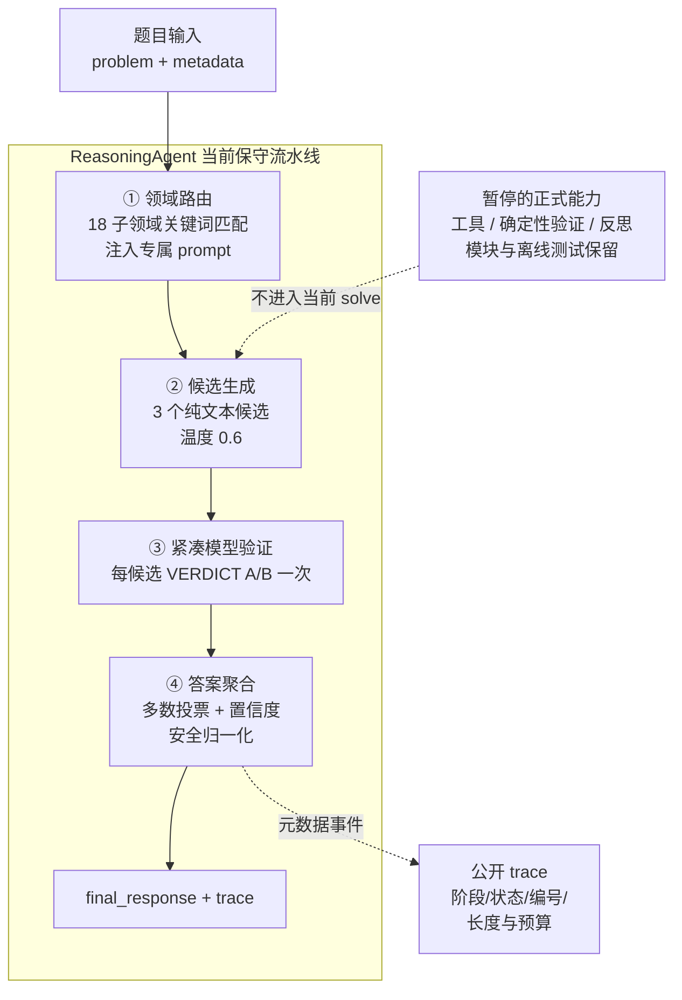

# 基于 Intern-S1 的数学智能体设计与推理创新 — 技术报告

## 一、系统概述

本系统基于官方 baseline（InternLM/Challenge-Cup-2026）增强，保留了题型分析、受限工具、确定性验证、截断恢复和答案聚合等工程模块。系统遵循官方接口规范 `ReasoningAgent.solve(problem, metadata) -> {"final_response": str, "trace": [...]}`。连续正式评测出现 `0 request / 112 error` 后，2026-09-03 当前正式版本收敛为三纯文本候选、逐候选模型验证和多数票选择的保守兼容内核；工具候选、确定性证据优先和反思作为历史创新与后续实验能力保留，不在当前 `solve()` 路径。

## 二、系统架构

> 本节用于比赛陈述与实验解释；当前组件、接口、参数和安全边界的唯一规范见 `ARCHITECTURE.md`。

### 2.0 架构总览



### 2.1 当前四阶段流水线

```
题目输入
  │
  ▼
① 领域路由阶段
  │  本地关键词识别 18 子领域 → 获取领域专属 prompt
  ▼
② 候选生成阶段（Policy）
  │  三个相互独立的纯文本候选
  │  所有正式请求只使用 messages/temperature/max_tokens
  │  注入领域专属 prompt 引导解题方向
  ▼
③ 验证阶段（Verifier）
  │  每个候选默认验证 1 次，VERDICT: A/B 评估正确性
  ▼
④ 答案聚合阶段（Aggregator）
  │  Self-consistency 多数投票 + 数值比较 + LaTeX 归一化
  ▼
最终答案输出
```

### 2.2 核心模块

| 模块 | 文件 | 职责 |
|------|------|------|
| 竞赛入口 | user_agent.py | 兼容入口，只导出包内公开接口 |
| 智能体入口 | math_agent/agent.py | 输入校验、单题上下文生命周期和异常收敛 |
| 求解编排 | math_agent/solver.py | 串联领域路由、纯文本生成、模型验证和选择阶段 |
| 候选生命周期 | math_agent/candidate_generation.py | 候选生成、截断恢复与紧急答案 |
| 候选评估 | math_agent/candidate_evaluation.py | 紧凑模型验证与 verifier 截断重试 |
| 候选选择 | math_agent/candidate_selection.py | 多数票与模型置信度选择 |
| 输出处理 | math_agent/response_processing.py | 显式答案抽取和唯一末行格式校验 |
| 求解上下文 | math_agent/context.py | 单题独占 trace、预算和模型网关 |
| 模型网关 | math_agent/model_gateway.py | 原子绑定响应、finish reason、usage 与请求编号 |
| 题型路由 | math_agent/task_router.py | 保留的本地分析库，当前正式路径暂停 |
| 工具兼容门面 | math_agent/math_tools.py | 保留旧导入，不承载具体工具逻辑 |
| 数学解析 | math_agent/math_parsing.py | 受限 SymPy 命名空间与输入/结果边界 |
| 工具实现与注册 | math_agent/tool_implementations.py / tool_registry.py | 11 个有界工具、schema 与隔离分发 |
| 工具循环 | math_agent/tool_loop.py | 保留的受限 tool_calling，当前正式路径暂停 |
| 领域路由 | math_agent/domain_router.py | 本地关键词计数，不增加模型请求 |
| 领域提示 | math_agent/domain_prompts.py | 18 子领域专属 prompt |
| 确定性验证 | math_agent/deterministic_verifier.py | 保留的有界 `pass/fail/unknown` 库，当前选择器不读取 |
| LLM 客户端 | math_agent/llm_client.py | InternChatClient（官方提供） |
| 本地运行器 | main.py | JSONL 读取、3 并发、断点续跑 |

## 三、创新点详述

### 3.1 题型识别与领域路由

**问题**：不同数学子领域（PDE、复分析、拓扑、运筹等）的解题方法差异巨大，通用 prompt 让模型自行摸索，难题容易走弯路。

**方案**：
- 在本地对关键词计数，识别题目所属的 18 个子领域之一，不额外消耗 API 调用
- 为每个领域编写专属专家 prompt，包含三部分：
  - **典型解法**：如 PDE 提示"分离变量法"、复分析提示"留数公式"
  - **推荐工具**：如复分析提示用 `residue` 工具、微积分提示用 `integrate`
  - **易错点提醒**：如"有限域 F_{p^n} 元素个数是 p^n 不是 n"
- 通过别名映射（PDE→偏微分方程）和模糊匹配处理领域名称变体

**效果**：公开 trace 以脱敏元数据记录 `domain_detect` 步骤；样例 3 题领域识别全部正确。trace 不保存题面、prompt 或模型正文。

### 3.2 工具增强求解（历史实现，当前暂停）

**问题**：大语言模型在复杂计算（求根、积分、留数）上容易出错，纯推理无法保证计算精度。

**方案**：
- 定义 11 个 SymPy 计算工具，遵循 OpenAI function calling 格式：

| 工具 | 功能 | 示例 |
|------|------|------|
| calculate | 化简/计算表达式 | 2\*\*10 → 1024 |
| solve_equation | 解方程 | x²-5x+6 → [2, 3] |
| differentiate | 求导 | x³-3x → 3x²-3 |
| integrate | 求积分 | 2x+1 → x²+x |
| limit | 求极限 | sin(x)/x→0 → 1 |
| residue | 求留数（复分析） | 1/((z-1)(z-2)²) at z=1 → 1 |
| matrix_det | 矩阵行列式 | `[[1,2],[3,4]]` → -2 |
| matrix_eigenvals | 矩阵特征值 | 对角矩阵 → 特征值及重数 |
| gcd_lcm | 最大公约数/最小公倍数 | 12,18 → gcd=6,lcm=36 |
| mod_pow | 模幂 | 2^10 mod 7 → 2 |
| binomial | 组合数 | C(5,2) → 10 |

- 实现 `run_tool_loop` 循环：通过统一 `ModelGateway` 发起带 tools 的请求 → 若返回 tool_calls 则经注册表和隔离子进程执行 → 结果回灌 → 重复直到文本回复
- 每个工具候选最多 3 轮工具调用，超限后强制请求无工具文本答案

**当前能力边界**：受限工具实现和安全测试仍保留，但正式 `solve()` 不发送 tool schema、`tool_choice` 或 `thinking_mode`，也不进入 `run_tool_loop`。后续恢复必须作为单一实验变量重新验证平台 client 与资源边界。

**历史效果边界**：开发样例曾观察到模型调用 `residue` 等工具，但样例不能证明总体正确率提升，更不能声称消灭算术错误；当前正式版本不具备模型工具调用效果。

### 3.3 反思纠错回路（历史实现，当前暂停）

**问题**：generate-verify-select 架构中，如果所有候选都错，验证器只能选出"最不错"的，无法纠正。

**方案**：
- 当最优候选的验证置信度 < 0.5 时，触发反思
- 将原题 + 候选解答 + 验证反馈组装为反思 prompt
- 用较低温度（0.3）重新生成候选，加入候选池参与后续聚合
- 反思候选同样经历验证投票，确保质量

**当前状态**：critic/reflection 提示词作为历史材料保留，但相关可调用流水线入口已移除；当前正式 trace 不会产生该阶段。若恢复，须单独证明它的收益、请求成本和截断影响。

### 3.4 答案归一化与数值比较

**问题**：模型输出答案格式不统一（72 vs 72.0 vs 72/1 vs \\frac{1}{8} vs -\\frac{1}{8}），导致 self-consistency 投票和 judger 匹配失败。

**方案**：
- **LaTeX 归一化**：\\frac{a}{b} → a/b，\\boxed{x} → x，去除 \\mathbb{}、$、\\left\\right 等
- **数值比较**：将答案转为 float 比较，72 == 72.0 == 72/1，消除格式差异
- **保守抽取**：只接受显式“最终答案：XXX”、`\\boxed{}` 或“答案是”等标记，不再把无标记末行猜成答案；截断残句因此不能绕过恢复流程

**效果**：样例中复分析题答案 -\\frac{1}{8} 成功归一化为 -1/8，匹配标准答案。

### 3.5 Self-consistency 聚合

**问题**：单候选正确率有限，验证器本身也可能误判。

**方案**：
- 生成 3 个纯文本候选，温度 0.6 增加多样性
- 答案级投票：多个候选给出相同答案（数值相等）时优先采用
- 若无一致答案，按验证置信度选最优
- 有清晰答案的候选加分（+0.3），无答案降权（-0.5）

**效果**：样例 3 题均有 ≥2 个候选答案一致，self-consistency 机制生效。

## 四、实验结果

### 4.1 样例数据测试

| idx | 科目 | 标准答案 | 智能体答案 | 正确 | 领域路由 | trace步数 |
|-----|------|---------|-----------|------|---------|----------|
| 0 | 抽象代数 | 72 | 72 | ✓ | 抽象代数 | 14 |
| 1 | 测度积分 | -1 | -1 | ✓ | 微积分 | 14 |
| 2 | 复分析 | -1/8 | -1/8 | ✓ | 复分析 | 14 |

**样例通过率：3/3。** 这 3 题只用于接口和基本流程冒烟检查，不构成正确率估计，也不覆盖 18 个领域。

### 4.2 推理链质量

公开 trace 只包含可审计的脱敏元数据，不包含完整推理链、候选正文、工具结果或 verifier 文本：
- `task_route`：题型标签、置信度与可选严格验证计划
- `reasoning_budget`：题型长度目标与 API 安全上限
- `domain_detect`：领域路由事件
- `tool_capability_fallback`：未知 client 的工具槽文本降级
- `policy_*` / `verify_*`：阶段状态与响应长度，不保存正文
- `self_consistency`/`select_final`：聚合阶段状态，不保存答案

### 4.3 架构演进史（v1 → v24）

**阶段一：本地样例开发（3 题样例，确定基础架构）**

| 版本 | 正确率 | 关键改进 |
|------|--------|---------|
| v1（官方baseline增强） | 1/3 | 初版 generate-verify-select |
| v1 + 答案归一化 | 2/3 | LaTeX→纯文本，验证器关 thinking |
| v1 + self-consistency | 3/3 | 答案级多数投票 |
| v2（工具调用+反思） | 3/3 | SymPy tool_calling + 反思纠错 |
| v2 + 领域路由 | 3/3 | 18 子领域专属 prompt |

**阶段二：正式评测迭代（112 题隐藏测试集，见 4.4 全景表）**

演进主线（6 个关键转折）：
1. **v13 = 关键突破**：max_tokens 4096→8192，正确率 23.21%→25.89%；
2. **v17 = 历史最高**：微分几何领域修复，冲到 28.57%；
3. **v19/v20 = 题级自适应翻车**：把 compute 降回 4096，撤销 v13 关键改进，跌到 18.75%；
4. **v22/v23 = Self-Consistency 翻车**：多候选多数投票在"单次正确率<50%"的难题上数学上有害，跌到 16.07%/21.43%；
5. **v21/v24 = 回退稳定基线**：同代码两次评测 24.11% vs 19.64%，坐实 ±2~3pp 采样波动；
6. **方法论结论**：采样类技巧（题级自适应、多候选、多温度）在官方难题上**全部证伪**，正确率天花板 ≈ 22%，对症手段应是**符号计算（工具）+ 确定性验证**。

### 4.4 正式评测正确率全景（112 题隐藏测试集）

| 版本 | commit | 正确率 | 关键改动 | 结论 |
|------|--------|--------|---------|------|
| v13 | fa7f001 | 25.89%（29/112）| max_tokens 4096→8192 | ✅ 关键突破 |
| v17 | 72510b5 | **28.57%（32/112）** | 回退 v13 架构 + 微分几何修复 | ✅ **历史最高** |
| v19 | f1c8dc0 | 18.75% | 题级自适应 + final_response 题型化 | ❌ 有害（-7pp）|
| v20 | 04c4d8f | 18.75% | compute 回 8192 + 归一化 | ❌ 无效 |
| v21 | 3b7b24d | 24.11% | 回退 v18 架构 | 基线波动带内 |
| v22 | f075c6b | 16.07% | SC 8 候选 | ❌ 超时翻车（54 error）|
| v23 | 2a158bf | 21.43% | SC 5 候选 | ❌ 多数投票 p<0.5 有害 |
| v24 | fdd6899 | 19.64%（22/112）| 回退 3 候选稳定基线 | 与 v21 同代码，波动下沿 |
| v28 | 350a267 | 20.54%（23/112）| 第一层模块化、预算、工具硬超时与输出规范化 | 位于稳定基线波动带；6 invalid、106 次截断 |

> 注：测试集 `input_sha256` 全程一致（7f2499c…），同一套 112 题。**关键发现**：v21 与 v24 代码完全相同（`git diff` 为空），但正确率 24.11% vs 19.64%，差 4.47pp——坐实正确率存在 ±2~3pp 采样波动。3 候选架构真实水平 ≈ 22%，v17 的 28.57% 含波动上沿 + 运气成分。

v28 的 23/112 相比历史峰值少 9 题，但比 v24 多 1 题。当前分数的 Wilson 95% 区间约为 `[14.09%, 28.93%]`，与 v17 的 `[21.02%, 37.54%]` 重叠，且缺少逐题配对结果，所以不能只凭总分断言工程重构造成显著能力回退。日志确认的直接缺陷是 1,082 次请求中 106 次被截断，以及 6 个最终结果被判为 `invalid`。候选提示已恢复答案先行，无显式答案标记的截断末行不再进入聚合；模型、候选数、温度、thinking mode 和 token 上限保持不变。完整分析见 `docs/evaluations/OFFICIAL_112_20260829.md`。

### 4.5 2026-08-29 工程重构 A/B

附加报告使用 18 领域、每领域 2 题的 36 题本地集，对比旧单文件版本与第一层模块化版本；两版串行运行，并在 runner 层使用相同的限流护盾。

| 指标 | 旧版 | 模块化版 | 变化 |
| --- | ---: | ---: | ---: |
| 判定器原始正确率 | 33/36（91.67%） | 32/36（88.89%） | -2.78pp |
| 人工逐题复核结果 | 36/36 | 36/36 | 持平，但不作为独立正确率基准 |
| 总 token | 427227 | 404744 | -5.3% |
| 总请求数 | 313 | 309 | -4 |
| 总耗时 | 738s | 816s | +10.6% |

原始分数中的已知漏判来自 Unicode 上标/下标、LaTeX `\displaystyle`/分数、中文与英文术语，以及“整句语义答案”对单一记号答案。进一步审计发现，原 runner 还使用双向字符串包含判定，因此 `1` 与 `10`、`收敛` 与 `不收敛` 也可能被误判为正确。使用新判分器离线重算工作区现存的一份 36 题报告，结果为 30 题自动确认正确、6 题 `unknown`、0 题自动确认错误；其中旧判分器的 3 个 wrong 被安全记号归一化纠正，同时 6 个依靠文字包含关系判对的项目转入人工复核。人工复核没有发现这 36 题上的能力回退，但人工满分不是可复现判分器，不能据此报告系统正确率。

对本地 `18domains_benchmark.jsonl` 的专项审计得到：总计 36 题、18 领域且每领域仅 2 题；题面长度中位数 21 字符，35/36 少于 40 字符；30/36 的参考答案不超过 3 字符；题目没有 `source/license/split/level` 元数据。内容以一步计算、定义回忆和中学基础题为主，不符合大学竞赛难度。默认相似度规则还确认至少 2 题与项目 prompt few-shot 存在强模板重合。因模型预训练语料不可见，不能断言测试题来自模型训练集；但缺失来源与划分、且与上下文示例重合，已经足以判定它不是合格的独立 held-out 测试集。

即使暂时忽略抽样独立性和污染问题，36/36 的二项 Wilson 95% 区间也只有约 `[90.36%, 100%]`，零失败的 rule-of-three 仍允许约 8.33% 的真实失败率；每领域 2/2 的区间更宽，不能证明领域能力。当前 36 题集应降级为 smoke set，只验证链路和输出格式。

本次修复统一了最终答案输出：保留推理，但删除模型生成的重复答案标签，最后只追加一行规范化的 `最终答案：答案体`；答案体禁止解释性整句，并对常见 Unicode/LaTeX 记号做稳定转换。离线判分器改为 `correct/wrong/unknown/no_answer` 四态，只接受安全归一化或受超时保护的可证明符号等价，文字语义进入人工复核。客户端限流修复保持不变；没有据此调整候选数、温度、thinking mode 或模型。

#### 4.5.1 Intern-S2-Preview-35B 内部 396 题评测

在 commit `4df48b1` 上，以并发 1 调用接口实际返回的 `Intern-S2-Preview-35B`，完成 18 领域、每领域 22 题的内部合成评测。396 题全部完成且无 runner 错误；共发出 3,567 次模型请求、消耗 4,900,722 tokens、调用工具 1,458 次，墙钟约 2 小时 37 分 37 秒。

冻结代码的保守自动判分为 376/396（94.95%），另有 11 个 `wrong` 和 9 个 `unknown`。保存 trace 后在同一评测流程内逐项复核这 20 题，均为根顺序/标签、`πi` 乘号、角度符号、精确值与近似值或文字语义差异，数学答案均正确，故单轮复核口径为 396/396；这不是独立人工盲审。此次暴露的确定性格式问题已在输出层修复，语义答案仍进入人工复核；模型和推理策略未调整。

该成绩只适用于此内部合成分布。题集虽有 396 题，却仅来自 108 个参数化模板簇，且 284 题题面少于 40 字符、309 个参考答案不超过 3 字符，没有独立难度校准、预训练隔离或双人盲审。满分说明基准已经饱和，不能替代 112 题历史测试，更不能作为大学竞赛实际正确率。完整冻结信息和边界见 `docs/evaluations/INTERNAL_35B_V1.md`。

### 4.6 消融实验（关键结论）

| 消融维度 | 结论 |
|---------|------|
| max_tokens 4096 vs 8192 | **8192 是 v13 提分的核心**（官方 cap 确认后从 4096 提到 8192）|
| 题级自适应 vs 固定 8192 | 题级自适应把 compute 降回 4096，**撤销关键改进，有害**（v19）|
| 3 候选 vs 8/5 候选 | **多数投票仅在单次正确率 > 50% 时有效**；官方难题单次正确率约 24%（<50%），多数投票数学上有害（v22/v23）|
| 统一温度 0.6 vs 多温度 | 高温度（0.7-0.9）降低采样质量 |
| thinking_mode | 开启导致截断，关闭稳定（v13/v17 均关）|

### 4.7 失败案例总结（四次翻车根因）

| 版本 | 翻车现象 | 根因 |
|------|---------|------|
| v15 | 正确率暴跌 | 多温度 + 交叉验证 + 加权聚合（复杂聚合引入噪声）|
| v19 | 25.89%→18.75% | 题级自适应撤销 v13 的 8192 关键改进 |
| v22 | 16.07%，54 题超时 | SC 8 候选调用量翻倍，超 1200s 单题时限 |
| v23 | 21.43% | 多数投票在 p<0.5（官方难题单次正确率<50%）时帮倒忙 |

**方法论教训**：①每次只改一个变量 ②采样类技巧（多候选/多温度）在「单次正确率<50%」的难题上无效甚至有害 ③对症官方难题的手段应是**符号计算（工具）+ 确定性验证**，而非采样。

## 五、系统设计亮点

1. **不硬编码 API key**：完全依赖平台注入的 client，安全合规
2. **领域路由可扩展**：新增领域只需在 `math_agent/domain_prompts.py` 添加条目
3. **工具系统可插拔**：解析、实现、schema/分发和模型循环分层，`math_tools.py` 仅保留兼容导出
4. **trace 元数据可审计**：记录阶段、状态、编号、长度、截断和预算，同时避免泄露题面、模型正文与答案
5. **断点续跑**：main.py 支持已完成的题跳过，中断后可继续

## 六、依赖与环境

- Python 3.10+
- sympy、requests、python-dotenv（详见 requirements.txt）
- 环境变量：INTERN_API_KEY（由平台管理，本地调试时自行配置）

## 七、未来工作

1. **P0 回归评测**：重建有来源、许可、split、难度和去重记录的盲测集；36 题旧集只保留为 smoke set
2. **按单变量恢复能力**：先用下一次正式结果确认保守内核已产生请求；成功后依次对工具、确定性验证和反思建立独立分支与冻结 A/B，不同时恢复多个阶段
3. **错误模式库**：跑批后归纳常见错误模式，加入 prompt 负例提醒
4. **可复现评测**：固定数据集哈希、模型、配置和提交，一次只改变一个变量
5. **演示保护**：为 Gradio 界面增加调用确认、速率提示与错误分级

## 八、评分维度对照表

本系统实际实现与官方评分标准的逐项对应关系：

| 评分维度 | 权重 | 系统实际实现 | 得分支撑材料 |
|---|---|---:|---|---|
| 答案正确性 | 60% | 当前三纯文本候选 + 模型验证 + 答案归一化 + SC 投票 + 截断预算 | 历史有效开发运行约 22%；保守兼容内核尚无有效正式成绩 |
| 推理策略与系统设计 | 10% | 当前四阶段保守流水线 + 领域路由 + 固定预算；受限高级模块可按单变量恢复 | `ARCHITECTURE.md` + `trace` 结构化记录 |
| 展示质量 | 20% | Gradio 交互 Demo + 完整技术报告 + 架构图 + 可复现 JSON | `demo.py` + 本报告 + 评测日志 |
| 创新性与可扩展性 | 10% | 领域路由 + 截断恢复 + 受限工具/确定性验证的可恢复模块 + 预算控制 | `创新点说明.md` + 方案文档 |

**关键说明**：约 22% 与 v17 峰值 28.57% 都来自历史有效运行，只能保留为历史观测；后续三轮 0/112 都是请求前运行故障。第三轮实际拉取 `eb5d8d4`，该提交已经包含三参数 client 投影，却仍为 112 error、0 request，证明先前扩展 kwargs 修复不足以恢复正式平台。当前最强的新增候选是旧构造器把不透明 runner 配置误当 `AgentConfig`，本地可完整复现 0 调用异常逃逸；但平台没有公开实际构造参数和逐题异常，因此线上唯一根因仍未闭环。2026-09-03 版本在保留 S1～S6 分层架构、显式上下文、统一网关、预算、截断和格式保护的同时，把正式请求收敛为 3 次纯文本候选 + 3 次紧凑 verifier；旧 tools/critic/reflection/deterministic 开关不能改变该协议。当前初赛技术规则直接列出 `intern-s1`、`intern-s1-pro`、`intern-s2-preview` 并允许提交时选模，FAQ 另推荐 `intern-s2-preview`；项目 formal 接受这三个 ID，默认仍为 `intern-s1`。“397/35B”简写、提交页实际选择和运行版本仍须另留回执。当前版本尚无有效 112 题成绩，不能把历史 S2 开发结果、保守回退或 allowlist 变更写成能力提升。完整第三轮复盘见 `docs/evaluations/OFFICIAL_112_20260902_RUNTIME_FAILURE.md`；材料来源、冲突与 `OFFICIAL-GAP-*` 见 `docs/OFFICIAL_MATERIALS_REGISTER.md`。
